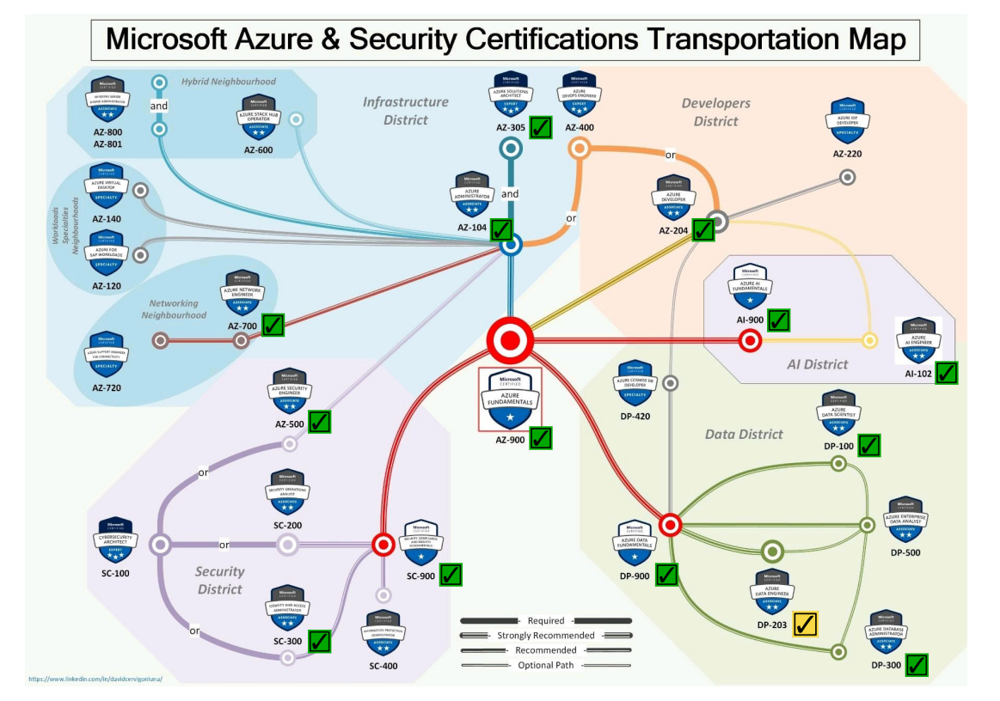
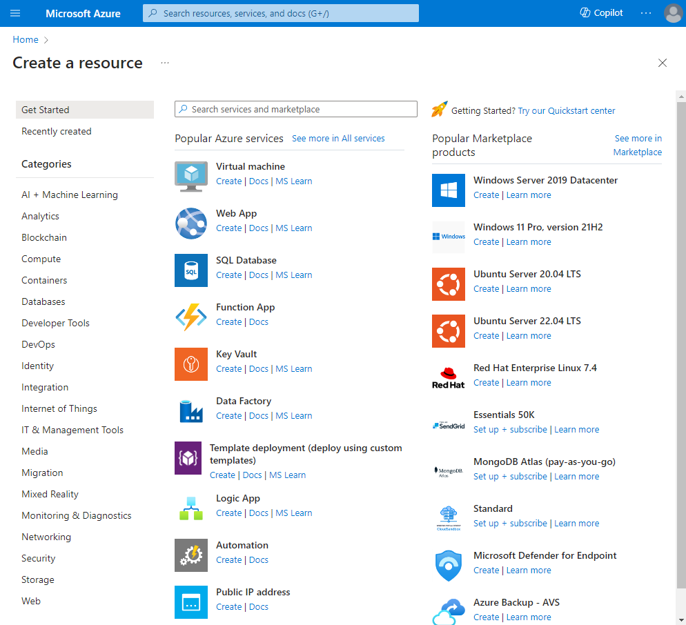
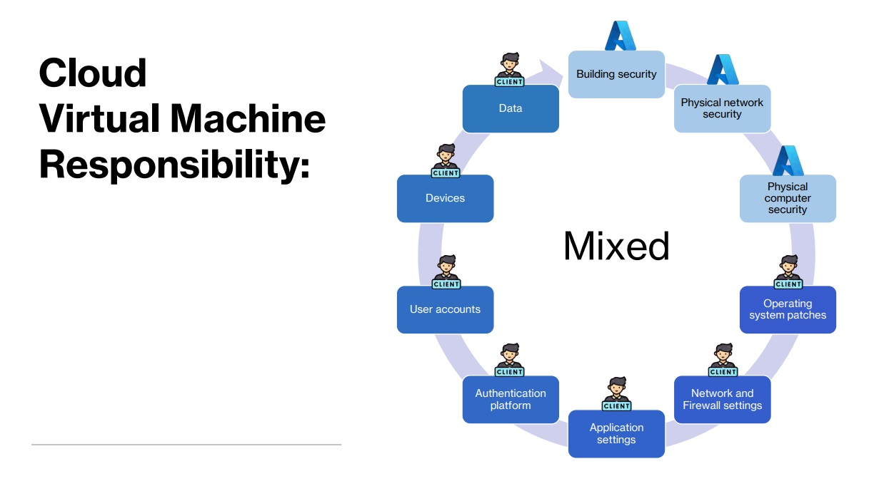

# A Guide to Azure with Focus on Machine Learning

These notes collect the basics related to using the Azure cloud services.

Some of them were written after following the Udemy tutorial/course by Scott Duffy

[AZ-900: Microsoft Azure Fundamentals Exam Prep](https://www.udemy.com/course/az900-azure/)

That tutorial prepares students for the [Exam AZ-900: Microsoft Azure Fundamentals](https://learn.microsoft.com/en-us/credentials/certifications/exams/az-900/).

Mikel Sagardia, 2024.  
No guarantees.

Table of contents:
- [A Guide to Azure with Focus on Machine Learning](#a-guide-to-azure-with-focus-on-machine-learning)
  - [1. Introduction](#1-introduction)
  - [2. Cloud Computing and Its Benefits](#2-cloud-computing-and-its-benefits)
    - [Shared Responsibility Model](#shared-responsibility-model)
    - [Types of Clouds](#types-of-clouds)
    - [Cloud Pricing](#cloud-pricing)
    - [Benefits of Cloud Computing](#benefits-of-cloud-computing)
      - [High Availability](#high-availability)
      - [Scalability](#scalability)
      - [Elasticity](#elasticity)
      - [Reliability](#reliability)
      - [Predictability](#predictability)
      - [Security](#security)
      - [Governance](#governance)
      - [Manageability](#manageability)
  - [3. Cloud Service Types](#3-cloud-service-types)
    - [Serverless](#serverless)
  - [4. Core Architectural Components](#4-core-architectural-components)
  - [5. Networking](#5-networking)
  - [6. Storage](#6-storage)
  - [7. Identity, Access and Security](#7-identity-access-and-security)
  - [8. Cost Management](#8-cost-management)
  - [9. Governance and Compliance](#9-governance-and-compliance)
  - [10. Tools for Managing Deployments](#10-tools-for-managing-deployments)
  - [11. Monitoring](#11-monitoring)
  - [12. Demos](#12-demos)
    - [Create a Virtual Machine (Appetizer)](#create-a-virtual-machine-appetizer)

## 1. Introduction

Updated to October 2023.

The course comprises the foundations and prepares for the exam; it's the first exam that should be taken.

Requirements for the exam (study guide): [Exam AZ-900: Microsoft Azure Fundamentals](https://learn.microsoft.com/en-us/credentials/certifications/exams/az-900/):

- Describe cloud concepts
- Describe Azure architecture and services
- Describe Azure management and governance

**Very IMPORTANT**: [Study Resources](https://softwarearchitect.ca/az-900-study-resources/):

- Study guide
- Slides
- etc.

Azure Certification Subway map by [David Cervigón Luna](https://www.linkedin.com/in/davidcervigonluna/)

## 2. Cloud Computing and Its Benefits

*There is no cloud, it's always some else's computer what we're using.*

Azure has 1000+ services, all accessible from the [Azure portal](https://portal.azure.com) (create account); we can click on **create a resource** to see some of these services:

- Virtual Machine
- Web App: a web application in which the VM is already set up and we care only about the web app
- Function app: we can just write the function in the UI and that's it; for small pieces of code for light tasks run frequently.
- Logic app: connection 2 application together, if an event happens, trigger one or the other, etc.
- ...

If we want to find something, we should type it in the **search space**!

There are **Categories**:

- AI + Machine Learning: Chatbots, NLP, CV, Custom ML service, ...
- Analytics:
  - Azure Machine Learning: custom ML service
  - Azure Synapse Analytics: Data Warehouse
  - ...
- Compute: Containers, Container Registries, Kubernetes, Quantum Computing, ...
- Databases: SQL, MongoDB, Cassandra

Even tools not supported officially by Microsoft are provided by 3rd party vendors, e.g., Oracle (Linux, DB, etc.).

There is a **Marketplace**, where 3rd party vendors offer their cloud products:

- Ubuntu server
- Wordpress app service
- ...

### Shared Responsibility Model

An app requires many hardware and software components, and depending on how everything is set up, the reponsibilities of each of the components vary; that's the [shared responsibility model](https://learn.microsoft.com/en-us/azure/security/fundamentals/shared-responsibility):

- If we have everything on premises, the responsibility is completely of the customer/user.
- IaaS (Infrastructure as a Service): VM Responsibility: everything starting at the OS is the user's responsibility.
- PaaS (Platform): App Service Responsibility (e.g., Web App): the OS becomes resposibility of the coud provider, i.e., Azure. Depending on the app, some component resposibilities might be shared. 
- SaaS (Software): Cloud Respnsibility (e.g., O365): the user is responsible of the components starting at the credentials.

### Types of Clouds

- Public cloud: available to anyone who wants to purchase them.
  - E.g., Azure; Azure owns the HW and offers the services.
- Private cloud: privately owned HW & setup; we need to be invited.
  - Government cloud, etc.
  - Azure also offers private clouds! It looks like the regular Azure cloud, but the customer either owns or leases exclusive access to the HW.
- Hybrid cloud: combination of both.
  - One deprecated example were the SQL DBs that had a local instance but which could scale in the cloud, i.e., Stretch DB.

Obviously, privacy is best in the private cloud.

### Cloud Pricing

Downsides of paying for cloud services:

- Difficult to predict monthly bill
- Difficult to understand what a service will cost
- Possibility of big savings, but no predictability

Factors of a service price, e.g., of a VM:

- Region
- OS
- Do we have a license?
- Instance size
- Disk size
- Bandwidth
- Backup
- Reservation
- Support

Factors of a service price, e.g., of a DB, concretely Cosmos DB:

- API
- Region
- Serverless?
- Ops/sec
- Storage
- Gateway?
- Backup?

Some services are free!

Most commonly we are charged

- by time (second-precission, but price is by hour)
- for storage space (~2 cent/GB/month)
- network traffic
- for operations (read, write, list, delete, query) - usually very cheap per op

Pricing Calculartor: [Azure Pricing Calculator](https://azure.microsoft.com/en-us/pricing/calculator/)

- Basic VM instance prices show, without storage, etc.
- We can also add the services we need for our app to the cart and check their price; however, it's an estimation, because usage factors also affect the price depending on the app's components.

### Benefits of Cloud Computing

In a nutshell:

- High availability
- Scalability
- Elasticity
- Reliability
- Predictability
- Security
- Governance
- Manageability

#### High Availability

High Availability = Uptime; high availability is a conscious effort to avoid downtime.

- Maximum: 100% = 365 days, 24/7; however, all cloud providers have some downtimes (sometimes for seconds).
- Ability of a system to remain operational to users during planned/unplanned outages.
- Planned outages are inevitable:
  - To updated applications
  - OS security patches
  - HW replacement
  - Migrations
- Unplanned outages are also inevitable
  - HW failure
  - NW disruptions
  - Power outages
  - Natural disasters
  - Cyber attacks
  - SW bugs
  - Poor architecture

Methods to mitigate planned outages:

- Gradual deployment: deploy 1 server, then 10, then 100
  - Test and monitor deployments
- Easy rollback plans: Azure has some tools for that, but the app needs to be constructed taking that into account
- Small deployments
- Frequent deplyments; because we become expertrs
- Automation: CICD

Methods to mitigate unplanned outages:

- Components have redundancy
- Use Azure's built-in features
  - Availability sets
  - Availability zones
  - Cross-region load balancing
- Health monitoring
- Automation
- Strong security, to prevent hackers
- Be geographically distributed (due to natural disasters)
- Have a disaster recovery plan and test it!
  - Can I have my systems running again in 20 mins?
- Load testing: in case we have a popular app, test scaling and load

#### Scalability

Scalability = ability of a system to accomodate increasing demand by adding or removing resources as needed.

- We adapt to changing traffic volume without any changes in the code or in the system design.
- Example of punctual traffic fluctuations
  - E-commerce on Black Friday
  - School registrations in September
  - ...

There are different types of scalings:

- Vertical:
  - Adding more resources to a single server: more memory, number of CPUs, etc.
  - Called *scale up* or *scale down*
  - There is an upper limit!
  - Largest server in Azure: 96 vCPUs, 384 GB memory
  - It does not improve the availability
- Horizontal
  - Adding more servers
  - Called *scale out* or *scale in*
  - No limits: number of servers, regions... we can scale in any direction
  - We have additional complexities for load balancing
  - It improves the systems availability

Impact on system cost:

- Cost increases linearly with the amount of resources
- However, we can control our **maximum capacity** on the system easily, so we spend only th emoney we need to spend!

#### Elasticity

Ability of a system to **quickly and easily** scale up/down:

- It needs to be automated: *autoscaling*; metrics are monitored (e.g., CPU usage) and scaling is managed, by modifying the **capacity**.
- *Waste* resources are minimized: systems that are paid for and not used; in non-cloud environments, waste is much larger.

#### Reliability

A high quality service should be:

- Available: accessible to the users when they need it.
- Reliable: system performs as intended without interruption.
  - We want to trust the system, which also requires transparency.
  - Autoscaling is related to the reliability.
  - Multiple-regions are also related to reliability.
  - Backups.
  - Health probes.
- Predictable

#### Predictability

Ability to forecasr and control performance and behaviour of a system:

- We have the confidence the system will work.
- How is the predictability achieved?
  - Autoscaling
  - Load balancing
  - Different instance types
  - Cost management
  - API
  - Pricing calculators

#### Security

Coud providers are massive targets for hackers. Thus, the providers spend a lot of money to be secure. Among others:

- They follow standard compliance certifications.
- They go through audits.
- They provide the users with tools to assure security (for apps and data).
- There is an always-on DDoS (Denial of service attack).
- There is a Microsoft Security Response Center (MSRC).
- They have always up-to-date platform services.
- Encryption by default.
- There are many Azure tools to enhance our security, like Firewalls, etc.

#### Governance

Governance is about how the organization does business and how that is related to the cloud services, i.e., how these services interact with the business processes. It involves the definition, implementation and monitoring of the policies that shape that business-cloud interaction.

Examples:

- The company wants that given policies/measures are followed in the cloud.
- Basic auditing and reporting is required.
- Sometimes some standard compliance is required: GDPR, etc.

How is governance achieved?

- Azure Policy & Blueprint: we can add taging, metadata, etc.
- Management groups: we can have management of different subscriptions.
- Custom roles: we define roles with accesses to certain resources.
- Soft delete: some data is sent to the trash, instead of deleting it (avoid accidental deletes).
- Guides on best practices are provided.

#### Manageability

Management **of** the cloud and **in** the cloud. The *of* part is achieved by:

- Templates
- Automation
- Scaling: autoscaling is possible for many resources.
- Monitoring and alerts: notify resource status, traffic, etc.
- Self-healing

In the case of the managenet *in* the cloud, we achieve it with:

- Web portal
- CLI & scripts
- Cloud Shell: in the we UI
- APIs
- Powershell

## 3. Cloud Service Types

The term **I/P/S as a Service**:

- It refers to something we could buy, but instead, we rent it.
- If we wish, we don't need to commit to a given volume/amount; but we can, so prices are cheaper.
- We pay for what we use.
- The cloud provider is responsible for maintenance & Co.

There are primarily three types of cloud services, as introduced in the shared responsibility model:

- IaaS (Infrastructure as a Service) - VMs
  - Usually, consists of real-world elements we could have on our data center, no abstracted products.
  - Essential services: computing, storage, networking
  - Example: Virtual Machines
    - We pay them by the second
    - We can choose different sizes
  - Example: Azure Storage
    - 5 PB capacity
    - Very cheap
    - Can handle blobs, files, queues, tables, etc.
    - Can be configured as a data lake.
  - Example: Virtual Networks
    - No cost, but we do have bandwidth cost
- PaaS (Platform) - Heroku / Docker container
  - A layer on top of IaaS: middleware, development tools, DB server, etc.
  - Example: Azure App Service
    - We upload code and configuration to Azure, and it runs without needing to configure the VM undereath
    - CI/CD included
  - Example: Managed Storage - Azure SQL Database
    - We don't have to worry about the server, the VM, disk space, etc.
  - Example: Azure Front Door / Load Balancer / Firewall
- SaaS (Software) - Apps / O365 / GDrive
  - App is ready to be used.

### Serverless

## 4. Core Architectural Components

## 5. Networking

## 6. Storage

## 7. Identity, Access and Security

## 8. Cost Management

## 9. Governance and Compliance

## 10. Tools for Managing Deployments

## 11. Monitoring

## 12. Demos

First, create an Azure account; I created one with the Github credentials.

After that, we basically open the [Azure portal](https://portal.azure.com).

### Create a Virtual Machine (Appetizer)

This very simple demo shows how easy it is to create a VM in Azure.

In [Azure portal](https://portal.azure.com), look for `Virtual Machines`: Create, Fill in form: 

    Basics
        Location
        Resource Group
        Name
        Operating System
        Security Type
        VM architecture: Windows, Linux
        Spot instances: free VMs assigned, but can also be evicted (cheaper)
        Size
        Username, Password (if Windows VM)
        Inbound Ports: SSH (Linux), RDP (WIndows), HTTP (80), HTTPS (443)
    Disk
        Hard Disk: SSD, etc.
    Networking
        Virtual Network
        Subnet
        Public IP
        Load balancers
        ...
    Management
        Antivirus
        Auto-shutdown
        Backups
        OS Updates
    Monitoring
        OS dignostics
    Advanced
        ...
    Tags
        Phone number, etc.

Finally, we review, create and deploy it.

Then, we can connect to it (RDP, SSH); open the VM resource in the Azure Portal and click on the `Connect` button for more information.

A standard VM costs around 17 cents/h; however, it's charged by the second.

