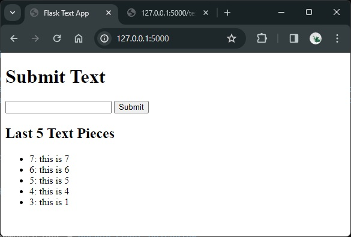
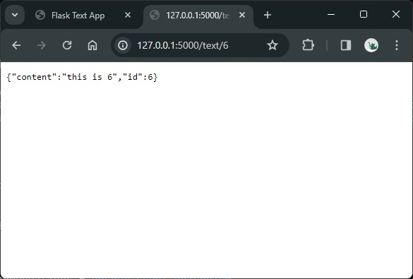

# Simple Web App

This repository contains a simple web app with a SQLite databse.

:warning: The app is **for test puposes only**. You should not deploy an app in a container with the database inside, due to many reasons:

- The database is not scalable.
- The changes in the container are ephemeral, i.e., they disappear when the container is removed.
- etc.

However, I use this simple example for deployment tests.

The app has two functionalities; when run locally, we can access them as follows:

- Web UI: `http://127.0.0.1:5000/`: we can enter text strings to a local database; additionally, the last 5 inserted text strings are shown with their insertion id.
- REST endpoint: `127.0.0.1:5000/text/<id>`: we can get the inserted text string with the passed id.

Note that neither exception handling nor logging are implemented &mdash; on purpose.





## Setup and Local Running

I prepared this simple app to test different cloud deployment and monitoring methods. However, you can/should run it locally, too.

**Option 1: Local run with flask**

```bash
# Environment
python -m venv venv
source venv/bin/activate # venv\Scripts\activate
pip install -r requirements.txt

# Run
flask run

# App
http://127.0.0.1:5000/
# Fill in table with texts

# REST API
127.0.0.1:5000/text/<id> # e.g., 3
# Check that the correct text is returned
```

**Option 2: Docker packaging and running:**

```bash
# Simple build
docker build -t flask-text-app .
# If we have a proxy; note that the --build_arg is optional
docker build --build-arg HTTPS_PROXY=$env:HTTPS_PROXY -t flask-text-app .

# Run
docker run -p 5000:5000 flask-text-app
# If we want to override the value of the HTTP_PROXY, first set the environment variable, then:
docker run -e HTTPS_PROXY=$env:HTTPS_PROXY -p 5000:5000 flask-text-app
# If we want to create a volume instance locally mounted in the contained; that's where the DB is saved by default
docker run -v instance:/app/instance -p 5000:5000 flask-text-app

# Stop
docker ps
docker stop <id_or_name>
```

## Cloud Deployments

### Procfile

Procfiles are used by [Heroku](https://www.heroku.com/), however, they can be used by other platforms.

We need to set [`Procfile`](./Procfile) with the correct `app:app` parameter, being `app:app == module_name:flask_app_instance`, e.g.:

```bash
# Heroku
web: gunicorn -w 4 -k gevent -b 0.0.0.0:8000 app:app

# Azure App Asrvice
gunicorn -w 4 -k gevent -b 0.0.0.0:8000 app:app

# AWS Elastic Beanstalk
web: gunicorn -w 4 -k gevent -b 0.0.0.0:5000 app:app
```


