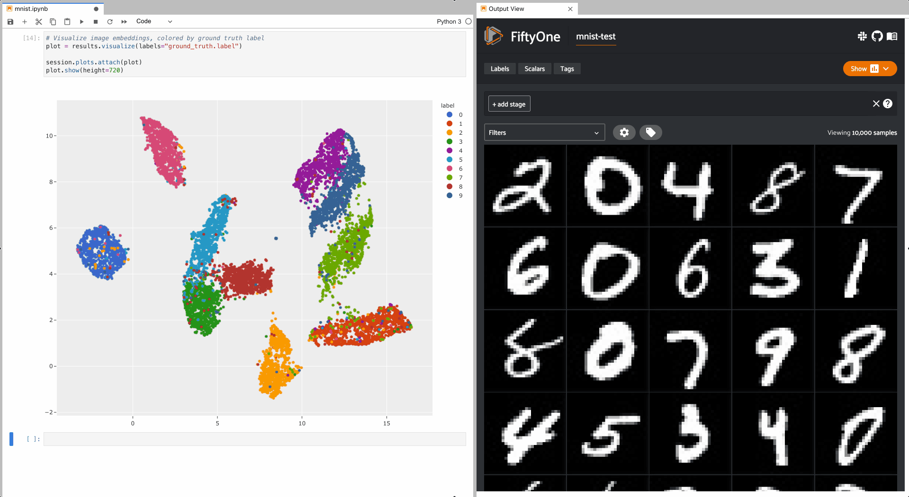

# FiftyOne Guide

[FiftyOne](https://docs.voxel51.com/index.html) is a 

> an open-source tool for building high-quality datasets and computer vision models

which can be used, among others, to visualize prediction data, curate datasets, or we can perform **error analysis** with it.

This tutorial shows how to use FiftyOne mainly for **error analysis**.

Table of contents:

- [FiftyOne Guide](#fiftyone-guide)
  - [Setup](#setup)
  - [Tutorials](#tutorials)
    - [General Utilities for Error Analysis (ndependent from FiftyOne)](#general-utilities-for-error-analysis-ndependent-from-fiftyone)
    - [General Notes Related to FiftyOne](#general-notes-related-to-fiftyone)
    - [Tabular Datasets](#tabular-datasets)
    - [Image Classification](#image-classification)
      - [Launch the Web UI](#launch-the-web-ui)
    - [Image Embeddings](#image-embeddings)
      - [Visualize Embeddings and Selected Samples](#visualize-embeddings-and-selected-samples)
        - [Visualization and Selection in the Web UI](#visualization-and-selection-in-the-web-ui)
        - [Visualization and Selection in Interactive Notebook Plots](#visualization-and-selection-in-interactive-notebook-plots)
        - [Pre-Annotations of Samples](#pre-annotations-of-samples)
        - [Re-Load Previous Visualizations](#re-load-previous-visualizations)
    - [Example: Flower Image Classification](#example-flower-image-classification)
  - [Further Information](#further-information)


## Setup

Environment and libraries:

```bash
# Create or activate your preferred python environment
conda env create -f conda.yaml
conda activate label

# If not done yet, install Label Studio
pip install --user label-studio
# If on Windows, add to Path the correct URL to be able to locate the binary
# C:\Users\<User>\AppData\Roaming\Python\Python39\Scripts

# Install FiftyOne
pip install fiftyone
```

Any other packages necessary are specifically installed in the notebooks.

Regarding FiftyOne, we can also:

- [Install a desktop app if we don't want to use the browser](https://docs.voxel51.com/getting_started/install.html#fiftyone-desktop-app).
- [Install `ffmpeg` to work with video datasets](https://docs.voxel51.com/getting_started/install.html#installing-fiftyone).

## Tutorials

The tutorials are implemented in Jupyter notebooks, they are located in the [`notebooks`](./notebooks/) folder, and focus on the following topics:

- [`00_general.ipynb`](./notebooks/00_general.ipynb): general utilities for error analysis.
- [`01_tabular.ipynb`](./notebooks/01_tabular.ipynb): Iris dataset modelling error analysis; see also: [Pandas Queries in FiftyOne](https://docs.voxel51.com/tutorials/pandas_comparison.html)
- [`02_image_classification.ipynb`](./notebooks/02_image_classification.ipynb): [Evaluating a Classifier in FiftyOne](https://docs.voxel51.com/tutorials/evaluate_classifications.html)
- [`03_image_embeddings.ipynb`](./notebooks/03_image_embeddings.ipynb): [Using Image Embeddings](https://docs.voxel51.com/tutorials/image_embeddings.html).

### General Utilities for Error Analysis (ndependent from FiftyOne)

Notebook: [`00_general.ipynb`](./notebooks/00_general.ipynb).

This notebook does not use FiftyOne; instead, it carries out some basic error analysis using the **Digits Dataset**.

Contents:

- General guideline
- Dataset is loaded and split
- A logistic regressoion model is trained
- Error Analysis:
  - Metrics: accuracy, precision, recall, F1
  - Confusion matrix plot
  - Log loss: model and baseline
  - Prediction probability distributions: confidence value histograms for TP, TN, FP, FN


```python
# Load dataset
import numpy as np
from sklearn import datasets
from sklearn.model_selection import train_test_split

#iris = datasets.load_iris()
#X = iris.data
#y = iris.target
#class_names = iris.target_names
#wine = datasets.load_wine()
#X = wine.data
#y = wine.target
#class_names = wine.target_names
digits = datasets.load_digits()
X = digits.data
y = digits.target
class_names = digits.target_names

X_train, X_test, y_train, y_test = train_test_split(X, y, test_size=0.3, random_state=42)

# Print class names and feature vector shape
print(class_names)
print(X.shape)

# Train model
from sklearn.linear_model import LogisticRegression
from sklearn.preprocessing import StandardScaler

scaler = StandardScaler()

X_train_scaled = scaler.fit_transform(X_train)
X_test_scaled = scaler.transform(X_test)

clf = LogisticRegression(max_iter=1) # few iterations, on purpose, to get worse results
clf.fit(X_train, y_train)

# Make the predictions
y_pred = clf.predict(X_test)
y_probs = clf.predict_proba(X_test)

# --- ERROR ANALYSIS

from sklearn.metrics import accuracy_score, precision_score, recall_score, f1_score

# Accuracy
accuracy = accuracy_score(y_test, y_pred)
print(f'Accuracy: {accuracy}')

# Precision, Recall, and F1 Score
precision = precision_score(y_test, y_pred, average='weighted')
recall = recall_score(y_test, y_pred, average='weighted')
f1 = f1_score(y_test, y_pred, average='weighted')

print(f'Precision: {precision}')
print(f'Recall: {recall}')
print(f'F1 Score: {f1}')

import seaborn as sns
import matplotlib.pyplot as plt
from sklearn.metrics import confusion_matrix
import numpy as np

# Compute confusion matrix
conf_matrix = confusion_matrix(y_test, y_pred)

# Plot using seaborn
plt.figure(figsize=(10, 7))
sns.heatmap(conf_matrix, annot=True, fmt='g', cmap='Blues', xticklabels=class_names, yticklabels=class_names)
plt.xlabel('Predicted')
plt.ylabel('Actual')
plt.title('Confusion Matrix')
plt.show()

from sklearn.metrics import log_loss

# Calculate log loss
logloss = log_loss(y_test, y_probs)
print(f'Log Loss: {logloss}')
print(f'Baseline Log Loss (random guess): {-np.log(1.0/len(class_names))}')

# Log loss = logistic loss = cross-entropy loss
# Input is a probability value between 0 and 1
# 0.00-0.10: Excellent model
# 0.10-0.20: Good model
# 0.20-0.30: Fair model
# 0.30-0.50: Poor model; may be acceptable depending on the application
# > 0.50: The model may have issues in terms of performance or may be predicting probabilities poorly
#
# Binary classification with balanced dataset:
# Random guessing -> log_loss = -log(1/2) = log(2) = 0.69
#
# Binary classification with IMbalanced dataset (p != 0.5, p: probability of the positive class)
# Random guessing -> log_loss = −(p*log(p) + (1−p)*log(1−p))
#
# Multiclass classification with balanced dataset:
# Random guessing -> log_loss = -log(1/C) = log(C)

import numpy as np
import seaborn as sns
import matplotlib.pyplot as plt

def plot_probability_distributions(class_index, y_test, y_probs, y_pred):
    # Create masks for the four conditions
    tp_mask = (y_test == class_index) & (y_pred == class_index)
    tn_mask = (y_test != class_index) & (y_pred != class_index)
    fp_mask = (y_test != class_index) & (y_pred == class_index)
    fn_mask = (y_test == class_index) & (y_pred != class_index)

    # Initialize variables to avoid reference before assignment
    tp_probs, tn_probs, fp_probs, fn_probs = [], [], [], []

    # Check if there are any probabilities to be plotted for each condition
    if np.any(tp_mask):
        tp_probs = y_probs[tp_mask, class_index]
        print("TP mean p = ", np.mean(tp_probs))
    if np.any(tn_mask):
        tn_probs = y_probs[tn_mask, class_index]
        print("TN mean p = ", np.mean(tn_probs))
    if np.any(fp_mask):
        fp_probs = y_probs[fp_mask, class_index]
        print("FP mean p = ", np.mean(fp_probs))
    if np.any(fn_mask):
        fn_probs = y_probs[fn_mask, class_index]
        print("FN mean p = ", np.mean(fn_probs))

    # Plot distributions
    if len(tp_probs) > 0:
        sns.histplot(tp_probs, color='green', label='True Positives', kde=True)
    if len(tn_probs) > 0:
        sns.histplot(tn_probs, color='blue', label='True Negatives', kde=True)
    if len(fp_probs) > 0:
        sns.histplot(fp_probs, color='orange', label='False Positives', kde=True)
    if len(fn_probs) > 0:
        sns.histplot(fn_probs, color='red', label='False Negatives', kde=True)

    plt.legend()
    plt.xlabel('Predicted Probabilities')
    plt.title(f'Class {class_names[class_index]} Probability Distributions')
    plt.show()

# Example usage for class 0
plot_probability_distributions(5, y_test, y_probs, y_pred)
```

### General Notes Related to FiftyOne

Some general considerations related to FiftyOne:

- FiftyOne works with a database located in `~/.fiftyone`.
- We can create datasets, e.g. with `fo.Dataset.from_dir()`, and the images are on the local folders, but the dataset information remains in `~/.fiftyone`. Then, when we open a new session we can access to the dataset object with `fo.load_dataset()`. See more in the notebook [`02_image_classification.ipynb`](./notebooks/02_image_classification.ipynb).
- We should launch the UI app (running in the browser) once the dataset is uploaded to FiftyOne. There are at least two ways to do that:
  - In the code, using the SDK: `session = fo.launch_app(...)`
  - Via the CLI: `(env) fiftyone app launch <dataset_name>`
- If we launch the UI app in the code, we have the advantage of getting the `session` object, which can be used to create filters in the code. However, if we use this approach:
  - We should use Jupyter Lab notebooks, not VSCode; otherwise, we might have issues.
  - We can click on "Create new View for Cell Output" and put the view side-by-side with our notebook code.

### Tabular Datasets

Notebook: [`01_tabular.ipynb`](./notebooks/01_tabular.ipynb) - Iris dataset modelling error analysis.

This is a dummy notebook in which the usage of FiftyOne is showcased with the Iris dataset; unfortunately, FiftyOne is much better suited for image datasets. Therefore, I suggest to switch to notebook `02`.

In any case, the most important snippets:

```python
import fiftyone as fo

DATASET_NAME = "Iris_Error_Analysis"

# Machine Learning
# We need to
# - Load the dataset
# - Train a model
# - Perform PCA if desired
# - etc.

# Create a FiftyOne sample collection
samples = []
for true_label, predicted_label, probs, features, pca in zip(y_test, y_pred, y_probs, X_test, pca_result):
    sample = fo.Sample(
        filepath="none",  # No image paths for the iris dataset
        predictions=fo.Classification(
            label=class_names[predicted_label], 
            confidence=max(probs),
            logits=probs.tolist()
        ),
        ground_truth=fo.Classification(label=class_names[true_label]),
        # Optional: features
        sepal_length=features[0],
        sepal_width=features[1],
        petal_length=features[2],
        petal_width=features[3],
        # Optional: PCA embeddings
        #pca_1=pca[0],
        #pca_2=pca[1]
        pca_embedding=pca.tolist()
    )
    samples.append(sample)

# Create a FiftyOne dataset
dataset = fo.Dataset(name=DATASET_NAME)
dataset = dataset.add_samples(samples)
# After adding the samples to the dataset
# we need to launch the UI
# http://localhost:5151
```

We can launch the FiftyOne UI app in several ways; the two most common ways:

1. With code in our environment:

    ```python
    session = fo.launch_app(dataset, desktop=True) # Browser: http://localhost:5151
    session = fo.launch_app(dataset, desktop=False) # Embedded in Jupyter
    ```

2. In the CLI:

    ```bash
    # fiftyone app launch <dataset_name>
    (label) fiftyone app launch "Iris_Error_Analysis"
    # Browser: http://localhost:5151
    ```

Launching the UI in the code has the advantage of obtaining the `session` object, with which can do additional things. However, if we use this approach:

- We should use Jupyter Lab notebooks, not VSCode; otherwise, we might have issues.
- We can click on "Create new View for Cell Output" and put the view side-by-side with our notebook code.

### Image Classification

Notebook: [`02_image_classification.ipynb`](./notebooks/02_image_classification.ipynb).

This notebook follows the official tutorial [Evaluating a Classifier with FiftyOne](https://docs.voxel51.com/tutorials/evaluate_classifications.html). It's perfect for beginners to get an idea of how to work with FiftyOne.
The following tasks are carried out:

- A FiftyOne dataset is created from a image binary classification dataset.
- A Fast.ai CNN is trained with the dataset.
- The model is used to predict the image classes.
- Sample predictions are uploaded to FiftyOne.
- The UI is used to filter samples, i.e., FN & FP samples according to priorization scalars like `hardness`.
- Exports are done: wrong samples (FP, FN) and entire dataset as a JSON.

In the tutorial, the [Malaria Dataset @ Kaggle](https://www.kaggle.com/datasets/iarunava/cell-images-for-detecting-malaria) is used, which contains 13.7k x 2 images (size around 150**2 px) of two classes: 

- cell `Infected` with malaria
- cell `Uninfected` with malaria

```python
# --- Create a FiftyOne Dataset

import os
import fiftyone as fo

# After downloading the dataset from Kaggle...

DATASET_DIR = os.path.join(os.getcwd(),"..","datasets","cell_images")

# Create FiftyOne dataset
# Images remain in local folder
# but a database is generated/updated in ~/.fiftyone
# Later, we can reference the dataset with its name
# and the content of the database is loaded
# Other ways of importing datasets to FiftyOne:
# https://docs.voxel51.com/user_guide/dataset_creation/index.html
dataset = fo.Dataset.from_dir(
    DATASET_DIR,
    fo.types.ImageClassificationDirectoryTree,
    name="malaria-cell-images",
)
dataset.persistent = True

print(dataset)

# Load existing dataset
dataset = fo.load_dataset("malaria-cell-images")
print(dataset)

# Compute visual uniqueness
# https://docs.voxel51.com/user_guide/brain.html#image-uniqueness
# A model is downloaded for us and a scalar [0, 1]
# related to the uniqueness of each image is computed
# following different computations: embeddings, neighbors, etc.
# Unique samples are vital in creating training batches
# that help your model learn as efficiently and effectively as possible.
import fiftyone.brain as fob

fob.compute_uniqueness(dataset)

# --- Train a Fast.ai CNN

import numpy as np
from fastai.data.all import *
from fastai.vision.data import *
from fastai.vision.all import *

# Load dataset into fastai

path = Path(DATASET_DIR)

splitter = RandomSplitter(valid_pct=0.2)

item_tfms = [Resize(224)]
batch_tfms = [
    *aug_transforms(flip_vert=True, max_zoom=1.2, max_warp=0),
    Normalize.from_stats(*imagenet_stats),
]

data_block = DataBlock(
    blocks=[ImageBlock, CategoryBlock],
    get_items=get_image_files,
    get_y=parent_label,
    splitter=splitter,
    item_tfms=item_tfms,
    batch_tfms=batch_tfms,
)

data = data_block.dataloaders(path, bs=64)
data.show_batch()

# Load a pre-trained model
# https://docs.fast.ai/vision.models.xresnet.html
learner = cnn_learner(data, xresnet34, metrics=[accuracy]).to_fp16()

# Fine-tune model on our dataset
learner.fine_tune(15)

# This will print the validation loss and metrics
# Return loss & accuracy of validation set/split
learner.validate()

# Preview some predictions
learner.show_results()

# Save model checkpoint
# A folder ./models is created and the model with name xresnet34-malaria.pth
# saved in it
learner.save("xresnet34-malaria")

# Loads `./models/xresnet34-malaria.pth` generated by `.save()`
learner = cnn_learner(data, xresnet34, metrics=[accuracy]).to_fp16()
learner.load("xresnet34-malaria")

# --- Evaluate Model with FiftyOne

import os
from pathlib import Path
from fiftyone import ViewField as F

def normalize_path(filepath):
    # This function is probably not always necessary
    # but when the paths in FiftyOne and in our dataloader don't match
    path = Path(filepath).resolve()
    return str(path).replace(str(path.drive), str(path.drive).lower()) # C:\\ -> c:\\

def do_inference(learner, dl, dataset, classes, tag):
    # Perform inference
    preds, _ = learner.get_preds(ds_idx=dl.split_idx)
    preds = preds.numpy()
    #preds = np.array([0, 0, 0])

    sample_count = 0
    tagged_count = 0

    # Save predictions to FiftyOne dataset
    with fo.ProgressBar() as pb:
        for filepath, scores in zip(pb(dl.items), preds):
            try:
                # Normalize the file path
                normalized_path = normalize_path(filepath)
                
                sample = dataset[normalized_path]
                target = np.argmax(scores)
                sample.tags.append(tag)  # Ensure tags are added, not replaced
                sample["predictions"] = fo.Classification(
                    label=classes[target],
                    confidence=scores[target],
                    logits=np.log(scores + 1e-9),  # add epsilon to avoid log(0)
                )
                sample.save()
                tagged_count += 1
            except KeyError as err:
                print(f"Filepath not found in dataset: {filepath}")
            sample_count += 1

    print(f"Processed {sample_count} samples.")
    print(f"Tagged {tagged_count} samples.")

    if tagged_count == 0:
        raise ValueError(f"No samples were tagged with '{tag}'. Please check the dataset and file paths.")

# Run inference on validation split
do_inference(learner, data.valid, dataset, classes, "validation")

# Run inference on train split
do_inference(learner, data.train, dataset, classes, "train")

# Check that the field prediction exists
print(dataset)

# Prediction in the first sample of the train split
print(dataset.match_tags("train").first())

# Prediction in the first sample of the validation split
print(dataset.match_tags("validation").first())

# Evaluating models with FiftyOne
# https://docs.voxel51.com/user_guide/evaluation.html
# Binary classification: https://docs.voxel51.com/user_guide/evaluation.html#binary-evaluation

# Evaluate the predictions in the `predictions` field with respect to the
# labels in the `ground_truth` field
results = dataset.evaluate_classifications(
    "predictions",
    gt_field="ground_truth",
    eval_key="eval",
    method="binary",
    classes=["Uninfected", "Parasitized"],
)

# Aggregate metrics
results.print_report()

# Confusion matrix
plot = results.plot_confusion_matrix()
plot.show()

plot.freeze()  # replaces interactive plot with static image / KILLS KERNEL?

plot = results.plot_pr_curve()
plot.show()

plot.freeze()  # replaces interactive plot with static image / KILLS KERNEL?

# Get counts of TP, TN, FP, FN
print(dataset.count_values("eval"))

# Compute hardness
# Identify samples that are more difficult for a model to learn
# so that training can be more focused around these hard samples.
# https://docs.voxel51.com/user_guide/brain.html#sample-hardness
import fiftyone.brain as fob

fob.compute_hardness(dataset, "predictions")

# Compute mistakenness
# Automatically identify the potential ground truth mistakes in your dataset
# https://docs.voxel51.com/user_guide/brain.html#label-mistakes
import fiftyone.brain as fob

fob.compute_mistakenness(dataset, "predictions", label_field="ground_truth")
```

#### Launch the Web UI

It is also possible to evaluate samples individually by generating views, i.e., by filtering samples in the UI.

We can launch the FiftyOne UI app in several ways; the two most common ways:

1. With code in our environment:

    ```python
    session = fo.launch_app(dataset, desktop=True) # Browser: http://localhost:5151
    session = fo.launch_app(dataset, desktop=False) # Embedded in Jupyter
    ```

2. In the CLI:

    ```bash
    # fiftyone app launch <dataset_name>
    (label) fiftyone app launch "malaria-cell-images"
    # Browser: http://localhost:5151
    ```

Launching the UI in the code has the advantage of obtaining the `session` object, with which can do additional things. However, if we use this approach:

- We should use Jupyter Lab notebooks, not VSCode; otherwise, we might have issues.
- We can click on "Create new View for Cell Output" and put the view side-by-side with our notebook code.

Basic usage of the UI:

- Left frame: select tags / labels / primitives (features added in code)
- Main frame: we can visualize several **panels**
  - Samples: we can click on each of them and a detailed view is opened
  - Histograms: we can select which vaiables to plot: labels, scalar values, etc.
  - Embeddings: we can plot scatterplots that represent the dataset
- We can add stages or filters, e.g.:
  - `Limit(int)` takes the number of samples we specify
  - `SortBy`
  - ...

After running the evaluation of the model, we have created many additional values for the samples (see left frame):

- `LABELS`: `ground_truth`, `predictions`
- `PRIMITIVES`:
  - `uniqueness`
  - `eval`: TP, TN, FP, FN
  - `hardness`: a float that refers to how dificult are the samples to be learnt by the model
  - `mistakenness`: a scalar that refers to the potential ground truth mistakes in your dataset

Now, we can visualize filtered samples using those values. To that end:

- We can select tags/values in the left frame
- We can apply filters in the main frame, e.g.: `SortBy`, `Limit`, etc.

It is also possible to access the filters via the SDK if we have the `session = fo.launch_app()` object.

Examples:

```python
# Show most unique CORRECT predictions on validation split
session.view = (
    dataset
    .match_tags("validation")
    .match(F("predictions.label") == F("ground_truth.label"))
    .sort_by("uniqueness", reverse=True)
)

# Show most unique INCORRECT predictions on validation split
session.view = (
    dataset
    .match_tags("validation")
    .match(F("predictions.label") != F("ground_truth.label"))
    .sort_by("uniqueness", reverse=True)
)

# Show the HARDEST FALSE POSITIVES on validation split
session.view = (
    dataset
    .match_tags("validation")
    .match(F("eval") == "FP")
    .sort_by("hardness", reverse=True)
)

# Show the HARDEST FALSE NEGATIVES on validation split
session.view = (
    dataset
    .match_tags("validation")
    .match(F("eval") == "FN")
    .sort_by("hardness", reverse=True)
)

# Show the most likely ANNOTATION MISTAKES on the train split
session.view = (
    dataset
    .match_tags("train")
    .sort_by("mistakenness", reverse=True)
)
```


### Image Embeddings

Notebook: [`03_image_embeddings.ipynb`](./notebooks/03_image_embeddings.ipynb).

Original tutorial:

- [Using Image Embeddings](https://docs.voxel51.com/tutorials/image_embeddings.html)
- [FiftyOne Embeddings Visualization](https://docs.voxel51.com/user_guide/brain.html#visualizing-embeddings)

> Covered concepts:
> - Loading datasets from the FiftyOne Dataset Zoo
> - Using compute_visualization() to generate 2D representations of images
> - Providing custom embeddings to compute_visualization()
> - Visualizing embeddings via interactive plots connected to the FiftyOne App
>
> And we’ll demonstrate how to use embeddings to:
> - Identify anomolous/incorrect image labels
> - Find examples of scenarios of interest
> - Pre-annotate unlabeled data for training

In summary, the following animation from [FiftyOne](https://docs.voxel51.com/tutorials/image_embeddings.html#Using-Image-Embeddings) shows the use-case in favor of embeddings: we can plot in 2D image vectors, color them with the predicted class labels and select interactively the ones which seem to be incorrect. Then, those selected samples are filtered in the web UI of FiftyOne.



```python
## -- Upload Dataset: MNIST

import fiftyone as fo
import fiftyone.zoo as foz

# Datasets downloaded to: C:\Users\Msagardi\fiftyone\mnist\
# Additionally, this command creates a dataset in the FiftyOne database
dataset = foz.load_zoo_dataset("mnist")

# Load existing dataset
# If we restart the notebook/session, we can load the dataset as follows
import fiftyone as fo

dataset = fo.load_dataset("mnist")
print(dataset)

# We start working with the test split, which contais 10k images
test_split = dataset.match_tags("test")

print(test_split)

## --- Compute Image Embeddings

import cv2
import numpy as np

import fiftyone.brain as fob

# Construct a ``num_samples x num_pixels`` array of images
# Usually, first we need to generate image vectors/embeddings with a DL model
# and them apply UMAP/T-SNE to project them to 2D
# However, since MNIST has so small images (28x28), we can ravel them and use them
# as embedding vectors, passed to UMAP/T-SNE
embeddings = np.array([
    cv2.imread(f, cv2.IMREAD_UNCHANGED).ravel()
    for f in test_split.values("filepath")
])

# Compute 2D representation
# We can select one of the default methods
# point to a model or a field in our dataset where vectors are stored
# https://docs.voxel51.com/api/fiftyone.brain.html#fiftyone.brain.compute_visualization
results = fob.compute_visualization(
    test_split,
    embeddings=embeddings,
    num_dims=2,
    method="umap", # "tsne", "pca", "manual"
    brain_key="mnist_test",
    verbose=True,
    seed=51,
)

print(type(results))
print(results.points.shape)
```

#### Visualize Embeddings and Selected Samples

##### Visualization and Selection in the Web UI

We can launch the FiftyOne UI app in several ways; the two most common ways:

1. With code in our environment:

    ```python
    # dataset = test_split
    session = fo.launch_app(view=test_split, desktop=True) # Browser: http://localhost:5151
    session = fo.launch_app(view=test_split, desktop=False) # Embedded in Jupyter
    ```

2. In the CLI:

    ```bash
    # fiftyone app launch <dataset_name>
    # Note that if we launch it via the CLI the entire dataset is loaded
    # not only the test_split
    (label) fiftyone app launch "mnist"
    # Browser: http://localhost:5151
    ```

Note that the main use-case of embeddings is to be able to visualize them in a 2D projection in order to select samples that have dubious locations/labels. In that sense, take into account that we have a subset of smaples `test_split = dataset.match_tags("test")` for which we have generated the `embedding` vectors and uploaded to the dataset with `fob.compute_visualization()`.

Launching the UI in the code has the advantage of obtaining the `session` object, with which can do additional things. However, if we use this approach:

- We should use Jupyter Lab notebooks, not VSCode; otherwise, we might have issues.
- We can click on "Create new View for Cell Output" and put the view side-by-side with our notebook code.

If we launch the the app via the CLI loading the entire dataset, we need to:

- Add a filter/stage `MatchTags(test)` to narrow down to the samples in `test_split`; i.e., we are reproducing the command  `test_split = dataset.match_tags("test")` but in the UI.
- Create an `Embeddings` view in the tabs of the main frame, using:
  - brain key: `mnist_test` - that was created with `fob.compute_visualization()`
  - color by: `ground_truth.label`

When the embeddings are visualized, we can select weird/bordeline samples and open the tab of the samples; there, we see which are those samples.

Recall the basic usage of the UI:

- Left frame: select tags / labels / primitives (features added in code)
- Main frame: we can visualize several **panels**
  - Samples: we can click on each of them and a detailed view is opened
  - Histograms: we can select which vaiables to plot: labels, scalar values, etc.
  - Embeddings: we can plot scatterplots that represent the dataset
- We can add stages or filters, e.g.:
  - `Limit(int)` takes the number of samples we specify
  - `MatchTags(str)`: 
  - `SortBy`
  - ...


##### Visualization and Selection in Interactive Notebook Plots

```python
# Launch App instance from the code using the SDK
# The advantage of this approach is that we get the session object
# Recommendations:
# - Use Jupyter lab
# - Right click on this cell and select: "Create New View for Cell Output"
# - Place cell output side-by-side
# - Continue interacting with the UI using code! :)
session = fo.launch_app(view=test_split)

# Plot embeddings colored by ground truth label
# Using the SDK interaction approach
# we can plot a scatterplot of the embeddings (plotly)
# zoom and select the weird samples
# Then, the UI view is updated! :)
# We can make use of the tools in plotly plots:
# Zoom, lasso selection, label-based selection, etc.
plot = results.visualize(labels="ground_truth.label")
plot.show(height=720)

# Attach plot to session
session.plots.attach(plot)

session.freeze()  # screenshots App and plot for sharing
```


##### Pre-Annotations of Samples

```python
# Let’s see how compute_visualization() can be used to efficiently pre-annotate the train split with minimal effort.
# First, load existing dataset
# If we restart the notebook/session, we can load the dataset as follows
import fiftyone as fo

dataset = fo.load_dataset("mnist")
print(dataset)

import cv2
import numpy as np

import fiftyone.brain as fob

# Now, let's create embeddings for the entire dataset
# Since MNIST images are so small, we ravel them and take their 28x28 pixel values as the embedding vectors
# Construct a ``num_samples x num_pixels`` array of images
embeddings = np.array([
    cv2.imread(f, cv2.IMREAD_UNCHANGED).ravel()
    for f in dataset.values("filepath")
])

# Compute 2D representation
results = fob.compute_visualization(
    dataset,
    embeddings=embeddings,
    num_dims=2,
    method="umap",
    brain_key="mnist",
    verbose=True,
    seed=51,
)

from fiftyone import ViewField as F

# Of course, our dataset already has ground truth labels for the train split,
# but let’s pretend that’s not the case
# Label `test` split samples by their ground truth label
# Mark all samples in `train` split as `unlabeled`
expr = F("$tags").contains("test").if_else(F("label"), "unlabeled")
labels = dataset.values("ground_truth", expr=expr)

# Launch App instance from the code using the SDK
# The advantage of this approach is that we get the session object
# Recommendations:
# - Use Jupyter lab
# - Right click on this cell and select: "Create New View for Cell Output"
# - Place cell output side-by-side
# - Continue interacting with the UI using code! :)
session = fo.launch_app(dataset)

# Visualize results
# The samples from both splits are visualized: train & test
# The key is that the samples from the train split are labeled as "unlabeled"
# Meanwhile, the samples from test have their correct labels: 0, 1, 2, ...
# When we plot the embeddings using a UMAP projection
# the regions are the same!
# Therefore, we can select the "unlabeled" samples in each blob
# and label/annotate them!
# We use the plotly tools (un/select labels, box/lasso selection, etc.)
plot = results.visualize(labels=labels)
plot.show(height=720)

# Attach plot to session
session.plots.attach(plot)
```

When the plot is created, the samples from both splits are visualized: train & test. The key is that the samples from the train split are labeled as "unlabeled". Meanwhile, the samples from test have their correct labels: 0, 1, 2, ... When we plot the embeddings using a UMAP projection, the regions are the same! Therefore, we can select the "unlabeled" samples in each blob and label/annotate them! We use the plotly tools (un/select labels, box/lasso selection, etc.).

The annotation process is as follows:

- Plot both train & test
- Hide "unlabeled", see blob labels
- Hide labeled, visualize "unlabeled"
- Select a blob in plotly with lasso
- Samples are updated in the UI main frame
- Click on "Tag" icon, provide a tag (e.g., 6 for a blob containing images of 6)
- Apply to samples
- Now, the `sample_tags` should have another tag: "6"

```python
# Take the train split that we pre-annotated
# and print some statistics
train_split = dataset.match_tags("train")

# Print state about labels that were added
print(train_split.count_sample_tags())

# Converts the sample tags into Classification labels
# in a new hypothesis field of the dataset
# Add a new Classification field called `hypothesis` to store our guesses
# https://docs.voxel51.com/user_guide/using_datasets.html#classification
with fo.ProgressBar() as pb:
    for sample in pb(train_split):
        labels = [t for t in sample.tags if t != "train"]
        if labels:
            sample["hypothesis"] = fo.Classification(label=labels[0])
            sample.save()

# Print stats about the labels we created
print(train_split.count_values("hypothesis.label"))

# Imagine we do that for all classes
# We still would have some samples which are not labeled
# We can filter them and apply a tag manually!
no_hypothesis = train_split.exists("hypothesis.label", False)
print(no_hypothesis)

# Export options:
# https://docs.voxel51.com/user_guide/export_datasets.html

# Export `hypothesis` labels as a classification directory tree format
# `exists()` ensures that we only export samples with a hypothesis
train_split.exists("hypothesis.label").export(
    export_dir="/path/for/dataset",
    dataset_type=fo.types.ImageClassificationDirectoryTree,
    label_field="hypothesis",
)

# Export **only** labels in the `hypothesis` field as classification label
# with absolute image filepaths
train_split.exists("hypothesis.label").export(
    dataset_type=fo.types.FiftyOneImageClassificationDataset,
    labels_path="mnist_hypothesis.json",
    label_field="hypothesis",
    abs_paths=True
)
```

##### Re-Load Previous Visualizations

```python
# If you provide the brain_key argument to compute_visualization(),
# then the visualization results that you generate will be saved
# and you can recall them later.
# List brain runs saved on the dataset
print(dataset.list_brain_runs())

# Load the results for a brain run
results = dataset.load_brain_results("mnist_test")
print(type(results))

# Load the dataset view on which the results were computed
results_view = dataset.load_brain_view("mnist_test")
print(len(results_view))
```

### Example: Flower Image Classification

This example was completely done by me, using the [Flowers dataset](https://www.kaggle.com/datasets/imsparsh/flowers-dataset) from Kaggle, placed in the local folder `data/flowers` (not committed).

Additionally, instead of using the images of the dataset directly, I used image vectors created with SimCLR in my other repository [simclr_pytorch_flowers](https://github.com/mxagar/simclr_pytorch_flowers): `datasets/vectors_dataset.csv`. The CSV compiles for each image the following information:

- `filename`
- `filepath`
- `label`: ground truth flower label: daisy, dandelion, rose, sunflower, tulip
- `linear_pred`: prediction with downstream ANN
- `embedding`: vector generated with SimCLR
- `cluster`: a cluster value, which could be compared to an unsupervised class prediction.


## Further Information

Interesting links:

- [See What You Segment with SAM](https://medium.com/towards-data-science/see-what-you-sam-4eea9ad9a5de)
- [From RAGs to Riches](https://medium.com/towards-data-science/from-rags-to-riches-53ba89087966)
- [FiftyOne Recipes](https://docs.voxel51.com/recipes/index.html)
- [FiftyOne Cheat Sheets](https://docs.voxel51.com/cheat_sheets/index.html)
- [Pandas Queries in FiftyOne](https://docs.voxel51.com/tutorials/pandas_comparison.html)

