# Git Version Control in Teams

This file contains a summary of the most common git commands and workflows when working in teams, among others:

- [Git Version Control in Teams](#git-version-control-in-teams)
  - [Fork-Branch-Merge Workflow](#fork-branch-merge-workflow)
  - [Git Merge and Rebase](#git-merge-and-rebase)
    - [Three Way Merge from Our Branch to Main](#three-way-merge-from-our-branch-to-main)
    - [Three Way Merge from Main to Our Branch](#three-way-merge-from-main-to-our-branch)
    - [Fast-Forward (FF) Merge](#fast-forward-ff-merge)
    - [Rebase (and FF Merge)](#rebase-and-ff-merge)
  - [Resolving Merge Conflicts](#resolving-merge-conflicts)
  - [Artifacts, Binaries, Large Files, Submodules](#artifacts-binaries-large-files-submodules)
    - [Model Registries](#model-registries)
    - [Git LFS](#git-lfs)
    - [DVC](#dvc)
    - [Git Submodules](#git-submodules)
  - [Commit Messages: Best Practices](#commit-messages-best-practices)
  - [Readme: Best Practices](#readme-best-practices)
    - [Markdown 101](#markdown-101)

This is not a basics guide, but rather an itermmediate-advanced one, focusing on team workflows. If you are looking fo basic git usage and commands, check the co-located [`git_howto.txt`](git_howto.txt).

## Fork-Branch-Merge Workflow

This is the most common go-to workflow when working in teams. It is also known as the **(Bidirectional) Three-Way Merge**; its rartionale is explained in [Three-Way Merge](#three-way-merge-from-our-branch-to-main).

```bash
# -- 1. Create a new branch to work on, forking from the default branch (e.g., dev)

# Get everything from remote
git fetch # inspect remote changes before integrating them
git pull # integrate remote changes

# Check local branches
git branch

# Check local and remote branches
git branch -a

# Switch to branch we'd like to derive from, e.g., dev
git checkout dev
git pull

# Create new branch and switch to it
git checkout -b feature/jira-XXX-concept

# -- 2. Work on your branch

# Modify/edit files
# Then either add all to stage or selected ones
git add .

# Commit changes to local repo
git commit -m "feat: explain changes you made"

# Push changes to remote repo in branch we are in
# If first time, we publish branch the first time
# git push [remote] [branch_name]; remote = origin, branch_name = name of the remote branch,
# by default same as local
# If it's the first push, we can publish the branch with
# git push -u origin [branch_name]
# the -u flag when pushing for the first time,
# which sets up tracking between the local and remote branches
git push origin

# -- 3. Merge your branch to the branch you forked it from (e.g., dev)

# Now, we would like to merge our feature/jira-XXX-concept branch
# to the dev branch.
# To that end:
# - FIRST, in case we suspect that somebody changed in dev something that might cause conflicts, we merge dev to feature/jira-XXX-concept; that way we fix any merge issues beforehand. This strategy is well known: "upstream first: keeping your feature branch up to date with the main branch."
# - SECOND, we merge feature/jira-XXX-concept to dev

# FIRST step: Merge locally dev to our feature/jira-XXX-concept (where we are)
# The '--no-ff' flag ensures that even if a fast-forward merge is possible,
# a new merge commit is created to clearly show that a merge operation took place,
# making it easier to track when and where branches were merged.
# If in a file the same function/section was changed simultaneously,
# we have a conflict and the merge won't be done:
# git will mark the file as having a conflict and leave it to you to resolve.
# In that case, 
# - We need to manually edit the conflicted file
# to decide which changes to keep and which to discard.
# - After resolving the conflict,
# we can then commit the changes to complete the merge.
# - Once the conflict is resolved and committed,
# Git will create a new merge commit to record the resolution,
# and both sets of changes will be incorporated into the 'dev' branch.
git checkout dev
git pull # update dev locally
git checkout feature/jira-XXX-concept
git pull # update feature branch locally
# Perform a "dry-run" merge
# i.e., the merge is not performed/committed, but instead it's checked for conflicts
git merge --no-commit --no-ff dev
# Then, if no conflicts/after resolving them, we finish the merge:
git merge --continue # a commit will be prompted with a message
# Alternatively, if we want to cancel the merge
git merge --abort
# Push changes
git push origin feature/jira-XXX-concept
# Or, alternatively:
git checkout feature/jira-XXX-concept
git push origin
# NOTE: ALTERNATIVELY, we can perform `git pull origin dev`
# while you are on the feature/jira-XXX-concept branch
# Then, git fetches the latest changes from the dev branch
# and then merges them into the current branch (feature/jira-XXX-concept).
# That operation includes a commit if the merge is successful.
git pull origin dev

# SECOND step: Merge locally our feature/jira-XXX-concept (where we are) to dev
# The end result will be a 'dev' branch that incorporates our changes from feature/jira-XXX-concept
git checkout dev
git merge --no-ff feature/jira-XXX-concept
# BUT, if the feature/jira-XXX-concept branch is pushed to the remote
# we can do the merge via the web interface of Github/Gitlab
# We perform a Pull/Merge request via the web.
    
# GITHUB: Pull request (PR)
# Open a Pull Request on upstream remote:
# (base) upstream:dev <- (head, compare) origin:feature/jira-XXX-concept
# Steps:
# - Go to GitHub, OUR remote repo (origin)
# - Navigate to "feature/jira-XXX-concept" branch
# - "Compare & pull request"
# - "Create Pull Request"
# Then, the OTHERS would accept the PR
# Typically, they:
# - Review
# - Wait for checks in the web GUI, then "Merge" and "Confirm"
# However, we can get change requests back.

# GITLAB: Merge request (MR)
# Instructions vary slightly between platforms, but it's a similar process.
# - Go to GitLab and navigate to your project.
# - Click on "Merge Requests" in the left sidebar.
# - Click the "New merge request" button.
# - Set the source branch (e.g., feature/jira-XXX-concept) and the target branch (e.g., dev).
# - Review and provide a title and description for your MR.
# - Assign reviewers if needed.
# - Click the "Submit merge request" button.
# - Configure approval options
# - Others will review your changes, discuss them, and finally "Accept" the MR.
# - Once accepted, GitLab will automatically merge your changes into the target branch.

# -- 4. Tidy up

# Finally, it's good practice to delete the feature branch
# if not done via GitHub/Gitlab web
# Locally
git checkout dev
git pull origin
git branch -D feature/jira-XXX-concept
# and remotely, if not done automatically by Github/Gitlab
git push origin --delete feature/jira-XXX-concept
```

## Git Merge and Rebase

Source: [Youtube: Git MERGE vs REBASE - The Definitive Guide, by The Modern Coder](https://www.youtube.com/watch?v=zOnwgxiC0OA).

This section covers these merging workflows commly used when working on teams. In such cases, we usually have a `main` branch (reference, shared among all developers) and a `feature_branch` (particular, specific branch where only we or few work):

- **Three-Way Merge**, which can be in both directions: `main -> feature_branch` and `main <- feature_branch`. This workflow, when done bidirectionally is the same as the [Fork-Branch-Merge Workflow](#fork-branch-merge-workflow) explained above.
- **Fast-Forward (FF) Merge**: equivalent to the previous one, but for the special case in which the `main` branch has not changed when we try to merge `feature_branch` into it.
- **Rebase**: alternative to the **Bidirectional Three-Way Merge**; it simplifies the commit history but has some caveats.

### Three Way Merge from Our Branch to Main

The 3-way merge is the most common situation/workflow:

- We create a `feature_branch` from the `main` branch.
- We work on `feature_branch` and add commits to it.
- Another team member creates another branch, works on it and merges the changes into `main`.
- We finish our work and want to merge our `feature_branch` into `main`.
- Three states are taken into account, thus 3-way merge:
  - The state when we create our branch.
  - The last `main` state before we want to merge.
  - The last `feature_branch` when we want to merge.

```bash
# Select the brach we want to merge INTO
git checkout main
# Merge the other branch into the selected branch (the one we've checked out)
git merge feature_branch
# Default text editor is opened to write commit message: vim
# Write message + ESC :wq
```

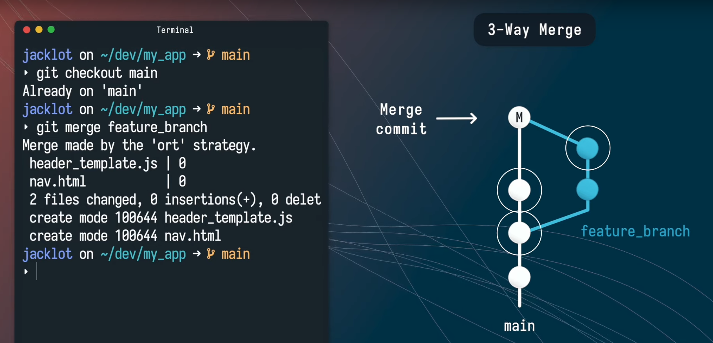

### Three Way Merge from Main to Our Branch

Imagine we've been working very long on our `feature_branch` and our colleagues have substantially modified `main`; thus, we want to have the latest `main` modifications in `feature_branch`:

- to avoid conflicts when we merge our final `feature_branch` to `main`
- because we need features added to `main`

To that end, we perform a 3-Way Merge but from `main` to `feature_branch`:

```bash
# Select the brach we want to merge INTO: our branch
git checkout feature_branch
# Merge the other branch into the selected branch (the one we've checked out)
git merge main
# Default text editor is opened to write commit message: vim
# Write message + ESC :wq
```

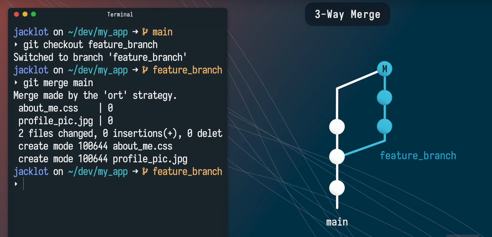

Therefore, a common approach is to use the **Three-Way Merge** but in both directions, i.e., the **Bidirectional Three-Way Merge**: when we finish developing in our `feature_branch` or when we have a milestone:

- First, we merge from `main` into `feature_branch`.
- Then, we merge from `feature_branch` into `main`.

This **Bidirectional Three-Way Merge** is the usual workflow, summarized in [Fork-Branch-Merge Workflow](#fork-branch-merge-workflow).

### Fast-Forward (FF) Merge

The Fast-Forward Merge happens when:

- We have created our `feature_branch` and have been working on it.
- Meanwhile, there where no changes in main.
- We merge `feature_branch` INTO `main`: no merge really occurs in reality, instead the `HEAD` pointer is moved from the last `main` state into the last `feature_branch` state! 

By default, we don't need to specify any commit message, because there no new merge commit, instead the `HEAD` is moved forward into `feature_branch`. Additionally, the `merge` command notifies us it is a `Fast-forward` merge.

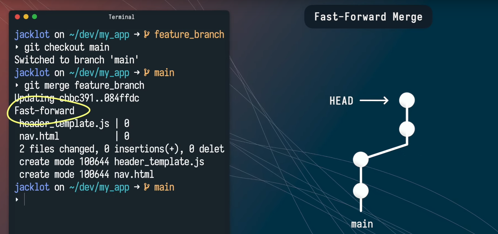

The Fast-Forward Merge is cleaner than the 3-Way Merge, but it has a drawback: we don't preserve in the history that we branched and merged, i.e., our history seems to be linear; to prevent that, i.e., if we want to have a clear history of what happened, we can use the `--no-ff` flag: that way the default editor is opened to write a commit message.

```bash
git checkout main
git merge feature_branch --no-ff
# Write message + ESC :wq
```

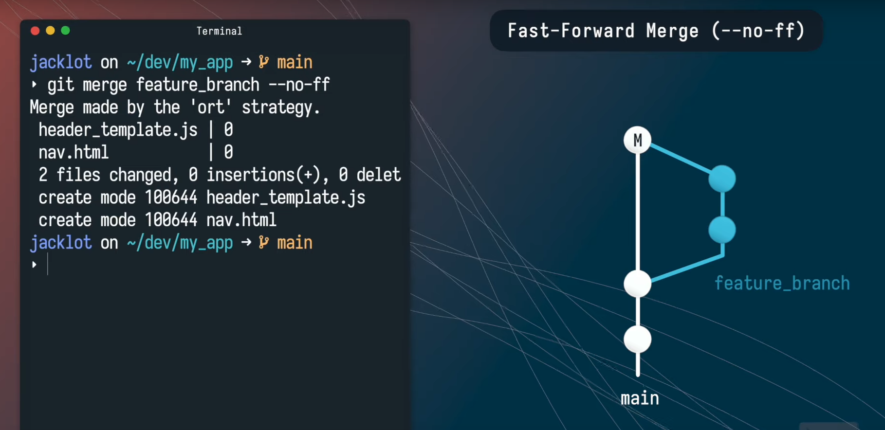

### Rebase (and FF Merge)

Rebasing is a way of integrating the changes from `main` into our `feature_branch` while setting the `HEAD` pointer of the `main` branch in the last state or our `feature_branch`. In other words, it seems like a Fast-Forward Merge from `feature_branch` into `main`.

The typical (or most common) **Rebase Workflow** applied to `main` with changes and `feature_branch` is the following:

```bash
# Select the brach we want to merge FROM: our branch
git checkout feature_branch
# Rebase the other branch: integrate commits from feature_branch into main
git rebase main
# Go to main
git checkout main
# Merge new commits from feature_branch in main: Fast-Forward Merge
git merge feature_branch
# No commit message is required
```

The following happens in the background:

- We have a `main` and a `feature_branch`; `main` has been updated since the branching. We want to merge both branches.
- We run `git rebase main` from the `feature_branch`.
  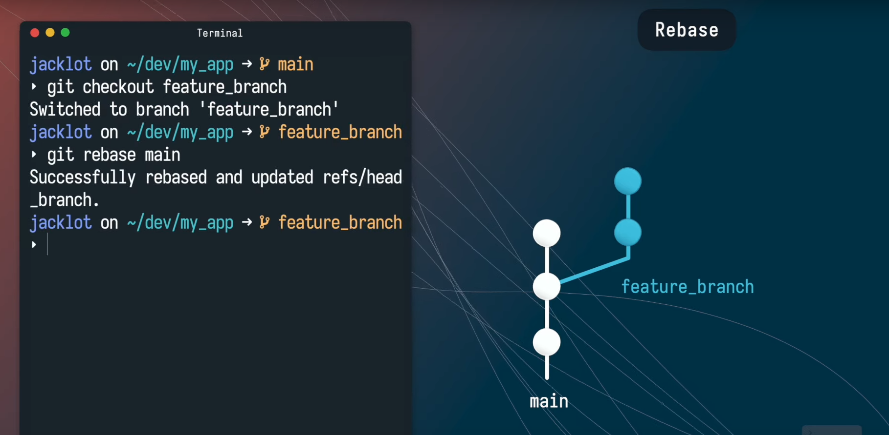
- The `feature_branch` commits are set into a separate holding area.
  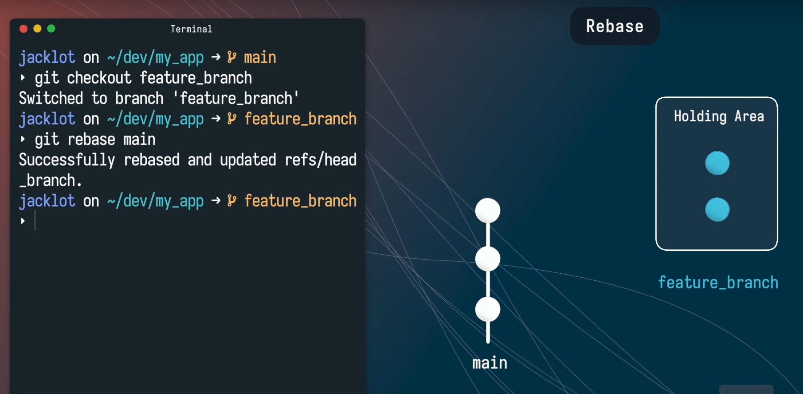
- Git copies one by one all the commits from `feature_branch` into `main`, starting in the latest `main` state; then, the `feature_branch` is removed. Our history is now linear, as it happened with the Fast-Forward Merge!
  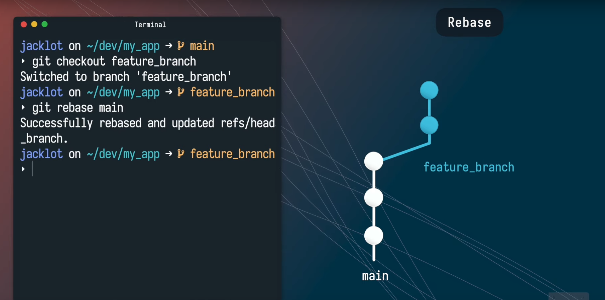
  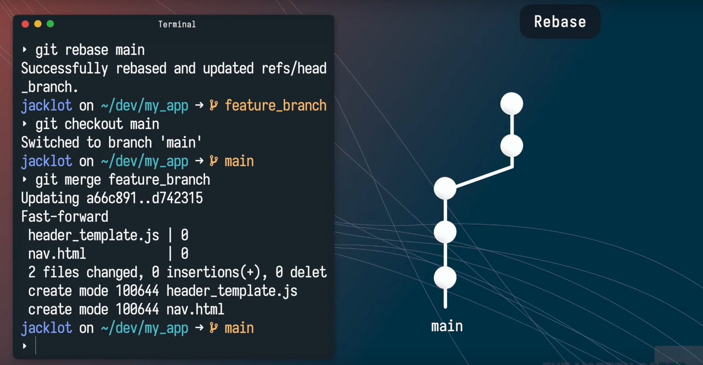

One of the main advantages of using a **Rebase + FF Merge Workflow** instead of the **Bidirectional Three-Way Merge** is that the commit and code change history is much more cleaner:

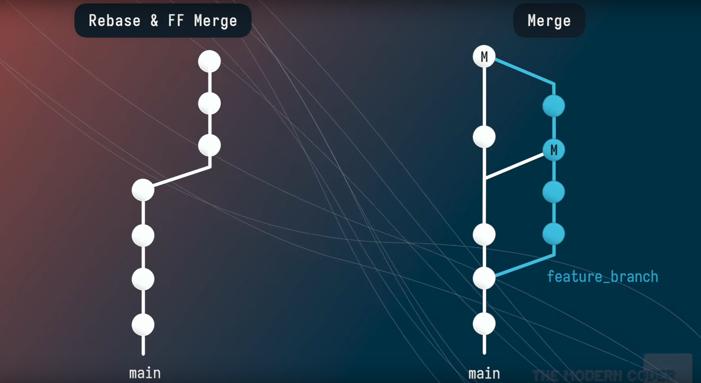

**But** there are some **caveats** when using **Rebase + FF Merge Workflow**:

- We still have the same conflicts we would have in the Three-Way Merge.
- All git commits are immutable, i.e., they cannot be changed; the commits added to main during a rebase are *copies* or their originals, we can check that running `git log --oneline` before and after the rebase: we'll see that the commit hashes are different (i.e., commits are new copies). Having *copy* commits is not an issue if `feature_branch` was used only by me, but it might be an issue if it was used by other people. If we have a *local* `feature_branch` shared with a *remote* `feature_branch`, the *remote* verion might have a different set of commits (e.g., one last one more) when we try to rebase. Therefore, it is not best practice to rely only the **Rebase + FF Merge Workflow** instead of the **Bidirectional Three-Way Merge**. A general recommendation: 
  > Do not rebase commits that exist outside your repository and that people may have based work on.
  


## Resolving Merge Conflicts

Source: [Youtube: Resolve Git MERGE CONFLICTS - The Definitive Guide, by The Modern Coder](https://www.youtube.com/watch?v=Sqsz1-o7nXk).

Most conflicts happen during the [**Three-Way Merge**](#three-way-merge-from-our-branch-to-main) workflow, i.e., when we bidirectionally merge `main <-> feature_branch`, being:

- `main` the reference branch we parted from,
- and `feature_branch` the branch we worked on.


Conflicts occur usually when the same area has been modified in the `main` and the `feature_branch` branches. Git tries to use `automerge` via different algorithms to reolve the conflict, but that might not work always.

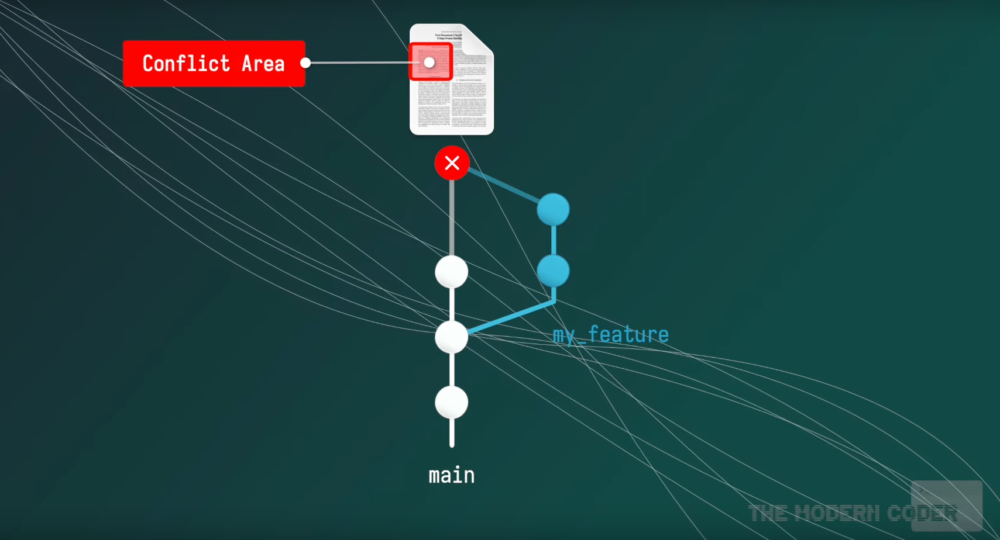

The conflict is triggered by the `merge` command:

```bash
git checkout main
git merge feature_branch
# Two errors can appear
# 1. error: Your local changes to the following files would be overwritten
# 2. Auto-merging ... CONFLICT (content): Merge conflict in ...
```

Two types of errors are displayed by git when a merge conflict occurs, and each requires a different procedure

1. `error: Your local changes to the following files would be overwritten`: Git has not even performed the merge; we can see the conflicting file(s) running `git status`. Solution:

    ```bash
    # Check list of conflicting files, e.g., index.html
    git status
    # Set aside our local changes for later
    # so that they don't interfere
    # BUT we need to merge them later...
    git add .
    git stash
    # We re-try the merge, without our local conflicting changes
    git merge feature_branch
    ```

2. `Auto-merging ... CONFLICT (content): Merge conflict in ...`. This time git did actually try to merge the files, but it failed. Git highlights the conflict areas in all the corresponding files with `<<<===>>>` markers, so we simply need to open them one by one and fix the issues manually. Solution step by step:
    
    Check the conflicting files:
    ```bash
    # Which commits are in conflict?
    git log --merge --oneline
    # Which files are in confict? 
    # We need to open them manually one by one and fix them
    git status # e.g., index.html
    ```
    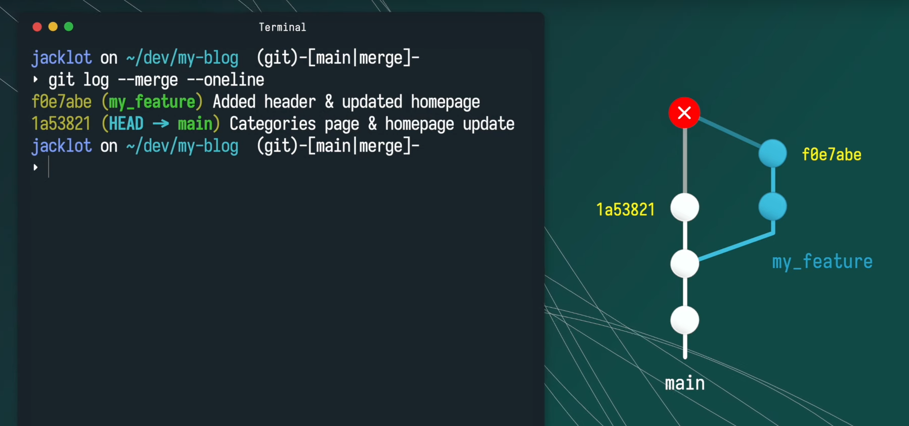

    Open and edit each conflicting file one by one:
    ```bash
    # Open one-by-one all conflicting files
    # look for conflict markers <<<===>>> in them and edit the part
    # - after <<< and until === is the contet in main (first part)
    # - the content between === and >>> is the content in feature_branch (second part)
    vim index.html # ESC :wq
    code index.html # UI selection of parts possible, etc.
    ```
    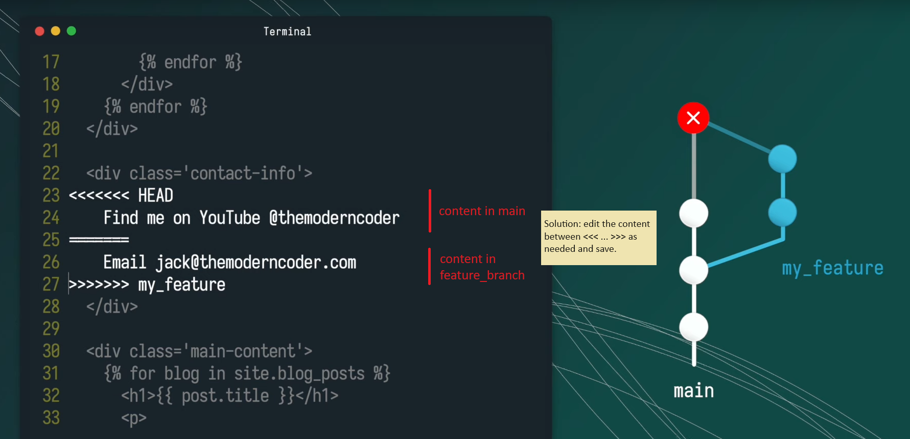
    
    After correct editing, save and commit the new file version:
    ```bash
    git add index.html
    git commit -m "Merged feature_branch with main and fixed merge conflicts."
    ```
    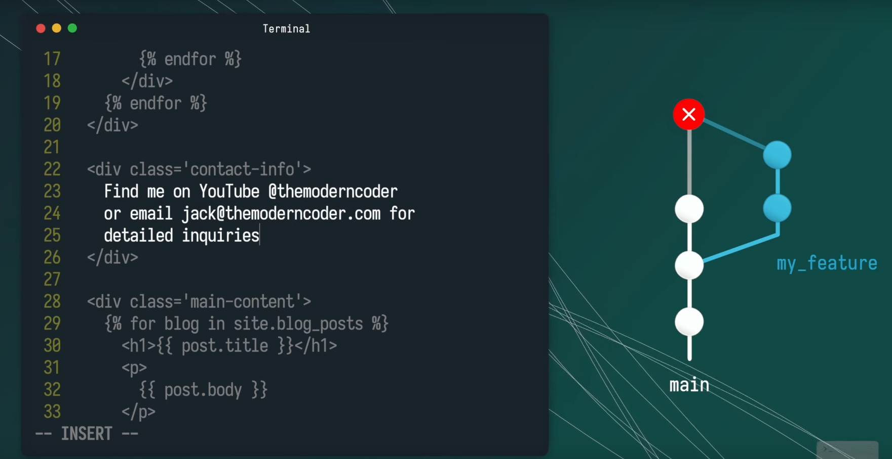

An alternative option is to cancel the merge altogether:

```bash
# This will cancel our merge and git will
# return our status to the point before we started the merge
# That way, we could make some changes, if necessary,
# and re-try again :)
git merge --abort
```

**Summary**:

```bash
# Start Three-Way Merge
git checkout main
git merge feature_branch
# Two errors can appear
# 1. "error: Your local changes to the following files would be overwritten"
# 2. "Auto-merging ... CONFLICT (content): Merge conflict in ..."

# 0. If error 1 occurs: Clear your working directory
git add .
git stash

# 1. If error 2 appears: find out which files are in conflict
git status

# 2. Open files one-by-one and fix conflict marker sections <<<===>>>
vim index.html

# 3. Save and commit those fixed files
git add index.html
git commit -m "Merged feature_branch with main and fixed merge conflicts."

# Alternative: abort merge and return to the state before starting it
git merge --abort
```

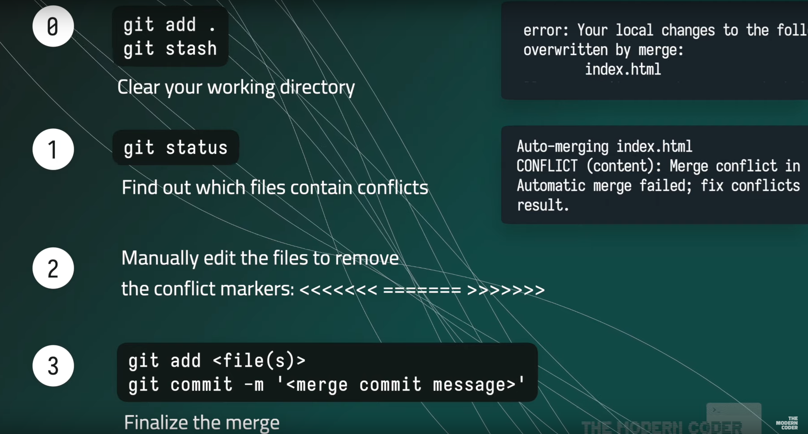


## Artifacts, Binaries, Large Files, Submodules

Do not commit binaries to the repository!

Alternatives:

- Use model registries, artifactories, etc.
- Use [Git LFS](https://git-lfs.com/)
- Use [DVC](https://dvc.org/)

Additionally, if you can separate the project into independent subprojects that can be re-used somewhere else, do it with submodules!

### Model Registries

Check my guide on [MLflow](mxagar/mlflow_guide): [mxagar/mlflow_guide](https://github.com/mxagar/mlflow_guide).

### Git LFS

[Git Large File Storage](https://git-lfs.com/):

> Git Large File Storage (LFS) replaces large files such as audio samples, videos, datasets, and graphics with text pointers inside Git, while storing the file contents on a remote server like GitHub.com or GitHub Enterprise.

Conditions to use LFS:

- The host should have it installed (GitLab or GitHub).
- The user needs to install it locally.
- Any service which is using the repo needs to have it installed (e.g., runners that build container images with the repo).

Local installation:

```bash
git install lfs
```

When committing artifacts/large binaries:

```bash
# We can track one file
git lfs track filename

# Or a pattern of files
git lfs track "*.bin"

# The git lfs track commands update the .gitattributes file
git add .gitattributes
git commit -m "Track *.bin files with Git LFS"

# After those previous steps,
# we can simply add & commit the large files
git add your_large_file.bin
git commit -m "Add a large binary file"
git push origin
```

Note: we cannot track folders, but patterns of files, e.g.:

```bash
# Track
git lfs track "large_files/*.bin"
git lfs track "large_files/*.data"

# Regular commits
git add .gitattributes
git commit -m "Track large files in large_files/ with Git LFS"
```

### DVC

Check my guide on [DVC](https://dvc.org/): [mxagar/tool_guides/dvc](https://github.com/mxagar/tool_guides/tree/master/dvc).

### Git Submodules

Git submodules allow to have an isolated repository A within another repository B. Sometimes this is necessary, because both A and B are independent projects, but B uses A; a concrete example: 

- repository B is a guide with many examples, one of them repository A,
- the repository A is an example app which needs to be deployed using CI/CD tools and should not know B; additionally, the repository A can be used in many other cases, not only for the guide B.

In the following, a concrete workflow is provided with two example repositories:

- App repository A (submodule): [simple_web_app_test](https://github.com/mxagar/simple_web_app_test)
- Guide repository B, aka. *host*: [tool_guides](https://github.com/mxagar/tool_guides)

```bash
# Go to the folder were we'd like to have the submodule
cd .../tool_guides/azure/examples
# Add external repository as submodule to the host repository
git submodule add https://github.com/mxagar/simple_web_app_test simple_web_app_test
# Initialize submodule -> .gitmodules is created in the root of the host/large repository
git submodule update --init --recursive

# Commit the .gitmodules file
git add .
git commit -m "Added the repository in simple_web_app_test as a submodule"
git push

# If the large/host repository is cloned somewhere else, we need to run an additional command
git clone https://github.com/mxagar/tool_guides.git
git submodule update --init --recursive
```

Usage:

- If we use the CLI, inside the submodule folder, we're connected to the submodule repository; outside from it, we're connected to the host repository.
- If we use an IDE (e.g., VSCode), we should see the 2 repositories in the git panel.

Sometimes we might run into dis-synchronization in the large repository wrt. to the other one; in those cases, VSCode shows an inexsistent file with the name of the repository to be committed in the larger repo. To address this issue, we can just committ that file *or* we can update/re-synch the larger repository:

```bash
# Go to the host root directory and get the submodule status
cd .../tool_guides/
git submodule status

# Go to the host root directory and update the module
git submodule update --remote azure/examples/simple_web_app_test
# Commit the update & push
git add azure/examples/simple_web_app_test
git commit -m "Updated submodule to the latest commit"
git push
```

To avoid those synchronization issues:

- Work on the separate submodule in its separate project folder using another IDE.
- Just pull the changes in the host repository to get the last version of the submodule.


## Commit Messages: Best Practices

Check: [git-styleguide](https://udacity.github.io/git-styleguide/).

```
<type>: <Subject>
    type
        feat: a new feature
        fix: a bug fix
        docs: changes to documentation
        style: formatting, missing semi colons, etc; no code change
        refactor: refactoring production code
        test: adding tests, refactoring test; no production code change
        chore: updating build tasks, etc; no production code change
    Subject: 50 chars max
        start capital, use imperative, no . at the end
[<body>]
    optional
    longer text paragraph after space, but as concise as possible
    bullet point can go here
    not all commits require one

[<footer>]
    optional
    indicate which issues or bugs the commit addresses
```

## Readme: Best Practices

How to write *readmes*:

- Tutorial style
- Short getting started examples
  - Usage examples
  - Should get user ready as fast as possible
- Short clear sections
- Short simple sentences
- Links to further information
- License!

Anatomy of a *readme*:

```
Title
    Short description
Installation / Getting Started
    Dependencies
    Installation commands
Usage
    Commands
    Known bugs
Contributing
    Guidelines if people wantto contribute
Code Status
    are all tests passing?
    shields: build/passing
    if necessary
FAQs
    if necessary
License / Copyright
    By default, I have the intelectual property, but it's not bad stating it explicitly if necessary
    Choose appropriate license
```

### Markdown 101

Tool for checking our Markdown text: [https://dillinger.io/](https://dillinger.io/).

```
# Basic Syntax

# Heading level 1, H1
## H2
### H3

This is normal text.
**bold text**
*italicized text*
_italicized text_	
~~strikethrough~~
__underline__
> blockquote
1. First item
2. Second item
3. Third item
- First item
- Second item
- Third item
`code`
---
[title](https://www.example.com)


# Extended Syntax

## Tables
| Syntax | Description |
| ----------- | ----------- |
| Header | Title |
| Paragraph | Text |

## Fenced code block
```
```
{
    "firstName": "John",
    "lastName": "Smith",
    "age": 25
}
```
```

## Fenced code block with syntax highlighting
```
```python
while(True):
    pass
```
```

## Footnotes

Here's a sentence with a footnote. [^1]

[^1]: This is the footnote.

## Heading ID

### My Great Heading {#custom-id}

## Definitions

term
: definition

## Task list

- [x] Write the press release
- [ ] Update the website
- [ ] Contact the media

## Links to files and sections

Files should appear as links: [File](file.md)
README sections should appear as anchor links: [Links to files and sections](#links-to-files-and-sections)

## Collapsable text

For some amazing info, you can checkout the [below](#amazing-info) section.

<details><summary>Click to expand</summary>

## Amazing Info
It would be great if a hyperlink could directly show this title.

</details>

## Badges

Check: [https://shields.io/#your-badge](https://shields.io/#your-badge).

Example:

[](https://shields.io/#your-badge)
```