# Gradio

[Gradio](https://www.gradio.app/)

> is the fastest way to demo your machine learning model with a friendly web interface so that anyone can use it, anywhere!

It is owned and extensively used by [HuggingFace](https://huggingface.co/) and it is quite similar to [Streamlit](https://streamlit.io/) &mdash; check my guide on Streamlit here: [https://github.com/mxagar/streamlit_guide](https://github.com/mxagar/streamlit_guide). However, Gradio is more focused on the usual Machine Learning workflow, where we have a model that can be configured and outputs a result given an input.

This current guide contains my notes on the basic functionalities of [Gradio](https://www.gradio.app/). I created the notes after following the [Hugging Face Bootcamp by JM Portilla, Udemy](https://www.udemy.com/course/complete-hugging-face-bootcamp). I have further notes on more ML/model-related topics referrng to Haggig Face at [mxagar/tool_guides/hugging_face](https://github.com/mxagar/tool_guides/tree/master/hugging_face).

Notes:

- I am adding modified versions of the notebooks used in the bootcamp. I tried to find the original repository to fork it, but unfortunately I didn't find it.
- The slides are public and accessible under [https://drive.google.com/drive/folders/1KPNewt6K68qdwYq5bGAauBVjjx0Mr-zz](https://drive.google.com/drive/folders/1KPNewt6K68qdwYq5bGAauBVjjx0Mr-zz).

Table of contents:

- [Gradio](#gradio)
  - [Setup](#setup)
  - [Introduction](#introduction)
  - [Gradio Components](#gradio-components)
  - [Multiple Components and Layouts](#multiple-components-and-layouts)
    - [Basic Layout](#basic-layout)
    - [Compositions and Alignment of Components](#compositions-and-alignment-of-components)
    - [Tabs](#tabs)
    - [Accordion](#accordion)
    - [Grouping and Dimensions](#grouping-and-dimensions)
    - [Nesting and CSS](#nesting-and-css)
  - [Component Interactions](#component-interactions)
    - [More Complex Programs](#more-complex-programs)
    - [Object-Oriented Programming Style](#object-oriented-programming-style)
  - [Example: Machine Learning Image Classification App](#example-machine-learning-image-classification-app)
  - [Pipeline Integration and Running at HuggingFace](#pipeline-integration-and-running-at-huggingface)
  - [Errors, Warnings, Info](#errors-warnings-info)
  - [Styling Themes](#styling-themes)

## Setup

See [mxagar/tool_guides/hugging_face/udemy_hugging_face](https://github.com/mxagar/tool_guides/tree/master/hugging_face/udemy_hugging_face).

To set up a conda environment, you ca use the co-located [`conda.yaml`](./conda.yaml):

```bash
conda env create -f conda.yaml
conda activate hf
```

Notebooks:

- [`01-Gradio-Introduction.ipynb`](./notebooks/01-Gradio-Introduction.ipynb)
- [`02-Layout.ipynb`](./notebooks/02-Layout.ipynb)
- [`03-Interactions.ipynb`](./notebooks/03-Interactions.ipynb)
- [`04-Image-ML-Integration.ipynb`](./notebooks/04-Image-ML-Integration.ipynb)
- [`05-Text-ML-Integration.ipynb`](./notebooks/05-Text-ML-Integration.ipynb)
- [`06-Modals-Errors.ipynb`](./notebooks/06-Modals-Errors.ipynb)
- [`07-Styling-and-Themes.ipynb`](./notebooks/07-Styling-and-Themes.ipynb)

Usually, GUIs are created in scripts, not in notebooks.
However, for learning puposes, here are shown in notebooks.
Each time we run `gradio.Interface.launch()` a web snippet is embedded in the notebook with the GUI; additionally, we can open the same GUI in `http://127.0.0.1:7860` or a successive port.

## Introduction

Key ideas:

- Gradio is made up by components: text, image, etc.
- Components can be interchangeably input or output components
- We define an interface layout where the components are set.
- Then, we define our Python code which connects to those components.

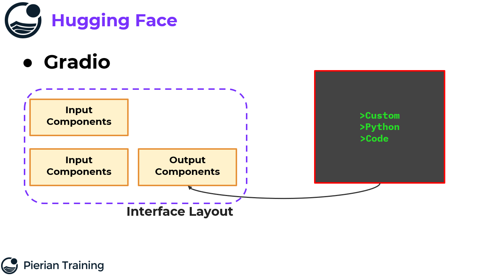

## Gradio Components

Notebook: [`01-Gradio-Introduction.ipynb`](./notebooks/01-Gradio-Introduction.ipynb).

> Gradio includes pre-built [components](https://www.gradio.app/docs/gradio/introduction) that can be used as inputs or outputs in your Interface or Blocks with a single line of code

Original components diagram:

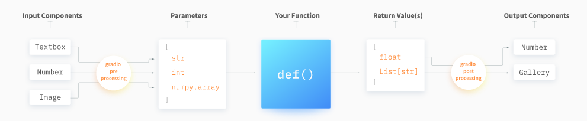

Some of the most common components are:

> - **Number**
> - **Textbox**
> - **Slider**
> - **Image**: Lets users upload an image or take a picture for image processing models.
> - **Dropdown**
> - **Label**: Displays text output. Commonly used to show the result from classification models.
> - **JSON**: Handle JSON data. Ideal for displaying raw model outputs or more complex data structures.
> - **Button**

```python
import gradio as gr

### -- Number

# We need to define a function, which will take
# inputs to process them and generate outputs
def add_numbers(x, y):
    return x + y

import gradio as gr

# We create the GUI just with this line!
# https://www.gradio.app/docs/gradio/interface
iface = gr.Interface(
    fn=add_numbers,
    # Input components
    inputs=[
        gr.Number(10), # gr.Number() can take a default value, label, info, etc.
        gr.Number()
    ], 
    # Output components
    outputs=gr.Number()
)
# When we call the launch method, the GUI will appear (if we're in a notebook)
# and the function will be executed when the user interacts with it
# Otherwise, we'll get a URL where we can access the GUI
# http://127.0.0.1:7860
# If we launch more gr.Interface objects, they will be available in different ports
# The `Flag` button can be used to *flag* outputs for manual review.
# The flagged outputs are stored within the `flagged` directory.
# We have a Submit button: when we click it,
# the inputs will be processed by fn and outputs will be displayed
iface.launch()


### -- Text

def reverse_text(input_text):
    return input_text[::-1]

iface = gr.Interface(fn=reverse_text, inputs=gr.Text(), outputs=gr.Text())
iface.launch()


### -- Slider

def slider_example(value):
    return f"Slider value: {value}"

iface = gr.Interface(fn=slider_example, inputs=gr.Slider(minimum=0, maximum=100), outputs=gr.Text())
iface.launch()


### -- Image

from PIL import Image
import numpy as np

def to_grayscale(input_image):
    # Watch out: gr.Image() is by default a numpy array
    # so we need to expect a numpy array here
    grayscale_image = np.mean(input_image, axis=2, keepdims=True)
    grayscale_image = np.tile(grayscale_image, (1, 1, 3))
    return grayscale_image.astype(np.uint8)

iface = gr.Interface(
    fn=to_grayscale,
    # Watch out: gr.Image() is by default a numpy array
    inputs=gr.Image(),
    outputs=gr.Image()
)
iface.launch()

### -- Dropdown

def handle_dropdown(selection):
    return f"You selected: {selection}"

options = ["Option 1", "Option 2", "Option 3"]
iface = gr.Interface(fn=handle_dropdown, inputs=gr.Dropdown(choices=options), outputs=gr.Text())
iface.launch()


### -- JSON

def number_details(number):
    details = {
        "original": number,
        "squared": number ** 2,
        "sqrt": number ** 0.5,
        "is_even": number % 2 == 0
    }
    return details

iface = gr.Interface(fn=number_details, inputs=gr.Number(), outputs=gr.Json())
iface.launch()


### -- Label

def classify_number(number):
    if number > 0:
        return "Positive"
    elif number < 0:
        return "Negative"
    else:
        return "Zero"

iface = gr.Interface(fn=classify_number, inputs=gr.Number(), outputs=gr.Label())
iface.launch()
```

Some output snapshots:

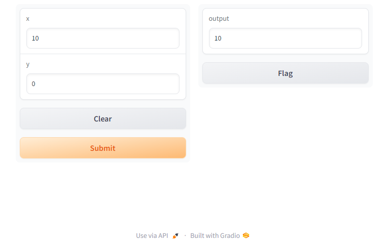

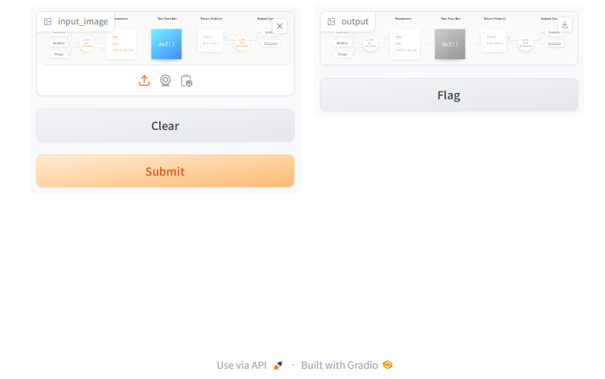

## Multiple Components and Layouts

It is possible to display more than one component or widget. We can achieve that with layouts that consist of blocks, rows and columns:

- The basis object is a **Block** (`gr.Blocks()`).
- Each block can have several **Rows** (`gr.Row()`).
- We can add components to the rows. The components in a row are equally sized/spaced by default, but we can assign to them specific page width fractions. Basically, a row aligns components horizontally.
- We can also add **Columns** (`gr.Column()`) to the rows and components to the columns, with which we can have more flexibility. The columns align components vertically.
- Rows and columns are the scaffolding; we can also leave them empty, which is traduced as empty space in the GUI.
- The users don't see the blocks, rows and/or columns, but only the components nicely outlayed!
- In addition to the mentioned Blocks, Rows and Columns, we also have:
  - `gr.Tab()`: create multiple tabs.
  - `gr.Accordion()`: enables to show/hide content.
  - `gr.Group()`: removes all space between elements.

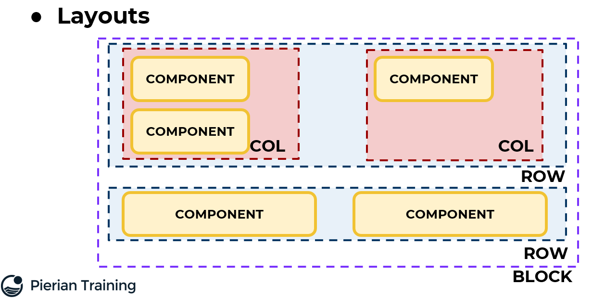

Altogether, gradio provides the following layout blocks:

- [Row](https://www.gradio.app/docs/gradio/row)
- [Column](https://www.gradio.app/docs/gradio/column)
- [Tab](https://www.gradio.app/docs/gradio/tab)
- [Group](https://www.gradio.app/docs/gradio/group)
- [Accordion](https://www.gradio.app/docs/gradio/accordion)

Notebook: [`02-Layout.ipynb`](./notebooks/02-Layout.ipynb).

### Basic Layout

```python
import numpy as np
import gradio as gr

with gr.Blocks() as demo:
    with gr.Row():
        text1 = gr.Text(value="Hello")
        text2 = gr.Text(value="World")

demo.launch() # http://127.0.0.1:7860
```

Note that we don't get a `Submit` button as when we use `gr.Interface.launch()`.


### Compositions and Alignment of Components

```python
import numpy as np
import gradio as gr

with gr.Blocks() as demo:
    with gr.Row():
        # Ratio 2:1 can be defined with scale
        with gr.Column(scale=2):
            text1 = gr.Text()
            text2 = gr.Text()
        with gr.Column(scale=1):
            btn1 = gr.Image()
    with gr.Row():
        with gr.Column(scale=2):
            text1 = gr.Text()
            text2 = gr.Text()

demo.launch() # http://127.0.0.1:7860
```

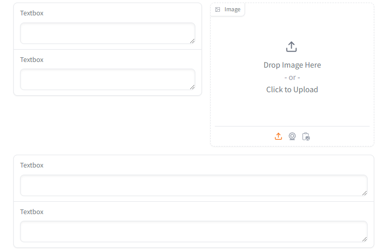

### Tabs

Tabs are overlaid pages. We can click on them to select which one to visualize.

```python
with gr.Blocks() as demo:
    with gr.Tab("Tab1"):
        gr.Button("Some Button in Tab 1")
    with gr.Tab("Tab2"):
        with gr.Row():
            gr.Button("Some Button in Tab 2")
            gr.Image()

demo.launch() # http://127.0.0.1:7860
```

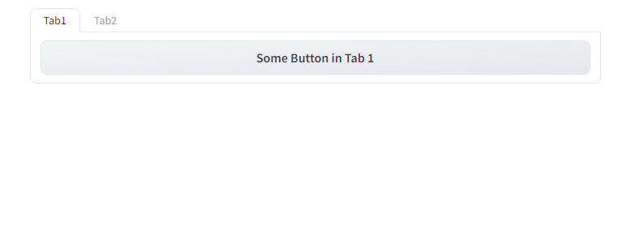

### Accordion

Accordion allows to hide/show content: it is a small arrow which expands the content.

```python
with gr.Blocks() as demo:
    gr.Label("Load Image")
    # Accordion allows to hide/show content
    # open=False means that content is hidden by default
    # It is a small arrow upon which you can click to show/hide content
    with gr.Accordion("Load Image", open=False):
        gr.Image()

demo.launch()
```

### Grouping and Dimensions

Groups pack components together and remove space and padding between them.

```python
with gr.Blocks() as demo:
    with gr.Group():
        gr.Button("Some Button")
        gr.Button("Some Button2")
        gr.Image()
    gr.Image() # http://127.0.0.1:7860

demo.launch()
```

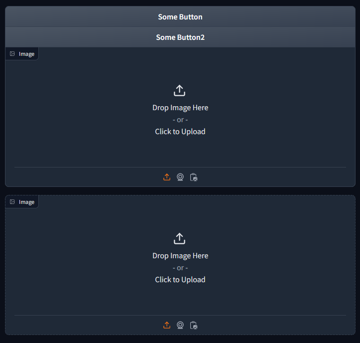

Also, the size of some components can be modified; note, however, that the components size is automatically adjusted depending on the window size.

```python
with gr.Blocks() as demo:
    with gr.Group():
        gr.Image(height="150px", width="20px")
demo.launch()
```

### Nesting and CSS

We can add a CSS template as a string to perform more complex nestings.

```python
with gr.Blocks(css=css) as demo:
    with gr.Row():
        text1 = gr.Text(label="Text 1")
        text2 = gr.Text(label="Text 2")
        image1 = gr.Image(label = "Image1")
    with gr.Row():
        with gr.Column():
            label1 = gr.Label(label="These labels are")
            label2 = gr.Label(label="below each other")
        with gr.Column():
            label3 = gr.Label(label="Note this new column")

demo.launch() # http://127.0.0.1:7860
```

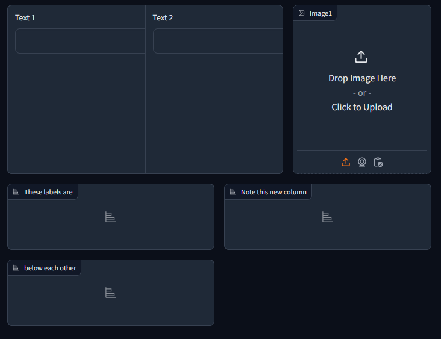

## Component Interactions

Recall that we automatically achieve interactions with `gr.Interface`, for which we need:

- inputs
- outputs
- and a function that converts inputs to outputs.

When `gr.Interface` is instantiated, a `Submit` button is added and clicking on it causes the intereaction to occur.

In general, interactions between components can be triggered by

- events that are *catched* (e.g., **clicking** a button)
- or **changes** that are *listened* (e.g., slider); however, better to use events to prevent unnecessarily calling expensive processing functions.

```python
def multiply(x, y):
    return x*y

with gr.Blocks() as demo:
    with gr.Row():
        slider1 = gr.Slider()
        slider2 = gr.Slider()
    with gr.Row():
        result = gr.Text() # result is an output of the function!
        # It seems it takes the value in the widget
        # but in reality we write it here because
        # it's the output of function that processes the input from the sliders!

    # This is our interaction: when the sliders change, the result will update
    # We pass: inputs, outputs and the function
    # Also, we can be listening to multiple changes!
    slider1.change(fn=multiply, inputs=[slider1, slider2], outputs=result)
    slider2.change(fn=multiply, inputs=[slider1, slider2], outputs=result)

demo.launch() # http://127.0.0.1:7860
```

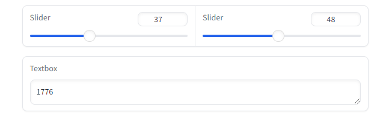

```python
def multiply(x, y):
    return x*y

with gr.Blocks() as demo:
    with gr.Row():
        slider1 = gr.Slider()
        slider2 = gr.Slider()
    with gr.Row():
        button = gr.Button("Multiply")
    with gr.Row():
        result = gr.Text() # result is an output of the function!
        # It seems it takes the value in the widget
        # but in reality we write it here because
        # it's the output of function that processes the input from the sliders!

    # Better to use clicks as triggers of interactions
    # because that way the user controls when the fn function is called
    # which can be very expensive (e.g., inference with a model)
    button.click(fn=multiply, inputs=[slider1, slider2], outputs=[result])
    # Of course, we can have multiple buttons calling different functions!

demo.launch() # http://127.0.0.1:7860
```

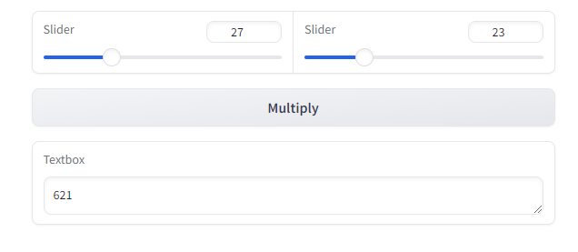


```python
# We can easily have multiple functions, inputs, outputs, etc.
def multiply(x, y):
    return x*y

def addition(x, y):
    return x+y

with gr.Blocks() as demo:
    with gr.Row():
        slider1 = gr.Slider()
        slider2 = gr.Slider()
    with gr.Row():
        button_multiply = gr.Button("Multiply")
        button_addition = gr.Button("Addition")

    with gr.Row():
        result = gr.Text() # result is an output of the function!
        # It seems it takes the value in the widget
        # but in reality we write it here because
        # it's the output of function that processes the input from the sliders!

    button_multiply.click(fn=multiply, inputs=[slider1, slider2], outputs=[result])
    button_addition.click(fn=addition, inputs=[slider1, slider2], outputs=[result])

demo.launch() # http://127.0.0.1:7860
```

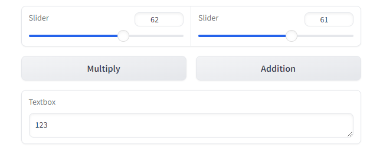

### More Complex Programs

```python
def create_result_string(i1, i2):
    return f"{i1} is the squared value and {i2} is the square root!"

def square_root_input(input_value):
    return input_value ** 0.5

def square_input(input_value):
    return input_value**2

def main(input_value):
    # Call function 2 on input 1
    input_value_squared = square_input(input_value)
    input_value_root = square_root_input(input_value)
    return create_result_string(input_value_squared, input_value_root)
    

with gr.Blocks() as demo:
    with gr.Row():
        slider1 = gr.Slider()
    with gr.Row():a
        button = gr.Button("Start program!")

    with gr.Row():
        result = gr.Label() # result is an output!

    button.click(fn=main, inputs=[slider1], outputs=[result])

demo.launch() # http://127.0.0.1:7860
```

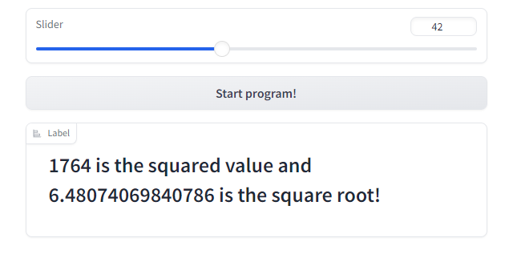

### Object-Oriented Programming Style

```python
class Calculator:
    def __init__(self):
        pass
    
    @staticmethod
    def multiply(x, y):
        return x*y
    
    @staticmethod
    def addition(x, y):
        return x+y

calc = Calculator()

with gr.Blocks() as demo:
    with gr.Row():
        slider1 = gr.Slider()
        slider2 = gr.Slider()
    with gr.Row():
        button_multiply = gr.Button("Multiply")
        button_addition = gr.Button("Addition")

    with gr.Row():
        result = gr.Text()

    button_multiply.click(fn=calc.multiply, inputs=[slider1, slider2], outputs=[result])
    button_addition.click(fn=calc.addition, inputs=[slider1, slider2], outputs=[result])

demo.launch() # http://127.0.0.1:7860
```

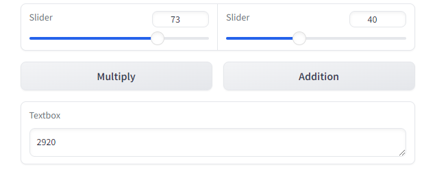

## Example: Machine Learning Image Classification App

In this example a ResNet18 model is used in a GUI created with Gradio.

Notebook: [`05-Text-ML-Integration.ipynb`](./notebooks/05-Text-ML-Integration.ipynb).

```python
from PIL import Image
import numpy as np
import gradio as gr

# These lines of code can be obtained from the official HF model page
# https://huggingface.co/microsoft/resnet-18
# Click on "Use this model" and also check the section "How to use"
from transformers import AutoImageProcessor, AutoModelForImageClassification

image_processor = AutoImageProcessor.from_pretrained("microsoft/resnet-18")
model = AutoModelForImageClassification.from_pretrained("microsoft/resnet-18")

# As always with Gradio, we create a function
def classify_image(image):
    # Apply the transformations to the image
    image = image_processor(image, return_tensors="pt")["pixel_values"]
    # Predict the class with the highest probability
    prediction = model(image).logits
    # Convert class index to label: ImageNet-1k
    return model.config.id2label[prediction.argmax().item()]

iface = gr.Interface(
    fn=classify_image,
    inputs=gr.Image(),
    outputs=gr.Label(), # predicted label returned by fn
    title="Real-time Image Classifier",
    description="Upload an image to classify it into one of 1000 classes",
    live=True
)
iface.launch() # http://127.0.0.1:7860
```

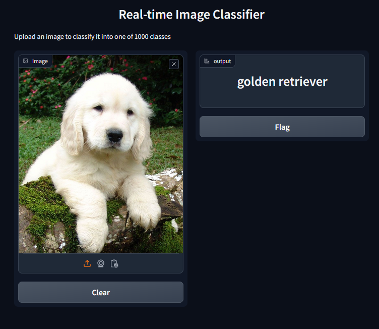

## Pipeline Integration and Running at HuggingFace

Using a `pipeline` is straightforward: we just call it inside a function. However, Gradio offers also the possibility of using `gr.load()`, which runs a pipeline at HuggingFace!

Notebook: [`05-Text-ML-Integration.ipynb`](./notebooks/05-Text-ML-Integration.ipynb).

```python
import gradio as gr

# Run the model locally
from transformers import pipeline

# Load the sentiment analysis pipeline
sentiment_analysis = pipeline("sentiment-analysis", model="distilbert-base-uncased-finetuned-sst-2-english")

def predict_sentiment(text):
    result = sentiment_analysis(text)
    return result[0]["label"], result[0]["score"]

iface = gr.Interface(
    fn=predict_sentiment,
    inputs=gr.Textbox(lines=2, placeholder="Type a sentence here..."),
    outputs=[gr.Label(label="Sentiment"), gr.Text(label="Score")],
    title="Sentiment Analysis",
    description="Enter a sentence to analyze its sentiment. The model can predict positive or negative sentiments."
)
iface.launch()

```

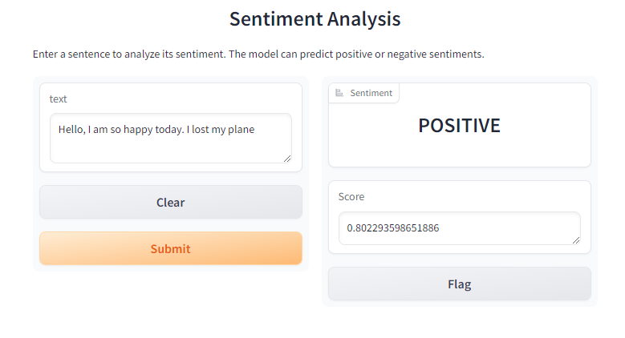

The equivalent demo using `gr.load()` so that we get the same wen GUI but the model/pipeline is running at HuggingFace:

```python
# Access the model within the hugging face ecosystem
demo = gr.load(
  "distilbert-base-uncased-finetuned-sst-2-english",
  src="models" # we need to specify models or a space
)
demo.launch()
```

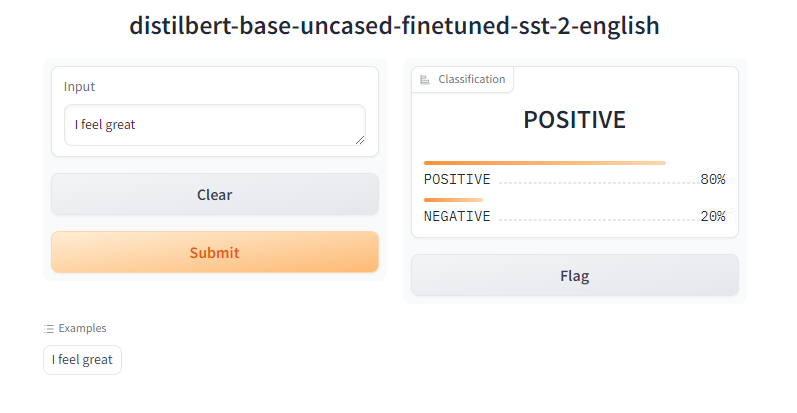

## Errors, Warnings, Info

TBD.

## Styling Themes

TBD.
