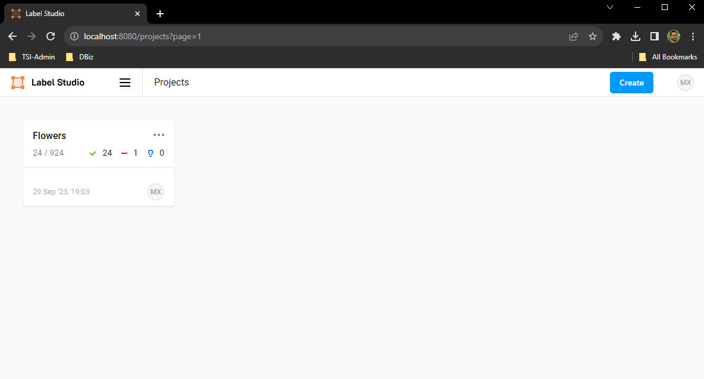
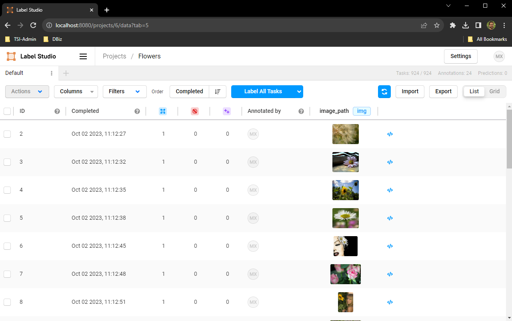
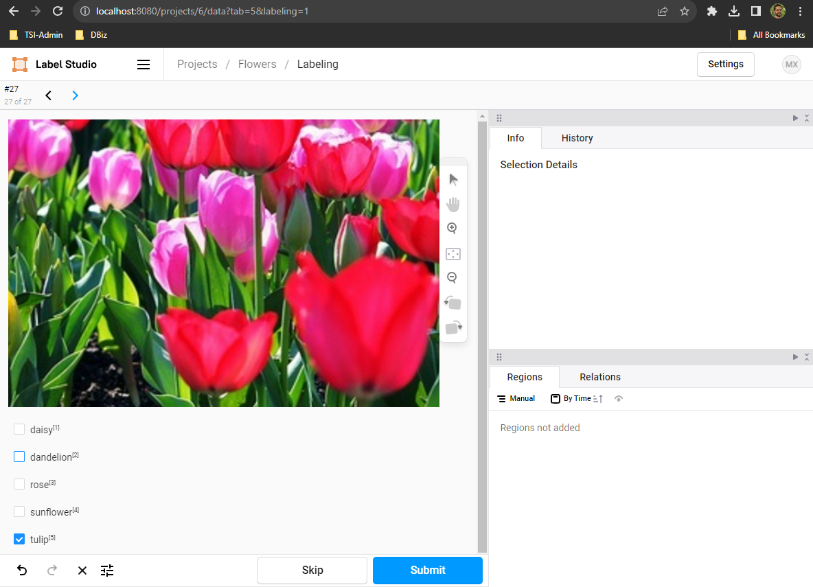

# Label Studio

[Label Studio](https://labelstud.io/) is a tool for data labeling. There are two versions at the moment:

- Community edition (free), used here; it runs locally.
- Enterprise cloud service edition (price unknown); hosted by them.

The tool has many useful functionalities:

- Labeling many data formats and applications:
  - Computer Vision: Classification, Segmentation, Object Detection, Keypoints, OCR, Image Captioning, etc.
  - NLP: Classification, QA, Translation, Summarization, etc.
  - Audio: Speech Recognition, etc.
  - Videos
  - ...
- We can add a Machine Learning Backend which assists the labeling.
- There is an SDK with which we can label programmatically.
- etc.

This guide focuses mainly on image labeling.

Table of contents:

- [Label Studio](#label-studio)
  - [Installation and Basic Setup](#installation-and-basic-setup)
    - [Create a Project](#create-a-project)
    - [Serve the Images as URLs](#serve-the-images-as-urls)
    - [Basic Usage: Label and Export Annotations](#basic-usage-label-and-export-annotations)
  - [More Advanced Usage](#more-advanced-usage)
    - [Import Pre-Annotated Datasets](#import-pre-annotated-datasets)
    - [Machine Learning Backend](#machine-learning-backend)
    - [Basic SDK Usage](#basic-sdk-usage)
  - [Notes on Examples and Use-Cases](#notes-on-examples-and-use-cases)
    - [Object Detection](#object-detection)
    - [Semantic Segmentation](#semantic-segmentation)


## Installation and Basic Setup

There are several ways of seting Label Studio up:

- `pip install`
- Docker
- Compilation from source

I tried two options and found complications with both:

- The `pip` local installation has sometimes issues with the `sqlite3.dll` library; the only way I managed to solve it is to create a new fresh conda environment using the committed `conda.yaml`.
- The docker container works right away, but its access to the local machine is restricted. The docker container will create a volume in the local folder we call docker from: `/mydata`. That might be an issue if we want to access images outside from that volume. However, not that the usual way of accessing to data/images is via a web server.

More information: [Install and upgrade](https://labelstud.io/guide/install.html).

```bash
# Create or activate your preferred python environment
conda env create -f conda.yaml
conda activate label

# If not done yet, install Label Studio
pip install --user label-studio
# If on Windows, add to Path the correct URL to be able to locate the binary
# C:\Users\<User>\AppData\Roaming\Python\Python39\Scripts

# Start Label Studio
label-studio start
# Open Browser at http://localhost:8080

#### -- Alternative: Docker Container

cd path/to/project
# Mac, Linux, WSL2
docker run -it -p 8080:8080 -v $(pwd)/mydata:/label-studio/data heartexlabs/label-studio:latest
# Windows PowerShell
docker run -it -p 8080:8080 -v ${PWD}/mydata:/label-studio/data heartexlabs/label-studio:latest label-studio --log-level DEBUG
# Open Browser at http://localhost:8080

# Shut down
# Ctrl+C
# Stop
docker stop label-studio
docker rm label-studio
docker ps

```

### Create a Project

For testing puposes, I used the [Flowers dataset](https://www.kaggle.com/datasets/imsparsh/flowers-dataset) from Kaggle, placed in the local folder `data/flowers` (not committed).

Label Studio can work with local files, i.e., we drag and drop the images we would like to use, for instance. However, **the most common/advised way is to serve those images (e.g., with a web server) and provide the URLs to Label Studio.**

The official guide suggests these steps after we launch Label Studio:

> - (Open the Label Studio UI at http://localhost:8080.)
> - Sign up with an email address and password that you create.
> - Click `Create` to create a project and start labeling data.
> - Name the project, and if you want, type a description and select a color.
> - Click Data Import and upload the data files that you want to use. **If you want to use data from a local directory, cloud storage bucket, or database, skip this step for now.**
> - Click Labeling Setup and choose a template and customize the label names for your use case. There are many options:
    - Computer Vision: Classification, Segmentation, Object Detection, Keypoints, OCR, Image Captioning, etc.
    - NLP: Classification, QA, Translation, Summarization, etc.
    - Audio: Speech Recognition, etc.
    - Videos
    - ...
> - Click `Save` to save your project.

We can access to the **Project Settings** clicking on the `...` icon.
In the project settings, in the *Labeling Interface*, we edit the UI with an XML code:

```xml
<View>
  <Image name="image" value="$image_path" zoom="true" zoomControl="true" rotateControl="true"/>
  <Choices name="class" toName="image">
    <Choice value="daisy"/>
    <Choice value="dandelion"/>
    <Choice value="rose"/>
    <Choice value="sunflower"/>
    <Choice value="tulip"/>
  </Choices>
</View>
```

Note the field `$image_path`.

### Serve the Images as URLs

As mentioned, Label Studio can work with local image paths, but the usual/recommended way of working is with image URLs, being images served via a web server, for instance. These are the steps I followed to achieve that serving:

- Using [`utils.ipynb`](./utils.ipynb), I created a CSV with all file URLs based on a local path.
- Using [`serve_local_files.py`](./serve_local_files.py) I served the images from a local path with a web server using CORS.

The web server is built with Flask; the `SERVER_DIRECTORY` specified in both files must be the same.

Effectively, we serve the image in such a way that they can be opened with a web browser:

    SERVER_DIRECTORY
        C:/Users/Msagardi/git_repositories/tool_guides/labelstudio/data/
    Original path
        ${SERVER_DIRECTORY}/flowers/test/Image_10.jpg
    URL: We can open the image one the browser
        http://localhost:8000/flowers/test/Image_10.jpg

Once the CSV is generated, we open the project in Label Studio and hit `Import`. Then, the image entries are generated.

In the following, the contents of the mentioned files are attached.

[`utils.ipynb`](./utils.ipynb)

```python
import os
import csv

def list_image_files(directory, server_directory,  base_url="http://localhost:8000/"):
    """
    Recursively lists all image URLs from a local server for the images in the given directory and its subdirectories.

    :param directory: Path to the directory.
    :param server_directory: Path to the directory from which the server is started.
    :return: List of URLs to image files served from a local server.
    """
    
    # List of common image extensions
    image_extensions = ['.jpg', '.jpeg', '.png', '.bmp', '.gif', '.tiff', '.webp']

    # Recursively walk through the directory
    image_urls = []
    for dirpath, _, filenames in os.walk(directory):
        for filename in filenames:
            if any(filename.lower().endswith(ext) for ext in image_extensions):
                # Convert file path to a URL path
                relative_path = os.path.relpath(os.path.join(dirpath, filename), server_directory)
                web_path = relative_path.replace('\\', '/')
                full_url = base_url + web_path
                
                image_urls.append(full_url)
                
    return image_urls

def save_to_csv(image_paths, output_file):
    """
    Save list of image paths to a CSV file.

    :param image_paths: List of image paths.
    :param output_file: Path to the output CSV file.
    """
    with open(output_file, 'w', newline='') as csvfile:
        csv_writer = csv.writer(csvfile)
        csv_writer.writerow(["image_path"])  # Writing the header
        for path in image_paths:
            csv_writer.writerow([path])

directory_path = 'C:/Users/Msagardi/git_repositories/tool_guides/labelstudio/data/flowers/test/'
server_directory = 'C:/Users/Msagardi/git_repositories/tool_guides/labelstudio/data'
image_paths = list_image_files(directory_path, server_directory)
print(image_paths[:5]) # ['http://localhost:8000/flowers/test/Image_1.jpg', 'http://localhost:8000/flowers/test/Image_10.jpg', ...

# Save CSV with image URLs
output_csv_path = 'image_paths.csv'
save_to_csv(image_paths, output_csv_path)

# Now, in ./serve_local_files.py, we need to set
#   SERVER_DIRECTORY = server_directory
# and execute it:
#   python serve_local_files.py
# With that, we're going to get the images served in the URLs
```

[`serve_local_files.py`](./serve_local_files.py)

```python
from flask import Flask, send_from_directory
from flask_cors import CORS

SERVER_DIRECTORY = 'C:/Users/Msagardi/git_repositories/tool_guides/labelstudio/data/'

app = Flask(__name__)
CORS(app)  # This will enable CORS for all routes

@app.route('/<path:path>')
def serve_file(path):
    return send_from_directory(SERVER_DIRECTORY, path)

if __name__ == '__main__':
    app.run(port=8000)

```

### Basic Usage: Label and Export Annotations

When the images are served and the project is created, we can click on it in the project dashboard and perform several actions in the project list overview:

- `Import` the CSV with the image URLs; then, the images are listed automatically. Images or samples are tasks.
- `Label All Tasks`: label the images with the custom UI we have defined in the project creation (accessible in the `Settings`).
- `Export` the labelled images as a CSV or JSON.







The exported CSV looks like this (for some reason, empty lines are added):

```csv
"annotation_id","annotator","class","created_at","id","image_path","lead_time","updated_at"
2,"1","dandelion","2023-10-02T09:12:27.480432Z",2,"http://localhost:8000/flowers/test/Image_10.jpg",16.135,"2023-10-02T09:12:27.480432Z"
3,"1","daisy","2023-10-02T09:12:32.337558Z",3,"http://localhost:8000/flowers/test/Image_100.jpg",4.559,"2023-10-02T09:12:32.337662Z"
4,"1","sunflower","2023-10-02T09:12:35.580605Z",4,"http://localhost:8000/flowers/test/Image_101.jpg",2.977,"2023-10-02T09:12:35.580605Z"
...
```

## More Advanced Usage

### Import Pre-Annotated Datasets

:construction:

TBD.

### Machine Learning Backend

:construction:

TBD.

### Basic SDK Usage

:construction:

TBD.

## Notes on Examples and Use-Cases

### Object Detection

:construction:

TBD.

### Semantic Segmentation

:construction:

TBD.
