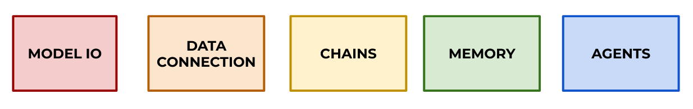
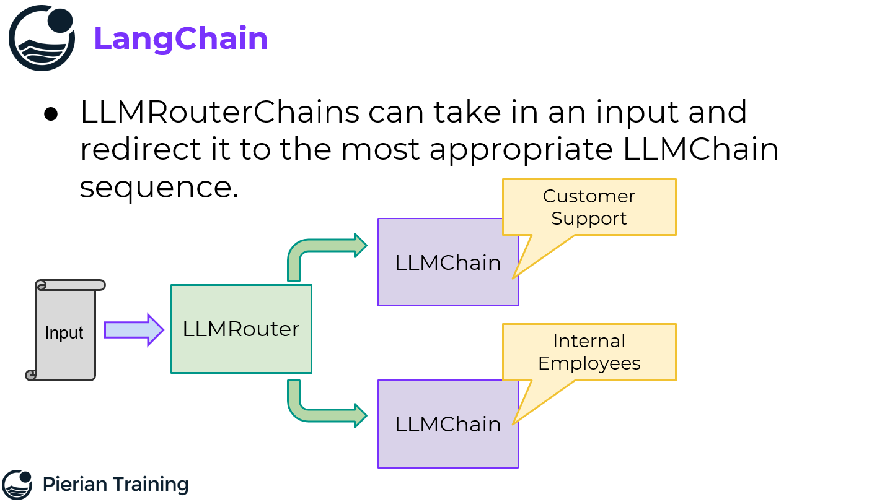

# LangChain Udemy Course Notes

> [LangChain](https://python.langchain.com) is a framework for developing applications powered by language models. It enables applications that are:
>
> - Data-aware: connect a language model to other sources of data, i.e., we integrate external data
> - Agentic: allow a language model to interact with its environment via decision making.

The idea is that we have several modules with different functionalities which are used in chains to accomplish tasks. Check the official

- [use cases](https://python.langchain.com/docs/use_cases),
- list of [modules](https://python.langchain.com/docs/modules/),
- list of [integrations](https://python.langchain.com/docs/integrations,
- and the latest [conceptual guide](https://python.langchain.com/v0.2/docs/concepts/).

Note that LangChain uses models from other frameworks/vendors, such as OpenAI, Cohere, HuggingFace, etc; these are called **integrations**. As such, we need to have the specific keys or access tokens of those vendors. This mini-tutorial uses `dotenv` to load the keys defined in the `.env` file (not committed):

```
OPENAI_API_KEY=xxx
HUGGINGFACEHUB_API_TOKEN=xxx
```

This guide part is a compilation of my notes on the [LanChain Bootcamp by JM Portilla, Udemy](https://www.udemy.com/course/langchain-with-python-bootcamp).

If you are looking for a quick start guide, please look at [`../01_introduction/`](../01_introduction/); instead, if you'd like to get a broader overview, this is your part/section.

Notes:

- I am adding modified versions of the notebooks used in the bootcamp. I tried to find the original repository to fork it, but unfortunately I didn't find it.
- The slides are public and accessible under [https://drive.google.com/drive/folders/1Kh3-3-aS_xtYhK73sVeXNTyFGREgub_U](https://drive.google.com/drive/folders/1Kh3-3-aS_xtYhK73sVeXNTyFGREgub_U).

Table of contents:

- [LangChain Udemy Course Notes](#langchain-udemy-course-notes)
  - [1. Introduction](#1-introduction)
    - [Setup](#setup)
    - [OpenAI](#openai)
    - [Documentation](#documentation)
  - [2. Model IO](#2-model-io)
    - [Large Language Models (LLMs) and Chatbots](#large-language-models-llms-and-chatbots)
    - [Prompt Templates](#prompt-templates)
    - [Few Shot Prompt Templates](#few-shot-prompt-templates)
    - [Parsing Outputs](#parsing-outputs)
    - [Serialization of Prompts: Saving and Loading](#serialization-of-prompts-saving-and-loading)
  - [3. Data Connections](#3-data-connections)
    - [Document Loading](#document-loading)
    - [Document Transformers](#document-transformers)
    - [Text Embedding](#text-embedding)
    - [Vector Stores](#vector-stores)
    - [Retrievers and Multi-Query Retrievers](#retrievers-and-multi-query-retrievers)
    - [Context Compression](#context-compression)
    - [Example: US Constitution Helper](#example-us-constitution-helper)
  - [4. Chains](#4-chains)
    - [LLMChain](#llmchain)
    - [SimpleSequentialChain](#simplesequentialchain)
    - [SequentialChain](#sequentialchain)
    - [LLMRouterChain](#llmrouterchain)
    - [TransformChain](#transformchain)
    - [OpenAI Function Calling](#openai-function-calling)
    - [LLMMathChain](#llmmathchain)
    - [Additional Chains: QAChains](#additional-chains-qachains)
    - [Example: Processing Emails](#example-processing-emails)
  - [5. Memory](#5-memory)
    - [ChatMessageHistory](#chatmessagehistory)
    - [ConversationBufferMemory](#conversationbuffermemory)
    - [ConversationBufferWindowMemory](#conversationbufferwindowmemory)
    - [ConversationSummaryBufferMemory](#conversationsummarybuffermemory)
  - [6. Agents](#6-agents)
    - [Agent Basics](#agent-basics)
    - [Agent Tools](#agent-tools)
    - [Custom Tools](#custom-tools)
    - [Conversation Agents](#conversation-agents)

## 1. Introduction

LangChain is not only a Python library, but also a package for other languages, e.g., Javascript. If we're going to use Python, we should stick to its documentation only:

[https://python.langchain.com/](https://python.langchain.com/)

The functionalities of the library are organized in **Modules** (Python) or **Components** (general). However, the Python documentation seems to use the word **Components**, which are:

> - Chat models
> - LLMs
> - Messages
> - Prompt templates
> - Example selectors
> - Output parsers
> - Chat history
> - Documents
> - Document loaders
> - Text splitters
> - Embedding models
> - Vector stores
> - Retrievers
> - Tools
> - Toolkits
> - Agents
> - Callbacks

This guide is built to reach the ultimate goals of dealing with **Agents**. However, that's the last section; beforehand, other more basic modules are shown:



- Model IO: standardized wrapper for models: local, APIs, etc. Thanks to the interface, we can easily switch the underlying model without many changes in the code.
- Data Connections: standardized wrapper for data storage and data sources. Again, vector databases can be changed easily, as well as data containers (e.g., S3, folder, etc.).
- Chains: outputs from one model can be linked as inputs for another one.
- Memory: save conversation histories, outputs, etc.
- Agents: they combine all the previous modules to autonomously perform tasks, even using tools! We can create our own custom tools, too.

### Setup

First, create a Python environment, e.g, with Conda:

```bash
# Create environment + activate it
conda env create --file conda.yaml
conda activate llms

# If we add packages to the YAML
conda env update --name llms --file conda.yaml --prune
```

Additionally, we'll need to set up OpenAI and HuggingFace accounts:

- Get the access tokens from both and save them in `.env`: `OPENAI_API_KEY, HUGGINGFACEHUB_API_TOKEN`
- Set a payment method in the OpenAI account and fill in the balance if we choose the pay-as-you-go option; and make sure what the pricing of our queries is!

If everything is setup correctly, we'll need to load the API keys from `.env`:

```python
import os
from dotenv import load_dotenv
load_dotenv()

hf_token = os.getenv("HUGGINGFACEHUB_API_TOKEN")
openai_token = os.getenv("OPENAI_API_KEY")
```

### OpenAI

The Playground, Docs and Examples from the OpenAI API/Platform page are very interesting

[https://platform.openai.com](https://platform.openai.com)

We can 

- test different models with different parameters
- fine-tune models
- etc.

If everything is setup correctly, we can use the `openai` library as follows:

```python
import os
from openai import OpenAI
from dotenv import load_dotenv
load_dotenv()

openai_token = os.getenv("OPENAI_API_KEY")
client = OpenAI(api_key=openai_token)

response = client.completions.create(
    model="gpt-3.5-turbo-instruct",
    prompt="Translate the following English text to French: 'Hello, how are you?'",
    max_tokens=60
)

print(response.choices[0].text)
# Salut, comment vas-tu ?
```

### Documentation

Important links:

- [Conceptual Guide](https://python.langchain.com/v0.2/docs/concepts/): where the packages, components and techniques are explained.
- [Integrations](https://python.langchain.com/v0.2/docs/integrations/platforms/): where bindings are listed.
- [API Reference](https://api.python.langchain.com/en/latest/langchain_api_reference.html).

:warning: **IMPORTANT NOTES:

- There seem to be some deprecations / API updates in the OpenAI library.
- This guide is very focused on OpenAI; however, we can instead use Google models by checking the examples in the [Integrations](https://python.langchain.com/v0.2/docs/integrations/platforms/) page.

## 2. Model IO

With the Model IO module, we can easily interchange the underlying models; we can even benchmark them before choosing one.

Contents:

- LLMs and Chatbots
- Prompt Templates
- Few Shot Prompt Templates
- Parsing Outputs
- Serialization: Saving and Loading Prompts

### Large Language Models (LLMs) and Chatbots

Notebook: [`00-Models-IO/00-Large-Language-Models.ipynb`](./00-Models-IO/00-Large-Language-Models.ipynb):

- LLM and Chat models: common calls, parameters
- Caching

```python
### -- LLMs
# !pip install langchain-openai
from langchain_openai import OpenAI, ChatOpenAI
# The OpenAI refers to the LLM, which is often an instruct model and returns raw text
# while ChatOpenAI refers to the Chatbot, which is often a conversation model and uses 3 distinct objects
# - SystemMessage: General system tone, personality
# - HumanMessage: Human request/reply
# - AIMessage: AI's response

llm = OpenAI(openai_api_key=openai_token) # default model: gpt-3.5-turbo-instruct
chat = ChatOpenAI(openai_api_key=openai_token) # default model: gpt-3.5-turbo

# We can use both the LLM and the Chat, but the reponse structure is different
# The tendency is to move towards Chats
print(llm.invoke('Here is a fun fact about Pluto:')) # Raw text: Pluto was discovered on February 18...
print(chat.invoke('Here is a fun fact about Pluto:')) # AIMessage object: {content: 'response', response_metadata: '', ...}

# Generate needs to be always a list
result = llm.generate(
    ['Here is a fun fact about Pluto:',
     'Here is a fun fact about Mars:']
)

# We can also use generate with a Chat model
result_chat = chat.generate(
    ['Here is a fun fact about Pluto:',
     'Here is a fun fact about Mars:']
)

# We get back a LLMResult object, both for llm and chat
type(result) # langchain_core.outputs.llm_result.LLMResult

# Schema of LLMResult
result.schema()

# The results are in the property generations
for g in result.generations:
    print(g[0].text)
    # Pluto was...
    # Mars has...

# Here we can see the metadata related to the operation
result.llm_output
# {'token_usage': {'total_tokens': 63, 'completion_tokens': 47, 'prompt_tokens': 16},
#  'model_name': 'gpt-3.5-turbo-instruct'}

### -- Chats and Parameters

# ChatOpenAI refers to the Chatbot, which is often a conversation model and uses 3 distinct objects
# - SystemMessage: General system tone, personality
# - HumanMessage: Human request/reply
# - AIMessage: AI's response
# The trend is towards using Chat models, not LLMs
from langchain_openai import ChatOpenAI

chat = ChatOpenAI(openai_api_key=openai_token)

from langchain.schema import (
    AIMessage,
    HumanMessage,
    SystemMessage
)

# The correst way of interacting with chat in OpenAI
# is to use the correct Message object: HumanMessage, SystemMessage
result = chat.invoke([HumanMessage(content="Can you tell me a fact about Earth?")])

type(result) # langchain_core.messages.ai.AIMessage
print(result.content) # Sure! One interesting...

# We can alter the personality or role of the chat with SystemMessage
result = chat.invoke(
    [
        SystemMessage(content='You are a very rude teenager who only wants to party and not answer questions'),
        HumanMessage(content='Can you tell me a fact about Earth?')
    ]
)

print(result.content) # Ugh, I don't know, like, why do you care? ...

# Generate needs to receive a list
# We can pass different message objects, though: SystemMessage, HumanMessage
# And each item can be a list, i.e., a chat history!
result = chat.generate(
    [[SystemMessage(content='You are a University Professor'),
      HumanMessage(content='Can you tell me a fact about Earth?')
      ]]
)

result.generations[0][0].text # Certainly! A fascinating fact...

# Extra params and arguments
# - temperature: creativity
# - presence_penalty: penalize token repetition
# - max_tokens: maximum number of tokens
result = chat.invoke(
    [HumanMessage(content='Can you tell me a fact about Earth?')],
    temperature=2, # default: 0.7, 2 is very high, so it will hallucinate rubbish
    presence_penalty=1,
    max_tokens=100
)

### -- Caching

# Caching is helpful when we're doing the same query several times:
# we incur in new costs, but the answer should be the same!
# The solution is to cache them, i.e., save the results.
# We can cache in memory, or we could also use a SQLite DB for that
# https://python.langchain.com/v0.1/docs/modules/model_io/chat/chat_model_caching/#sqlite-cache
import langchain
from langchain_openai.chat_models import ChatOpenAI

llm = ChatOpenAI(openai_api_key=openai_token)

# !pip install langchain-community
from langchain.cache import InMemoryCache, SQLiteCache
langchain.llm_cache = InMemoryCache()

# The first time, it is not yet in cache, so it should take longer
llm.invoke("Tell me a fact about Mars")
# You will notice this reply is instant!
llm.invoke('Tell me a fact about Mars')

```

### Prompt Templates

Notebook: [`00-Models-IO/01-Prompt-Templates.ipynb`](./00-Models-IO/01-Prompt-Templates.ipynb):

We can use prompt templates to define parametrized messages/instructions for the chatbot. These are an alternative to using f-string literals.

**Personal opinion**: I have the impression that most of these prompt templates are an excessive wrapping that in many cases is not really necessary.

```python
### -- LLM Models

from langchain import PromptTemplate

# Instead of using f-string literals (add formating them),
# we can create prompt temaplates
# An example prompt with multiple input variables (but we can have no or one input)
multiple_input_prompt = PromptTemplate(
    input_variables=["topic", "level"], 
    template="Tell me a fact about {topic} for a student {level} level."
)
multiple_input_prompt.format(topic='Mars',level='8th Grade')
# 'Tell me a fact about Mars for a student 8th Grade level.'

### -- Chat Models

from langchain_openai import ChatOpenAI

chat = ChatOpenAI(openai_api_key=api_key)

# For chat type models, we need specific prmpt template classes
from langchain.prompts import (
    ChatPromptTemplate,
    PromptTemplate,
    SystemMessagePromptTemplate,
    AIMessagePromptTemplate,
    HumanMessagePromptTemplate,
)
from langchain.schema import (
    AIMessage,
    HumanMessage,
    SystemMessage
)

# We can automatically create a prompt from a string
system_template = "You are an AI recipe assistant that specializes in {dietary_preference} dishes that can be prepared in {cooking_time}."
system_message_prompt = SystemMessagePromptTemplate.from_template(system_template)
# input_variables is automatically extracted from the template
system_message_prompt.input_variables # ['cooking_time', 'dietary_preference']

human_template = "{recipe_request}"
human_message_prompt = HumanMessagePromptTemplate.from_template(human_template)
human_message_prompt.input_variables # human_message_prompt.input_variables

# Now, we can create a chat prompt template from the system and human message prompts
chat_prompt = ChatPromptTemplate.from_messages([system_message_prompt, human_message_prompt])
chat_prompt.input_variables

# Get a chat completion from the formatted messages
prompt = chat_prompt.format_prompt(cooking_time="15 min", dietary_preference="Vegan", recipe_request="Quick Snack").to_messages()
# [SystemMessage(...), HumanMessage(...)]

result = chat.invoke(prompt)
print(result.content)
# How about making a simple and delicious Avocado Toast? Here's a quick recipe for you: ...

### -- Exercise / Example

from langchain_openai.chat_models import ChatOpenAI
from langchain.prompts import (
    ChatPromptTemplate,
    PromptTemplate,
    SystemMessagePromptTemplate,
    AIMessagePromptTemplate,
    HumanMessagePromptTemplate,
)

def travel_idea(interest,budget):
    '''
    INPUTS:
        interest: A str interest or hobby (e.g. fishing)
        budget: A str budget (e.g. $10,000)
    '''
    # PART ONE: SYSTEM
    system_template="You are an AI Travel Agent that helps people plan trips about {interest} on a budget of {budget}"
    system_message_prompt = SystemMessagePromptTemplate.from_template(system_template)
    # PART TWO: HUMAN REQUEST
    human_template="{travel_help_request}"
    human_message_prompt = HumanMessagePromptTemplate.from_template(human_template)
    # PART THREE: COMPILE TO CHAT
    chat_prompt = ChatPromptTemplate.from_messages([system_message_prompt, human_message_prompt])
    # PART FOUR: INSERT VARIABLES
    request = chat_prompt.format_prompt(interest=interest, budget=budget, travel_help_request="Please give me an example travel itinerary").to_messages()
    # PART FIVE: CHAT REQUEST
    chat = ChatOpenAI(openai_api_key=api_key)
    result = chat.invoke(request)
    return result.content

```

### Few Shot Prompt Templates

Notebook: [`00-Models-IO/04-Few-Shot-Prompt-Templates.ipynb`](./00-Models-IO/04-Few-Shot-Prompt-Templates.ipynb).

Few-show prompting means giving some examples to the chatbot in the prompt. There is a way of achieveing that with the presented tools.

```python
from langchain_openai.chat_models import ChatOpenAI
from langchain import PromptTemplate, LLMChain
from langchain.prompts.chat import (
    ChatPromptTemplate,
    SystemMessagePromptTemplate,
    AIMessagePromptTemplate,
    HumanMessagePromptTemplate,
)
from langchain.schema import AIMessage, HumanMessage, SystemMessage

# System prompt: we define the role and overall task
template = "You are a helpful assistant that translates complex legal terms into plain and understandable terms."
system_message_prompt = SystemMessagePromptTemplate.from_template(template)

# Noe we need example input and output to train the model, i.e., Human-AI pairs
legal_text = "The provisions herein shall be severable, and if any provision or portion thereof is deemed invalid, illegal, or unenforceable by a court of competent jurisdiction, the remaining provisions or portions thereof shall remain in full force and effect to the maximum extent permitted by law."
example_input_one = HumanMessagePromptTemplate.from_template(legal_text)
plain_text = "The rules in this agreement can be separated. If a court decides that one rule or part of it is not valid, illegal, or cannot be enforced, the other rules will still apply and be enforced as much as they can under the law."
example_output_one = AIMessagePromptTemplate.from_template(plain_text)

# Now, we define the real human prompt we're going to use, which is basically the legal text!
human_template = "{legal_text}"
human_message_prompt = HumanMessagePromptTemplate.from_template(human_template)

# Finally, the complete prompt is the list
# system_message_prompt, example_input_one, example_output_one, human_message_prompt
chat_prompt = ChatPromptTemplate.from_messages(
    [system_message_prompt, example_input_one, example_output_one, human_message_prompt]
)

chat_prompt.input_variables # ['legal_text']

# Now, we format the prompt with the variable
some_example_text = "The grantor, being the fee simple owner of the real property herein described, conveys and warrants to the grantee, his heirs and assigns, all of the grantor's right, title, and interest in and to the said property, subject to all existing encumbrances, liens, and easements, as recorded in the official records of the county, and any applicable covenants, conditions, and restrictions affecting the property, in consideration of the sum of [purchase price] paid by the grantee."
request = chat_prompt.format_prompt(legal_text=some_example_text).to_messages()

result = chat.invoke(request)
print(result.content) # The person giving the property, who owns it completely, is transferring and...
```

### Parsing Outputs

Notebook: [`00-Models-IO/05-Parsing-Output.ipynb`](./00-Models-IO/05-Parsing-Output.ipynb).

Sometimes we want to structure the output from the chat in a certain way, e.g., convert it into a JSON, a datetime object, etc. We have tools to achieve that. Some format parsers:

- JSON
- XML
- CSV: CommaSeparatedListOutputParser
- YAML
- PandasDataFrame
- Enum
- Pydantic
- Datetime
- ...

Sometimes the output parsers don't work because the model outputs some more text. We can fix that with several methods:

- System prompt: we explicitly highlight the format.
- We can use `OutputFixingParser`, which re-requests to the model to reformat the answer.

Also, regarding the `Pydantic` parser/format, check the section [OpenAI Function Calling](#openai-function-calling). According to the [official documentation](https://platform.openai.com/docs/guides/function-calling):

> In an API call, you can describe functions and have the model intelligently choose to output a JSON object containing arguments to call one or many functions. The Chat Completions API does not call the function; instead, the model generates JSON that you can use to call the function in your code. Example: `extract_data(name: string, birthday: string)`.

```python
from langchain.prompts import (
    PromptTemplate, 
    SystemMessagePromptTemplate,
    ChatPromptTemplate, 
    HumanMessagePromptTemplate
)
from langchain_openai import ChatOpenAI

model = ChatOpenAI(openai_api_key=api_key)

### -- List Parsing

# List Parsing: we want to have a list as an output
# We can browse all the parsers with TAB 
# https://python.langchain.com/v0.1/docs/modules/model_io/output_parsers/
# - JSON
# - XML
# - CSV: CommaSeparatedListOutputParser
# - YAML
# - PandasDataFrame
# - Enum
# - Pydantic
# - Datetime
# - ...
from langchain.output_parsers import CommaSeparatedListOutputParser
output_parser = CommaSeparatedListOutputParser()

# The instructions are really a string 
format_instructions = output_parser.get_format_instructions()
print(format_instructions) # Your response should be a list of comma separated values, eg: `foo, bar, baz` or `foo,bar,baz`

# However, the parser has also the method parse() which parses a correctly formatted string
reply = "one, two, three"
output_parser.parse("one, two, three") # ['one', 'two', 'three']

# The prompt is a string with two placeholders: {request} and {format_instructions}
human_template = '{request}\n{format_instructions}' # \n new line is a good idea
human_prompt = HumanMessagePromptTemplate.from_template(human_template)

# Now, we can create a chat prompt
chat_prompt = ChatPromptTemplate.from_messages([human_prompt])
chat_prompt.format_prompt(request="give me 5 characteristics of dogs",
                   format_instructions = output_parser.get_format_instructions())

# Note: the request needs to line up with the instructions!
request = chat_prompt.format_prompt(
    request="give me 5 characteristics of dogs",
    format_instructions = output_parser.get_format_instructions()).to_messages()

result = model.invoke(request)

# We get back a string but it should follow the instructions
result.content # 'Loyal, playful, protective, social, obedient'

# Convert to desired output
output_parser.parse(result.content) # ['Loyal', 'friendly', 'playful', 'protective', 'intelligent']

### -- Pydantic Objects

from langchain.output_parsers import PydanticOutputParser
from pydantic import BaseModel, Field

# First, we define the Pydantic class
# We want to get objects that line up with these fields
class Scientist(BaseModel):
    name: str = Field(description="Name of a Scientist")
    discoveries: list = Field(description="Python list of discoveries")

# This is our NL query
query = 'Name a famous scientist and a list of their discoveries' 

# Pydantic parser
parser = PydanticOutputParser(pydantic_object=Scientist)

print(parser.get_format_instructions()) # The output should be formatted as a JSON instance...

# Prompt template
prompt = PromptTemplate(
    template="Answer the user query.\n{format_instructions}\n{query}\n",
    input_variables=["query"],
    partial_variables={"format_instructions": parser.get_format_instructions()},
)

# We modify the template with the query
input_prompt = prompt.format_prompt(query=query)
# Run the model
output = model.invoke(input_prompt.to_string()) # Sometimes lowering the temperature helps
# Parse
parser.parse(output.content) # A Scientist object is returned!
```

### Serialization of Prompts: Saving and Loading

Notebook: [`00-Models-IO/06-Serialization-Saving-Prompts.ipynb`](./00-Models-IO/06-Serialization-Saving-Prompts.ipynb).

We save prompt templates as JSON files and load them later.

```python
import os
from langchain.prompts import (
    PromptTemplate,
    ChatPromptTemplate,
    HumanMessagePromptTemplate
)
from langchain import PromptTemplate

from langchain_openai import OpenAI
model = OpenAI(openai_api_key=api_key)


# We can save a prompt template to a JSON with .save()
template = "Question: {question}\n\nAnswer: Let's think step by step."
prompt = PromptTemplate(template=template, input_variables=["question"])
prompt.save("prompt.json")

# All prompts are loaded through the `load_prompt` function.
from langchain.prompts import load_prompt
loaded_prompt = load_prompt('prompt.json')
loaded_prompt # PromptTemplate(input_variables=['question'],

```

The JSON file [`prompt.json`](./00-Models-IO/prompt.json):

```json
{
    "name": null,
    "input_variables": [
        "question"
    ],
    "optional_variables": [],
    "input_types": {},
    "output_parser": null,
    "partial_variables": {},
    "metadata": null,
    "tags": null,
    "template": "Question: {question}\n\nAnswer: Let's think step by step.",
    "template_format": "f-string",
    "validate_template": false,
    "_type": "prompt"
}
```

## 3. Data Connections

Contents:

- Document Loading and Integrations
- Document Transformers
- Text Embedding
- Vector Stores
- Queries and Retrievers

### Document Loading

There are many [Document Loaders](https://python.langchain.com/v0.2/docs/integrations/document_loaders/) available in LangChain: CSV, PDF, Word, TXT, HTML, etc. We need to manually install the dependencies of each of them.

Similarly, we have many [Integrations](https://python.langchain.com/v0.2/docs/integrations/platforms/): AWS S3, ElasticSearch, MongoDB, IBM, Pinecone, Wikipedia,s etc. Each integration is different and we should look at the documentation. In some cases, the integrations might be broken, because the providers have changed something and LangChain has not updated the interfaces yet.

Usually, any document format (CSV, HTML, PDF, etc.) is loaded as a `Document` object.

Notebooks: 

- [`01-Data-Connections/00-Document-Loaders.ipynb`](./01-Data-Connections/00-Document-Loaders.ipynb): CSV, HTML, PDF
- [`01-Data-Connections/01-Document-Integration-Loader.ipynb`](./01-Data-Connections/01-Document-Integration-Loader.ipynb): Hacker News integration and example
- [`01-Data-Connections/03-Document-Loading-Exercise-Solution.ipynb`](./01-Data-Connections/03-Document-Loading-Exercise-Solution.ipynb): Wikipedia integration and example

```python
### -- CSV
from langchain.document_loaders import CSVLoader

# Lazy loader: not loaded until .load() is called
loader = CSVLoader('some_data/penguins.csv')

# Now occurs the loading
data = loader.load()

type(data) # List of Document objects
# We work with Document objects, which are essentially dictionaries with some extra methods
# No matter the format, the data is always returned as a list of Document objects

# Document 0
data[0]

# Print metadata and the content of the first document
print(data[0].metadata) # {'source': 'some_data/penguins.csv', 'row': 0}
print(data[0].page_content)
# species: Adelie
# island: Torgersen
# ...

### -- HTML

from langchain.document_loaders import BSHTMLLoader

loader = BSHTMLLoader('some_data/some_website.html')
data = loader.load()

### -- PDF

# PDFs in particular, might lead to reading errors, e.g., 
# wrong formatting, images replaed by placeholders, etc.
# We can always use the PyPDF2 library to extract the text from a PDF file
# and the load the text as a Document
from langchain.document_loaders import PyPDFLoader

loader = PyPDFLoader('some_data/SomeReport.pdf')
pages = loader.load_and_split()

pages[0]
print(pages[0].page_content)

### -- Integrations - Example: Hacker News

from langchain.prompts import (
    ChatPromptTemplate,
    SystemMessagePromptTemplate,
    HumanMessagePromptTemplate,
)
from langchain_openai.chat_models import ChatOpenAI

model = ChatOpenAI(openai_api_key=api_key)

human_prompt = HumanMessagePromptTemplate.from_template('Please give me a single sentence summary of the following:\n{document}')

chat_prompt = ChatPromptTemplate.from_messages([human_prompt])

result = model.invoke(chat_prompt.format_prompt(document=data[0].page_content).to_messages())

result.content
# 'Nicholast was a multi-talented individual with interests in jazz music, juggling, unicycling, and inventing various contraptions, whose papers are still relevant in fields such as information theory and artificial intelligence.'

### -- Integrations - Example: Wikipedia

# https://python.langchain.com/v0.2/docs/integrations/document_loaders/wikipedia/

from langchain.prompts import (
    ChatPromptTemplate,
    SystemMessagePromptTemplate,
    HumanMessagePromptTemplate,
)
from langchain_openai.chat_models import ChatOpenAI
from langchain.document_loaders import WikipediaLoader


def answer_question_about(person_name: str, question: str, model=None) -> str:
    '''
    Use the Wikipedia Document Loader to help answer questions about someone,
    insert it as additional helpful context.
    '''
    # Get Wikipedia Article
    docs = WikipediaLoader(query=person_name,load_max_docs=1)
    context_text = docs.load()[0].page_content
    
    # Connect to OpenAI Model
    if model is None:
        #load_dotenv()
        api_key = os.getenv("OPENAI_API_KEY")
        model = ChatOpenAI(openai_api_key=api_key)
    
    # Ask Model Question
    human_prompt = HumanMessagePromptTemplate.from_template('Answer this question\n{question}, here is some extra context:\n{document}')
    
    # Assemble chat prompt
    chat_prompt = ChatPromptTemplate.from_messages([human_prompt])
    
    #result
    result = model.invoke(chat_prompt.format_prompt(question=question,document=context_text).to_messages())
    
    print(result.content)

model = ChatOpenAI(openai_api_key=api_key)
answer_question_about("Claude Shannon", "When was he born?", model)

```

### Document Transformers

Document transformers split document strings into chunks so that they can be processed later on. Keep in mind these chunks and usually encoded into vector embeddings and the length of the sequences fed to the encoder models has often a limit.

Notebook: [`01-Data-Connections/04-Document-Transformers.ipynb`](./01-Data-Connections/04-Document-Transformers.ipynb).

```python
# https://api.python.langchain.com/en/latest/character/langchain_text_splitters.character.CharacterTextSplitter.html
from langchain.text_splitter import CharacterTextSplitter
# We can use the CharacterTextSplitter to split the text into smaller chunks
# - based on separator characters (e.g., new line) or the number of characters in each chunk 
# - based on the number of tokens in each chunk

with open('some_data/FDR_State_of_Union_1944.txt') as file:
    speech_text = file.read()

# Characters: 21995
len(speech_text)

# Words: 3750
len(speech_text.split())

### -- Split by character

# We can separate upon a particular character: \n\n, ##, etc.
text_splitter = CharacterTextSplitter(
    separator="\n\n", # default
    chunk_size=1000 # 1000 is default value
)
# The text is split into chunks when separator=\n\n is found or every chunk_size=1000 characters
# However, if the characters between the separators are much less than chunk_size, the separators are ignored.
# In fact, I think chunk_size preceeds?

texts = text_splitter.create_documents([speech_text])
print(type(texts)) # list
print(type(texts[0])) # Document
print(len(texts[0].page_content.split())) # 152 words
print('\n')
print(texts[0].page_content) # complete chunk text

### -- Split by Token

# Now chunk size is a hard length based on tokens
text_splitter = CharacterTextSplitter.from_tiktoken_encoder(chunk_size=500)

texts = text_splitter.split_text(speech_text)

# In contrast to the previous CharacterTextSplitter,
# if we use tiktoken the output is a text string!
type(texts[0]) # str

print(len(texts[0].split())) # 411 words ~ 500 tokens
```

### Text Embedding

Text embeddings are vector representations of texts. Usually semantic embeddings are used, i.e., similar texts yield similar vectors, in such a way, that algebra operations are possible with the vectors.

This guide uses [OpenAI Text Embeddings](https://python.langchain.com/v0.1/docs/integrations/text_embedding/openai/), but many more are possible.

Embedding models are not compatible between each other.

Notebook: [`01-Data-Connections/05-Text-Embedding.ipynb`](./01-Data-Connections/05-Text-Embedding.ipynb).

```python
import numpy as np
from langchain_openai.embeddings import OpenAIEmbeddings
from langchain.document_loaders import CSVLoader

# Embedding model
# To use the OpenAI model, we need to have defined OPENAI_API_KEY as environment variable
# https://platform.openai.com/docs/guides/embeddings
# Default model: text-embedding-ada-002
# Dimension: 1536
embeddings = OpenAIEmbeddings()

text = "Some normal text to send to OpenAI to be embedded into a N dimensional vector"
embedded_text = embeddings.embed_query(text)

# The returned vector is a list
type(embedded_text) # list
len(embedded_text) # 1536

# We can convert the list into an array
embedding_array = np.array(embedded_text)
embedding_array.shape # (1536,)

## -- Embedding a Document

loader = CSVLoader('some_data/penguins.csv')
# This loads a list of Document objects
# Each Document is a row in the CSV
data = loader.load()
type(data) # list
type(data[0]) # langchain_core.documents.base.Document

# Unfortunately, we cannot pass a list of Documents
# but we need to pass a list of strings, i.e., page_content
embedded_docs = embeddings.embed_documents([text.page_content for text in data])

len(embedded_docs) # 344 (rows)
len(embedded_docs[0]) # Embedding dimension
```

### Vector Stores

We want to persist/store embedding vectors and be able to access them easily, even with similarity queries. We can do that with a **vector store**:

- We can store large N-dimensional vectors.
- We can index a vector and its text string.
- Given a new query vector not in the DB, we can run similarity searches in the DB.
- We can easily add/update/delete vectors.

Popular vector stores:

- [ChromaDB](https://www.trychroma.com/)
- [FAISS (Meta): Facebook AI Similarity Search](https://github.com/facebookresearch/faiss)
- [Elasticsearch with k-NN Plugin](https://www.elastic.co/guide/en/elasticsearch/reference/current/knn-search.html)
- [Pinecone](https://www.pinecone.io/)
- [Weaviate](https://weaviate.io/)
- [ScaNN (Google)](https://github.com/google-research/google-research/tree/master/scann)
- [Annoy (Spotify): Approximate Nearest Neighbors Oh Yeah](https://github.com/spotify/annoy)
- [PGVector: Vector Plugin for Postgres](https://python.langchain.com/v0.2/docs/integrations/vectorstores/pgvector/)

Here, we use **ChromaDB**.

Notebook: [`01-Data-Connections/06-Vector-Store.ipynb`](./01-Data-Connections/06-Vector-Store.ipynb).

```python
from langchain_openai import OpenAIEmbeddings
from langchain.text_splitter import CharacterTextSplitter
from langchain.vectorstores import Chroma
from langchain.document_loaders import TextLoader

# Load the document and split it into chunks
loader = TextLoader("some_data/FDR_State_of_Union_1944.txt")
documents = loader.load()

# Split it into chunks
text_splitter = CharacterTextSplitter.from_tiktoken_encoder(chunk_size=500)
docs = text_splitter.split_documents(documents)

# The variable OPENAI_API_KEY needs to bet set in the environment
embedding_function = OpenAIEmbeddings()

# Load it into Chroma; we pass:
# - the documents
# - the embedding function or Embeddings class/object
# - the directory where the DB is persisted
db = Chroma.from_documents(docs,
                           embedding_function,
                           persist_directory='./speech_embedding_db')
# The persisted folder contains
# - a SQLite database
# - two parquet files with the embeddings and the texts
# - index files

# Here, we load a persisted DB, i.e.,
# we CONNECT to persisted DB
db_connection = Chroma(persist_directory='./speech_embedding_db',
                       embedding_function=embedding_function)

# Query the DB
# WARNING: Do not use questions, but rather statements
# because this is not a chat, but a similarity search
# based on the cosine similarit of the embeddings
new_doc = "What did FDR say about the cost of food law?"

# We can do it with the string or the vector of the string
# Default top k = 4
# We get as result Document objects of the chunks
# that were passed to the vector store
docs = db_connection.similarity_search(new_doc)

len(docs) # 4
type(docs[0]) # langchain_core.documents.base.Document

# Show the content of the first document
print(docs[0].page_content) # A continuation ...

# Important: for each chunk, we can get the original document
print(docs[0].metadata) # {'source': 'some_data/FDR_State_of_Union_1944.txt'}
```


### Retrievers and Multi-Query Retrievers

Vector stores are passed as retrievers to different modules when we use them.

When we convert a vector store into a retriever, we get access to standardized retriever methods that can be used for querying and searching.

Additionally, in some cases, the phrasing in our query is not optimal; we can use an LLM to generate multiple variations of it. That way, we rather focus on ideas and not in the exact phrasing. That is achieved with **MultiQueryRetrievers**. Note, however, that in a Multi-Query Retriever an LLM generates query variations, so we should decrease its temeprature if we want to have reproducible results.

Notebooks: 

- [`01-Data-Connections/07-Vector-Store-Retriever.ipynb`](./01-Data-Connections/07-Vector-Store-Retriever.ipynb).
- [`01-Data-Connections/08-Multi-Query-Retriever.ipynb`](./01-Data-Connections/08-Multi-Query-Retriever.ipynb).

```python
from langchain.vectorstores import Chroma
from langchain_openai import OpenAIEmbeddings

# Load vector store
# We need to have OPENAI_API_KEY in the environment
# The DB contains the Wikipedia page on the MKUltra project from the CIA
embedding_function = OpenAIEmbeddings()
db_connection = Chroma(
    persist_directory='./mk_ultra',
    embedding_function=embedding_function
)

# When we convert our vector store to a retriever,
# we get access to standardized retriever methods
# that can be used for querying and searching
retriever = db_connection.as_retriever()

search_kwargs = {
    "score_threshold":0.8,
    "k":4
}

# This gets the top 4 documents
# that are most similar to the query "President"
docs = retriever.invoke(
    "President",
    search_kwargs=search_kwargs
)

print(len(docs)) # 4
docs[0].page_content # The United States President...
```

**This is the continuation of the previous notebook:**

```python
# We have db_connection already loaded in previous code block
# db_connection = Chroma(...)
# The DB contains the Wikipedia page on the MKUltra project from the CIA

# For the MultiQueryRetriever we need to associated module
# and a chat model
from langchain_openai import ChatOpenAI
from langchain.retrievers.multi_query import MultiQueryRetriever

# Instance of a chat model
# It is advisable to use temperature=0
# in order to be able to replicate the results,
# i.e., otherwise the query variations might differ
# and lead to different results...
llm = ChatOpenAI(temperature=0)

# MultiQueryRetriever: we need a retriever and a chat model
retriever_from_llm = MultiQueryRetriever.from_llm(
    retriever=db_connection.as_retriever(),
    llm=llm
)

# Set logging for the queries
# to see which queries are formed
import logging

logging.basicConfig()
logging.getLogger('langchain.retrievers.multi_query').setLevel(logging.INFO)

# Initial query: This is the seed query which will be used to generate the queries
question = "When was this declassified?"

# This will return the most relevant documents
# related to the query, NOT the multiple queries
# However, since we activated the logging with level INFO
# we see the different queries that are formed from our initial
# question
unique_docs = retriever_from_llm.invoke(input=question)
# INFO:langchain.retrievers.multi_query:Generated queries: 
# ['1. What is the date of the declassification of this information?', 
# '2. Can you provide the specific time when this was declassified?', 
# '3. Do you know the exact moment when this information became declassified?']

len(unique_docs) # 5 (top 5 unique documents)

print(unique_docs[0].page_content) # The Church Committee (formally...
```

### Context Compression

It is possible to compress/distill/summarize the retrieved results using an LLM. This often used more than the multi-query retrieval.

Notebook: [`01-Data-Connections/09-Context-Compression.ipynb`](./01-Data-Connections/09-Context-Compression.ipynb).

```python
# Build a sample vectorDB
from langchain.vectorstores import Chroma
from langchain_openai import OpenAIEmbeddings

# We need to have OPENAI_API_KEY in the environment
embedding_function = OpenAIEmbeddings()

# Load/connect DB
db_connection = Chroma(
    persist_directory='./mk_ultra',
    embedding_function=embedding_function
)

from langchain_openai import ChatOpenAI
from langchain.retrievers import ContextualCompressionRetriever
from langchain.retrievers.document_compressors import LLMChainExtractor

# We need an LLM chat
llm = ChatOpenAI(temperature=0)
# We create the compressor with the chat
compressor = LLMChainExtractor.from_llm(llm)

# The compression retriever consists of
# - a base compressor (from an LLM/chat)
# - a retriever (from a DB)
compression_retriever = ContextualCompressionRetriever(
    base_compressor=compressor, 
    base_retriever=db_connection.as_retriever()
)

# Similarity search in the DB
docs = db_connection.similarity_search('When was this declassified?')

docs[0] # Document(page_content='The United States President

# Here, we use the compression retriever to summarize the document:
# - Documents are retrieved according to the query
# - Results are sent to the LLM to summarize
# - The summarized results are presented
compressed_docs = compression_retriever.invoke("When was this declassified?")compressed_docs[0].page_contents
```

### Example: US Constitution Helper

Notebook: [`01-Data-Connections/11-Data-Connections-Exercise-Solution.ipynb`](./01-Data-Connections/11-Data-Connections-Exercise-Solution.ipynb).

The US Constitution is ingested/vectorized and we can ask questions to it.

I refactored the proposed solution.

```python
from langchain.vectorstores import Chroma
from langchain_openai import ChatOpenAI
from langchain.document_loaders import TextLoader
from langchain_openai import OpenAIEmbeddings
from langchain.text_splitter import CharacterTextSplitter
from langchain.retrievers import ContextualCompressionRetriever
from langchain.retrievers.document_compressors import LLMChainExtractor 
from typing import List
from langchain.schema import Document

import os
from dotenv import load_dotenv
load_dotenv()

openai_token = os.getenv("OPENAI_API_KEY")

class QABot:
    def __init__(self, persist_directory: str):
        self.persist_directory = persist_directory
        self.docs: List[Document] = []
        self.db = None
        self.llm = None
        self.retriever = None

    def load_text_file(self, file_path: str, chunk_size: int = 500) -> None:
        # Load the text file into a Document object
        loader = TextLoader(file_path)
        documents = loader.load()

        # Split the document into chunks
        text_splitter = CharacterTextSplitter.from_tiktoken_encoder(chunk_size=chunk_size)
        self.docs = text_splitter.split_documents(documents)
        
        # Embed the documents and create a persisted ChromaDB
        embedding_function = OpenAIEmbeddings()
        self.db = Chroma.from_documents(self.docs,
                                        embedding_function,
                                        persist_directory=self.persist_directory)
        #self.db.persist()
    
    def _connect_llm(self) -> ChatOpenAI:
        # Initialize and return the LLM chat model
        self.llm = ChatOpenAI(temperature=0.0)
        return self.llm

    def _get_retriever(self) -> ContextualCompressionRetriever:
        # Initialize the LLM compressor
        if self.llm is None:
            self._connect_llm()
        compressor = LLMChainExtractor.from_llm(self.llm)

        # Create and return the contextual compression retriever
        self.retriever = ContextualCompressionRetriever(base_compressor=compressor, base_retriever=self.db.as_retriever())
        return self.retriever

    def ask(self, question: str) -> str:
        # Ensure the LLM and retriever are loaded
        if self.retriever is None:
            self._get_retriever()

        # Use the retriever to get the most relevant part of the documents
        compressed_docs = self.retriever.invoke(question)
        return compressed_docs[0].page_content if compressed_docs else "No relevant content found."

# First, load the documents and create a specific chatbot
qa_bot = QABot(persist_directory='./US_Constitution')
qa_bot.load_text_file("some_data/US_Constitution.txt")

# Then, ask questions to the chatbot
answer = qa_bot.ask("What is the 1st Amendment?")
print(answer) # First Amendment: Congress shall make no law respecting an establishment of religion...
```

## 4. Chains

Chains are a core feature of LangChain: they allow to pipe the output from one LLM call as the input for the next LLM call.

There are many chain classes, e.g.:

- LLMChain (deprecated)
- SimpleSequentialChain (deprecated)
- SequentialChain (deprecated)
- LLMRouterChain
- TransformChain
- MathChain
- AdditionalChains

However, according to the [official documentation](https://python.langchain.com/v0.1/docs/modules/chains/), these are being replaced by chains in the [LangChain Expression Language (LCEL)](https://python.langchain.com/v0.1/docs/expression_language/). For instance, as shown in the section [Get started](https://python.langchain.com/v0.1/docs/expression_language/get_started/), a simple chain could be created by concatenating objects with `|`:

```python
model = ChatOpenAI(model="gpt-4")
prompt = ChatPromptTemplate.from_template("tell me a short joke about {topic}")
output_parser = StrOutputParser()

chain = prompt | model | output_parser

chain.invoke({"topic": "ice cream"})
```

**Personal opinion**: I have the impression that most of these chains are an excessive wrapping that in many cases is not really necessary.

### LLMChain

`LLMChain` is a very simple chain in which a prompt and a LLM/chat are linked. It is the most basic chain.

> We can create a chain that takes user input, formats it with a `PromptTemplate`,  and then passes the formatted response to an LLM. We can build more complex chains by combining multiple chains together, or by combining chains with other components.

In the new version, the class `LLMChain` is not instantiated, instead, the piping notation is used:

    chain = prompt | llm

Notebook: [`02-Chains/00-LLMChain.ipynb`](./02-Chains/00-LLMChain.ipynb).

```python
import os
from dotenv import load_dotenv
load_dotenv()

openai_token = os.getenv("OPENAI_API_KEY")

from langchain_openai import ChatOpenAI
from langchain.prompts.chat import (
    ChatPromptTemplate,
    HumanMessagePromptTemplate,
)

human_message_prompt = HumanMessagePromptTemplate.from_template(
    "Make up a funny company name for a company that produces {product}"
)
chat_prompt_template = ChatPromptTemplate.from_messages([human_message_prompt])

chat = ChatOpenAI()

# We can create a chain that takes user input, 
# formats it with a PromptTemplate, 
# and then passes the formatted response to an LLM. 
# We can build more complex chains by combining multiple chains together, 
# or by combining chains with other components.
# This is how a simple LLMChain is created, we concatenate: prompt | chat
chain = chat_prompt_template | chat

print(chain.invoke(input="Computers").content) # Byte Me Technologies
```

### SimpleSequentialChain

A `SimpleSequentialChain` is a sequential collection of `LLMChain` objects.

In the following example, two basic chains are concatenated:

- The first creates an outline for a blog post, the topic is given by the user.
- The second writes the blog post with the outline.

Usually, the same LLM/chat model is used for each step, but we can actually use any different model in each chain step.

In the versions of LangChain there is no difference in the notation when it comes to creating `SimpleSequentialChain`, compared to `LLMChain`, and no `SimpleSequentialChain` class is instantiated, but the same piping notation as with `LLMChain` is used:

    chain_1 = prompt_1 | llm_1
    chain_2 = prompt_2 | llm_2
    ...
    chain_n = prompt_n | llm_n
    full_sequential_chain = chain_1 | chain_2 | ... | chain_n

The main limitation of `SimpleSequentialChain` is that **we have every step 1 input and 1 output.**

If we want to access to the output of each step, we can do it as follows:

    (chain_1 | chain_2).invoke(input)
    ...

Notebook: [`02-Chains/02-SequentialChain.ipynb`](./02-Chains/02-SequentialChain.ipynb).

```python
import os
from dotenv import load_dotenv
load_dotenv()

openai_token = os.getenv("OPENAI_API_KEY")

from langchain_openai import ChatOpenAI
from langchain.prompts import ChatPromptTemplate
from langchain.chains import SimpleSequentialChain

llm = ChatOpenAI()

# The first chain creates an outline for a blog post, the topic is given by the user.
template = "Give me a simple bullet point outline for a blog post on {topic}"
first_prompt = ChatPromptTemplate.from_template(template)
chain_one = first_prompt|llm

# The second writes the blog post with the outline.
template = "Write a blog post using this outline: {outline}"
second_prompt = ChatPromptTemplate.from_template(template)
chain_two = second_prompt|llm

# SimpleSequentialChain: there is no difference in the new versions of LangChain
# wrt. the LLMChain notation
full_chain = chain_one|chain_two

result = full_chain.invoke("Data Science")
print(result.content)

# If we want to access to the intermmediate output/input results
# of each step we need to invoke each chain separately
result_1 = chain_one.invoke("Data Science")
print(result_1.content)
result_2 = chain_two.invoke(result_1.content)
print(result_2.content)
```

### SequentialChain

The class `SequentialChain` is deprecated. The same style as in the previous section `SimpleSequentialChain` needs to be used.

Notebook: [`02-Chains/02-SequentialChain.ipynb`](./02-Chains/02-SequentialChain.ipynb).

### LLMRouterChain

> `LLMRouterChains` can take in an input and redirect it to the most appropriate `LLMChain` sequence.



Notebook: [`02-Chains/03-LLMRouterChain.ipynb`](./02-Chains/03-LLMRouterChain.ipynb).

In the notebook example we have an `LLMRouterChain` which answers physics questions for either 8th-grade-level students or PhD-level students. We ingest the question and in the chain an LLM decides the level, then, the question is routed to the appropriate sequence chain.

```python
import os
from dotenv import load_dotenv
load_dotenv()

openai_token = os.getenv("OPENAI_API_KEY")

beginner_template = '''You are a physics teacher who is really
focused on beginners and explaining complex topics in simple to understand terms. 
You assume no prior knowledge. Here is the question\n{input}'''

expert_template = '''You are a world expert physics professor who explains physics topics
to advanced audience members. You can assume anyone you answer has a 
PhD level understanding of Physics. Here is the question\n{input}'''

# We can create templates for additional chains
empty_template = 'empty'

# We need to create a list of dictionaries that contain the prompt name, description, and template
# We can add more prompts/chains by adding more dictionaries to the list
prompt_infos = [
    #{'name':'empty','description':'Replies to empty questions','prompt_template':empty_template},
    {'name':'advanced physics','description': 'Answers advanced physics questions',
     'prompt_template':expert_template},
    {'name':'beginner physics','description': 'Answers basic beginner physics questions',
     'prompt_template':beginner_template},
    
]

from langchain_openai import ChatOpenAI
from langchain.chains.router import MultiPromptChain
llm = ChatOpenAI()

# Here we create a MultiPromptChain from the prompt_infos list, 
# which is the router for the chains.
# Internally an initial default prompt is used, 
# which asks to decide between our prompt chains,
# and then, the correct promt+llm chain is run.
chain = MultiPromptChain.from_prompts(llm, prompt_infos, verbose=True)

chain.invoke("How do magnets work?")
# > Entering new MultiPromptChain chain...
# beginner physics: {'input': 'How do magnets work?'}
# Magnets work by creating a magnetic field around them...

chain.invoke("How do Feynman Diagrams work?")
# > Entering new MultiPromptChain chain...
# advanced physics: {'input': 'How do Feynman Diagrams work in the context of particle interactions?'}
# Feynman diagrams are a graphical representation of the mathematical expressions that describe particle interactions in quantum field theory...
```

### TransformChain

In a `TransformChain` we can add a custom function that transforms our data in a step of the chain.

Notebook: [`02-Chains/04-TransformChain.ipynb`](./02-Chains/04-TransformChain.ipynb).

```python
import os
from dotenv import load_dotenv
load_dotenv()

openai_token = os.getenv("OPENAI_API_KEY")

from langchain.chains import TransformChain, LLMChain, SimpleSequentialChain
from langchain_openai import ChatOpenAI
from langchain.prompts import ChatPromptTemplate

yelp_review = open('yelp_review.txt').read()
# The review has some features we'd like to remove:
# - it is all caps, we want small characters
# - It has a title, we just want the body of the review
# We create a function that processes the review to remove these features
print(yelp_review) # TITLE: AN ABSOLUTE DELIGHT! A CULINARY HAVEN!

def transformer_fun(inputs: dict) -> dict:
    '''
    Notice how this always takes an inputs dictionary.
    Also outputs a dictionary. You can call the output and input keys whatever you want, 
    just make sure to reference it correct in the chain call.
    '''
    # Grab incoming chain text
    text = inputs['text']
    only_review_text = text.split('REVIEW:')[-1]
    lower_case_text = only_review_text.lower()
    return {'output':lower_case_text}

# TransformChain is basically a class which runs our function
# and it can be chained to other chain steps
transform_chain = TransformChain(
    input_variables=['text'],
    output_variables=['output'],
    transform=transformer_fun
)

transform_chain.invoke(yelp_review) # 'output': "\noh my goodness, ...

llm = ChatOpenAI()

template = "Create a one sentence summary of this review:\n{text}"
prompt = ChatPromptTemplate.from_template(template)
summary_chain = prompt|llm
sequential_chain = transform_chain|summary_chain

result = sequential_chain.invoke(yelp_review)

result.content # This review raves about the phenomenal ambiance...
```

### OpenAI Function Calling

According to the official documentation, [OpenAI Function calling](https://platform.openai.com/docs/guides/function-calling):

> In an API call, you can describe functions and have the model intelligently choose to output a JSON object containing arguments to call one or many functions. The Chat Completions API does not call the function; instead, the model generates JSON that you can use to call the function in your code. Example: `extract_data(name: string, birthday: string)`.

Notebook: [`02-Chains/05-OpenAI-Functions.ipynb`](./02-Chains/05-OpenAI-Functions.ipynb).

In the notebook example, the output of the LLM is formated to match a JSON schema. The example is equivalent to the `Pydantic` parser/formatting, shown in the section [Parsing Outputs](#parsing-outputs).

```python
import os
from dotenv import load_dotenv
load_dotenv()

api_key = os.getenv("OPENAI_API_KEY")

from typing import Optional

from langchain.chains.openai_functions import (
    create_openai_fn_chain,
    create_structured_output_chain,
)
from langchain_openai import ChatOpenAI
from langchain.prompts import ChatPromptTemplate, HumanMessagePromptTemplate
from langchain.schema import HumanMessage, SystemMessage

# Choose the correct model based on: 
# https://platform.openai.com/docs/models/
llm = ChatOpenAI(model='gpt-4o-mini')

# We have a class we'd like to fill in with outputs from LLMs
# LLMs return text, but using Function Calling
# we can enforce some structure in the returns
class Scientist():
    def __init__(self,first_name,last_name):
        self.first_name = first_name
        self.last_name = last_name

# We define a JSON schema that specified
# the structure of the return data
json_schema = {
  "title": "Scientist",
  "description": "Information about a famous scientist",
  "type": "object",
  # properties is the dict used by OpenAI
  # we need to define the fields we want as shown here
  "properties": {
      "first_name": {
        'title':'First Name',
        'description': "First name of scientist",
        "type": "string"
      },
      "last_name":{
        'title':'Last Name',
        'description': "Last name of scientist",
        "type": "string"
      },
  },
  "required": ['first_name','last_name']
}

# Prompt
template = 'Name a famous {country} scientist'
#human_prompt = HumanMessagePromptTemplate.from_template(template)
chat_prompt = ChatPromptTemplate.from_template(template)

# Now, we create the chain but enforce the structure in the chat/LLM
chain = chat_prompt|llm.with_structured_output(schema=json_schema)

result = chain.invoke({"country": "Indian"})
print(result) # {'first_name': 'A.P.J.', 'last_name': 'Abdul Kalam'}
type(result) # dict
```

### LLMMathChain

Math problems, even easy ones, are difficult for LLMs because they produce text hallucinations, i.e., they really cannot compute. `MathChain` addresses that issue in a way that it prompts to create the mathematical representation of the question which is then evaluated.

Notebook: [`02-Chains/06-MathChain.ipynb`](./02-Chains/06-MathChain.ipynb).

```python
import os
from dotenv import load_dotenv
load_dotenv()

api_key = os.getenv("OPENAI_API_KEY")

from langchain_openai import ChatOpenAI
from langchain.prompts import ChatPromptTemplate, HumanMessagePromptTemplate

from langchain.schema import (
    AIMessage,
    HumanMessage,
    SystemMessage
)

# The chat/LLM model; OPENAI_API_KEY needs to be defined in the environment
model = ChatOpenAI()

# In Python, eval() can easily be used to transform a code string
# into code that is executed; so we can execute mathematical expressions
eval('17**11')

# We ask the plain question
result = model.invoke([HumanMessage(content="What is 17 raised to the power of 11?")])
result.content # A hallucination is output

# We prompt the model to generate the Python formula
# for the simple question
result = model.invoke([HumanMessage(content="Give me the Python formula that represents: What is 17 raised to the power of 11? Only reply with the formula, nothing else!")])
result.content # Now, a formula is ouput: '17 ** 11'

# The output formula, evaluated, yields the correct result
eval(result.content)

# With LLMMathChain it is much easier!
from langchain import LLMMathChain

llm_math_model = LLMMathChain.from_llm(model)
llm_math_model.invoke("What is 17 raised to the power of 11?") # 34271896307633
```

### Additional Chains: QAChains

There are many chains: [Chains](https://python.langchain.com/v0.1/docs/modules/chains/).

We could implement manually many applications (e.g., question-answering documents), but we have many chains that accomplish them:

- [SQL DB chain](https://api.python.langchain.com/en/latest/chains/langchain.chains.sql_database.query.create_sql_query_chain.html#langchain.chains.sql_database.query.create_sql_query_chain)
- [QA with sources chain](https://api.python.langchain.com/en/latest/chains/langchain.chains.openai_functions.qa_with_structure.create_qa_with_sources_chain.html#langchain.chains.openai_functions.qa_with_structure.create_qa_with_sources_chain)
- ...

Notebook: [`02-Chains/07-Additional-Chains.ipynb`](./02-Chains/07-Additional-Chains.ipynb).

In the notebook QA chains are shown, with and without source reporting.

```python
import os
from dotenv import load_dotenv
load_dotenv()

api_key = os.getenv("OPENAI_API_KEY")

from langchain_openai import OpenAIEmbeddings
#from langchain.vectorstores import Chroma
from langchain_chroma import Chroma

from langchain.chains.question_answering import load_qa_chain
# The QA chain with sources is like the QA chain but
# it returns some metadata related to the source documents
# where the answer was found.
from langchain.chains.qa_with_sources import load_qa_with_sources_chain

from langchain_openai import ChatOpenAI

embedding_function = OpenAIEmbeddings()

db_connection = Chroma(
    persist_directory='../01-Data-Connections/US_Constitution/',
    embedding_function=embedding_function
)

llm = ChatOpenAI(temperature=0)

# chain_type: stuff = we will enter the context in to a prompt; that the usual type
chain = load_qa_chain(llm,chain_type='stuff')

question = "What is the 15th amendment?"

# We first need to perform the similarity search and get the documents
docs = db_connection.similarity_search(question)
docs # [Document(), ...]

# We insert the documents found in the similarity search and the question into the chain
chain.invoke({"input_documents":docs,"question":question})["output_text"] # The 15th Amendment to the United States Constitution prohibits the denial or abridgment...

# The QA chain with sources is like the QA chain but
# it returns some metadata related to the source documents
# where the answer was found.
chain = load_qa_with_sources_chain(llm,chain_type='stuff')

query = "What is the 14th amendment?"

docs = db_connection.similarity_search(query)

chain.invoke({"input_documents":docs,"question":query})["output_text"] # The 14th Amendment states that all persons...
```

### Example: Processing Emails

Task:

> 1. Detect the language the email is written in
> 2. Translate the email from detected language to English
> 3. Return a summary of the translated email

Notebook: [`01-Data-Connections/11-Data-Connections-Exercise-Solution.ipynb`](./01-Data-Connections/11-Data-Connections-Exercise-Solution.ipynb).

I refactored and optimized a bit the proposed code. However, it still has some optimization potential (e.g., create the chains when instantiating the class).

```python
import os
from dotenv import load_dotenv
from langchain_openai import ChatOpenAI
from langchain.prompts import ChatPromptTemplate
from langchain_core.runnables.base import RunnableSequence

# Load environment variables
load_dotenv()

# Load the OpenAI API key
api_key = os.getenv("OPENAI_API_KEY")

class EmailProcessor:
    def __init__(self, api_key: str):
        self.api_key = api_key
        self.llm = ChatOpenAI(api_key=self.api_key)
    
    def detect_language_chain(self) -> RunnableSequence:
        template = "Return the language this email is written in:\n{email}.\nONLY return the language it was written in."
        prompt = ChatPromptTemplate.from_template(template)
        return prompt | self.llm
    
    def translate_chain(self) -> RunnableSequence:
        template = "Translate this email from {language} to English. Here is the email:\n{email}"
        prompt = ChatPromptTemplate.from_template(template)
        return prompt | self.llm
    
    def summarize_chain(self) -> RunnableSequence:
        template = "Create a short summary of this email:\n{translated_email}"
        prompt = ChatPromptTemplate.from_template(template)
        return prompt | self.llm
    
    def process_email(self, email: str) -> dict:
        """Translates an email written in a detected language to English and generates a summary.

        Args:
            email (str): The email to be processed and translated.

        Returns:
            dict: A dictionary containing the following keys:
            - 'language': The language the email was written in.
            - 'translated_email': The translated version of the email in English.
            - 'summary': A short summary of the translated email.

        Raises:
            Exception: If any error occurs during the LLM chain execution.

        Example:            
            email_processor = EmailProcessor(api_key=api_key)
            email = "Hola, ¿cómo estás? Espero que todo vaya bien."
            result = email_processor.process_email(email)
            # Output:
            # {
            #     'language': 'Spanish',
            #     'translated_email': 'Hello, how are you? I hope everything is going well.',
            #     'summary': 'A friendly greeting and a wish for well-being.'
            # }
        """

        # Create the chains
        detect_language_chain = self.detect_language_chain()
        translate_chain = self.translate_chain()
        summarize_chain = self.summarize_chain()
        
        # Detect the language
        language_result = detect_language_chain.invoke({"email": email})
        language = language_result.content
        
        # Translate the email
        translated_email_result = translate_chain.invoke({"language": language, "email": email})
        translated_email = translated_email_result.content
        
        # Summarize the translated email
        summary_result = summarize_chain.invoke({"translated_email": translated_email})
        summary = summary_result.content
        
        return {
            'language': language,
            'translated_email': translated_email,
            'summary': summary
        }

email_processor = EmailProcessor(api_key=api_key)
spanish_email = open('spanish_customer_email.txt', encoding="latin-1").read()
result = email_processor.process_email(spanish_email)
print(result)
```

## 5. Memory

Memory = Message interaction history.

The idea is to keep track and store the conversation as part of the context. LangChain provides different options for that:

- Store all messages
- Store a limited number of interactions
- Store a limited number of tokens
- Store summaries of the conversations (and other transformations)

ChatMessageHistory
ConversationBufferMemory
ConversationBufferWindowMemory
ConversationSummaryMemory

### ChatMessageHistory

Notebook: [`03-Memory/00-ChatMessageHistory.ipynb`](./03-Memory/00-ChatMessageHistory.ipynb).

`ChatMessageHistory` is the most basic history class, but it is not attached to a LLM/chat.

```python
from langchain.memory import ChatMessageHistory

# We can add messages to the history: AI, user or generic (avoid the latter)
history = ChatMessageHistory()

# User & AI interactions
history.add_user_message("Hello, nice to meet you.") # user 
history.add_ai_message("Nice to meet you too!") # AI response

history.messages
# [HumanMessage(content='Hello, nice to meet you.'),
#  AIMessage(content='Nice to meet you too!')]
```

### ConversationBufferMemory

Notebook: [`03-Memory/01-ConversationBufferMemory.ipynb`](./03-Memory/01-ConversationBufferMemory.ipynb).

`ConversationBufferMemory` can be attached to a LLM/chat, e.g., via `ConversationChain`. The notebook shows how to:

- Create a memory/history object and attach it to an LLM/chat.
- Persist and load the memory/history object.

:warning: **However, important WARNING**: The class `ConversationChain` used 

```python
import os
from dotenv import load_dotenv

import langchain
from langchain_openai import ChatOpenAI
from langchain.chains import ConversationChain
from langchain.memory import ConversationBufferMemory
from langchain_core.runnables.history import RunnableWithMessageHistory

# Load environment variables
load_dotenv()

# Load the OpenAI API key
api_key = os.getenv("OPENAI_API_KEY")

print(langchain.__version__) # 0.2.11

llm = ChatOpenAI(temperature=0.0)
memory = ConversationBufferMemory()

# ConversationChain links a LLM/chat and a memory object
# WARNING: ConversationChain is deprecated and will be removed in LangChain 1.0
# Instead, use RunnableWithMessageHistory
# which is quite different...
# https://api.python.langchain.com/en/latest/runnables/langchain_core.runnables.history.RunnableWithMessageHistory.html
conversation = ConversationChain(
    llm=llm, 
    memory=memory, # everything will be saved here
    verbose=True # conversation will be printed
)

conversation.invoke(input="Hello, nice to meet you!")
# The conversattion is printed, because verbose=True
conversation.invoke(input="Tell me about the Einstein-Szilard Letter ")
# Complete conversation
print(memory.buffer)

# Complete conversation
print(memory.buffer)
# Human: Hello, nice to meet you!
# AI: Hello! It's nice to meet you too. I am an AI ...
# Human: Tell me about the Einstein-Szilard Letter 
# AI: The Einstein-Szilard Letter was a letter written by ...

# Also, we can get the memory variables as follows
# (empty dict needs to be passed)
# NOTE: load_memory_variables() loads/shows the history
memory.load_memory_variables({})

# We can manually save conversation items as follows
memory.save_context(
    {"input": "Very Interesting."}, 
    {"output": "Yes, it was my pleasure as an AI to answer."}
)

# We can also save the memory to a file
# https://stackoverflow.com/questions/75965605/how-to-persist-langchain-conversation-memory-save-and-load
# This is the memory object from the ConversationChain
conversation.memory

import pickle

# Generate pickled string from the memory object
pickled_str = pickle.dumps(conversation.memory)

# Save pickle as bytes object
with open('memory.pkl','wb') as f:
    f.write(pickled_str)

# Load saved memory pickler
new_memory_load = open('memory.pkl','rb').read()

# Here we create a new conversation chain with the loaded memory
# The chat/LLM model would be new, but we pass to it the memory/history
llm = ChatOpenAI(temperature=0.0)
reload_conversation = ConversationChain(
    llm=llm, 
    memory=pickle.loads(new_memory_load),
    verbose=True
)

reload_conversation.memory.buffer
```

### ConversationBufferWindowMemory

`ConversationBufferWindowMemory` is very similar to `ConversationBufferMemory` but it has a limited `k` window size for the number of interaction items that are recalled, being `k` a parameter set by the user.

Notebook: [`03-Memory/02-ConverationBufferWindowMemory.ipynb`](./03-Memory/02-ConverationBufferWindowMemory.ipynb).

The code is very similar to the previous notebook/section, but `ConversationBufferWindowMemory` is used instead of `ConversationBufferMemory`.

```python
# ConversationBufferWindowMemory is very similar to ConversationBufferMemory
# but it has a limited k window size for the number of interaction items 
# that are recalled, being k a parameter set by the user
# Here, only one item is remembered
memory = ConversationBufferWindowMemory(k=1)

# ConversationChain links a LLM/chat and a memory object
# WARNING: ConversationChain is deprecated and will be removed in LangChain 1.0
# Instead, use RunnableWithMessageHistory
# which is quite different...
# https://api.python.langchain.com/en/latest/runnables/langchain_core.runnables.history.RunnableWithMessageHistory.html
conversation = ConversationChain(
    llm=llm, 
    memory=memory,
    verbose=True
)
```


### ConversationSummaryBufferMemory

`ConversationSummaryBufferMemory` is similar to the previous memory classes, but it can summarize the history provided a chat/LLM model to do that.

Notebook: [`03-Memory/03-ConversationSummaryMemory.ipynb`](./03-Memory/03-ConversationSummaryMemory.ipynb).

```python
import os
from dotenv import load_dotenv

# Load environment variables
load_dotenv()

# Load the OpenAI API key
api_key = os.getenv("OPENAI_API_KEY")

from langchain_openai import ChatOpenAI
from langchain.memory import ConversationSummaryBufferMemory

llm = ChatOpenAI(temperature=0.0)

# Create a Long string that will break a token limit, causing the need for a summary
trip_plans = '''Oh, this weekend I'm actually planning a trip to Yellowstone National
Park! I'm super excited about it! I'll be starting off by driving through
the grand entrance and soaking in the stunning scenery. My first stop will
be the famous Old Faithful Geyser to catch its incredible eruptions.
Then, I'll wander around the Upper Geyser Basin on the boardwalks to 
check out all those cool geothermal features. And guess what? I'll 
be wrapping up the day with a relaxing dip in the Boiling River, 
a natural hot spring. Can't wait to unwind and enjoy the beauty of 
nature! So yeah, that's my weekend plan. How about you?'''

# Here, we link a chat/LLM to the memory
# and specify the max number of tokens
# in the summrized response that the model
# will generate
memory = ConversationSummaryBufferMemory(
    llm=llm,
    max_token_limit=100
)

memory.save_context({"input": "Hello"}, {"output": "Hi!"})
memory.save_context({"input": "What plans do you have this weekend?"}, 
                    {"output": f"{trip_plans}"})

# load_memory_variables() shows the history
# here, the history is summarized!
memory.load_memory_variables({})
# {'history': 'System: The human greets the AI and asks about its weekend plans. 
#  The AI excitedly shares that it is planning a trip to Yellowstone National Park, 
#  detailing its itinerary from visiting Old Faithful Geyser to relaxing in the Boiling River. 
#  The AI then asks the human about their weekend plans.'}

```

## 6. Agents

Seminal paper on LLM-based agents:

[ReAct: Synergizing Reasoning and Acting in Language Models (Yao et al., 2022, Google)](https://arxiv.org/abs/2210.03629)

Agents are the newest part of LangChain.

Agents connect LLMs to tools:

- Wikipedia search
- Calculator
- Google search
- etc.

Additionally, they provide a structured approach to decide between tools and complete a task.

The core idea of the **ReAct** paper/framework is to combine small pseudo-reasoning and action/tool-usage steps iteratively or in sequence. In LangChain, the steps are composed by:

- Observation
- Thought
- Action

Agents can be very powerful, specially when we start building our own tools are provide them with those tools.

:warning: Note that LangChain is currently updating its [Agents](https://python.langchain.com/v0.2/docs/concepts/#agents) to use [LangGraph](https://github.com/langchain-ai/langgraph), not covered here.

Contents:

- Agent Basics
- Agent Tools
- Custom Tools
- Conversation Agents

:warning: Some caveats:

- The notebooks were missing so I created them coding along with the lectures.
- The lectures use old interfaces which are deprecated; I collect both the old and the new calls.

### Agent Basics

Notebook: [`04-Agents/00-Agents-Basics.ipynb`](./04-Agents/00-Agents-Basics.ipynb):

- Available tools and agent types are listed.
- A `llm-math` tool is used with the new and old interfaces.

```python
import os
from dotenv import load_dotenv

# Load environment variables
load_dotenv()

# Load the OpenAI API key
api_key = os.getenv("OPENAI_API_KEY")

from langchain.agents import load_tools, initialize_agent, AgentType
from langchain.agents.load_tools import get_all_tool_names
from langchain_openai import ChatOpenAI

# For tools/agents, use temeprature=0 to get deterministic results
llm = ChatOpenAI(temperature=0)

# Integrations > Tools:
# https://python.langchain.com/v0.2/docs/integrations/tools/
tools = load_tools(["llm-math"], llm=llm) # list

# load_tools returns a list of the tools related to the tool names we input
#len(tools) # 1
type(tools[0]) # langchain_core.tools.Tool

# Get all tool names
all_tool_names = get_all_tool_names()
print(all_tool_names)

# dir: return an alphabetized list of names comprising 
# (some of) the attributes of the given object, 
# and of attributes reachable from it
# Here, we get all the AgentTypes
dir(AgentType)
# 'CHAT_CONVERSATIONAL_REACT_DESCRIPTION',
# 'CHAT_ZERO_SHOT_REACT_DESCRIPTION',
# 'CONVERSATIONAL_REACT_DESCRIPTION',
# 'OPENAI_FUNCTIONS',
# 'OPENAI_MULTI_FUNCTIONS',
# 'REACT_DOCSTORE',
# 'SELF_ASK_WITH_SEARCH',
# 'STRUCTURED_CHAT_ZERO_SHOT_REACT_DESCRIPTION',
# 'ZERO_SHOT_REACT_DESCRIPTION': no examples

# We create a Zero-shot Agent
# WARNING: initialize_agent is deprecated...
# Instead, we should use new agent constructor methods:
# create_react_agent, create_json_agent, create_structured_chat_agent, ...
agent = initialize_agent(
    tools, # LLM-Math
    llm, 
    agent=AgentType.ZERO_SHOT_REACT_DESCRIPTION,
    verbose=True # check what is happening inside
)

agent.run("What is 123456 multiplied by 29748?") # 3672569088
# > Entering new AgentExecutor chain...
# I need to multiply 123456 by 29748.
# Action: Calculator
# Action Input: 123456 * 29748
# Observation: Answer: 3672569088
# Thought:I now know the final answer
# Final Answer: 3672569088

### --- NEW INTERFACES

# Same example but with the new interface
# https://api.python.langchain.com/en/latest/langchain_api_reference.html#module-langchain.agents
# https://api.python.langchain.com/en/latest/agents/langchain.agents.react.agent.create_react_agent.html#langchain.agents.react.agent.create_react_agent
from langchain.agents.react.agent import create_react_agent
from langchain.agents import AgentExecutor

from langchain_core.prompts import PromptTemplate

template = '''Answer the following questions as best you can. You have access to the following tools:

{tools}

Use the following format:

Question: the input question you must answer
Thought: you should always think about what to do
Action: the action to take, should be one of [{tool_names}]
Action Input: the input to the action
Observation: the result of the action
... (this Thought/Action/Action Input/Observation can repeat N times)
Thought: I now know the final answer
Final Answer: the final answer to the original input question

Begin!

Question: {input}
Thought:{agent_scratchpad}'''

prompt = PromptTemplate.from_template(template)

agent = create_react_agent(
    llm,
    tools,
    prompt
)

agent_executor = AgentExecutor(agent=agent, tools=tools)

agent_executor.invoke({"input": "What is 123456 multiplied by 29748?"})
```

### Agent Tools

Notebook: [`04-Agents/01-Agent-Tools.ipynb`](./04-Agents/01-Agent-Tools.ipynb):

- The Brave search tool is used with the new and old interfaces.
- In another agent, Python is used as tool to execute Python code: `sort()`.

```python
import os
from dotenv import load_dotenv

# Load environment variables
load_dotenv()

# Load API keys
openai_api_key = os.getenv("OPENAI_API_KEY")
brave_api_key = os.getenv("BRAVE_API_KEY")

from langchain.agents import load_tools, initialize_agent, AgentType
from langchain_openai import ChatOpenAI

# For tools/agents, use temeprature=0 to get deterministic results
llm = ChatOpenAI(temperature=0)

# Tools:
# # https://python.langchain.com/v0.2/docs/integrations/tools/
# For most of them we need to set an API key
# Check each integration page for instructions
# Here the SerpAPI is used: Search Engine Results API
# https://python.langchain.com/v0.2/docs/integrations/tools/serpapi/
# https://serpapi.com/
# from langchain_community.utilities import SerpAPIWrapper
# However, I decided to choose the Brave Search API
# https://python.langchain.com/v0.2/docs/integrations/tools/brave_search/
# https://api.search.brave.com
from langchain_community.tools import BraveSearch

search_tool = BraveSearch.from_api_key(
    api_key=brave_api_key,
    search_kwargs={"count": 3}
)

type(search_tool) # langchain_community.tools.brave_search.tool.BraveSearch
search_tool.run("obama middle name") # [{"title": "Barack Obama - Wikipedia", "link": "https://en.wikipedia.org/wiki/Barack_Obama", "snippet": "In January 2007, he left...

# We load the LC math tool and add the Brave search tool to the list
tools = load_tools(["llm-math"], llm=llm) # list
tools = tools + [search_tool]

# We create a Zero-shot Agent
# WARNING: initialize_agent is deprecated...
# Instead, we should use new agent constructor methods:
# create_react_agent, create_json_agent, create_structured_chat_agent, ...
agent = initialize_agent(
    tools, # Brave-Search
    llm, 
    agent=AgentType.ZERO_SHOT_REACT_DESCRIPTION,
    verbose=True # check what is happening inside
)

agent.run("What is the year Albert Einstein was born? What is this year multiplied by 5?") # ... 9400

### ---

# Same agent but using the new interface
# https://api.python.langchain.com/en/latest/langchain_api_reference.html#module-langchain.agents
# https://api.python.langchain.com/en/latest/agents/langchain.agents.react.agent.create_react_agent.html#langchain.agents.react.agent.create_react_agent
from langchain.agents.react.agent import create_react_agent
from langchain.agents import AgentExecutor

from langchain_core.prompts import PromptTemplate

template = '''Answer the following questions as best you can. You have access to the following tools:

{tools}

Use the following format:

Question: the input question you must answer
Thought: you should always think about what to do
Action: the action to take, should be one of [{tool_names}]
Action Input: the input to the action
Observation: the result of the action
... (this Thought/Action/Action Input/Observation can repeat N times)
Thought: I now know the final answer
Final Answer: the final answer to the original input question

Begin!

Question: {input}
Thought:{agent_scratchpad}'''

prompt = PromptTemplate.from_template(template)

agent = create_react_agent(
    llm,
    tools,
    prompt
)

agent_executor = AgentExecutor(agent=agent, tools=tools)

agent_executor.invoke({"input": "What is the year Albert Einstein was born? What is this year multiplied by 5?"})
# {'input': 'What is the year Albert Einstein was born? What is this year multiplied by 5?',
# 'output': 'Albert Einstein was born in 1879. 1879 multiplied by 5 is 9395.'}

### --- Python Agent Tool

# This agent can run Python code. It is very powerful, but can be dangerous at the same time.

from langchain_experimental.tools.python.tool import PythonREPLTool
from langchain_experimental.utilities import PythonREPL
from langchain_experimental.agents.agent_toolkits import create_python_agent

llm = ChatOpenAI(temperature=0.0)

agent = create_python_agent(
    tool=PythonREPLTool(),
    llm=llm,
    agent=AgentType.ZERO_SHOT_REACT_DESCRIPTION,
    verbose=True
)

python_list = [1,1,2,3,1,2,5,50,1,4,8,6,78,9]

agent.run(f"Sort this list: {python_list}") # '[1, 1, 1, 1, 2, 2, 3, 4, 5, 6, 8, 9, 50, 78]'

```


### Custom Tools


### Conversation Agents


