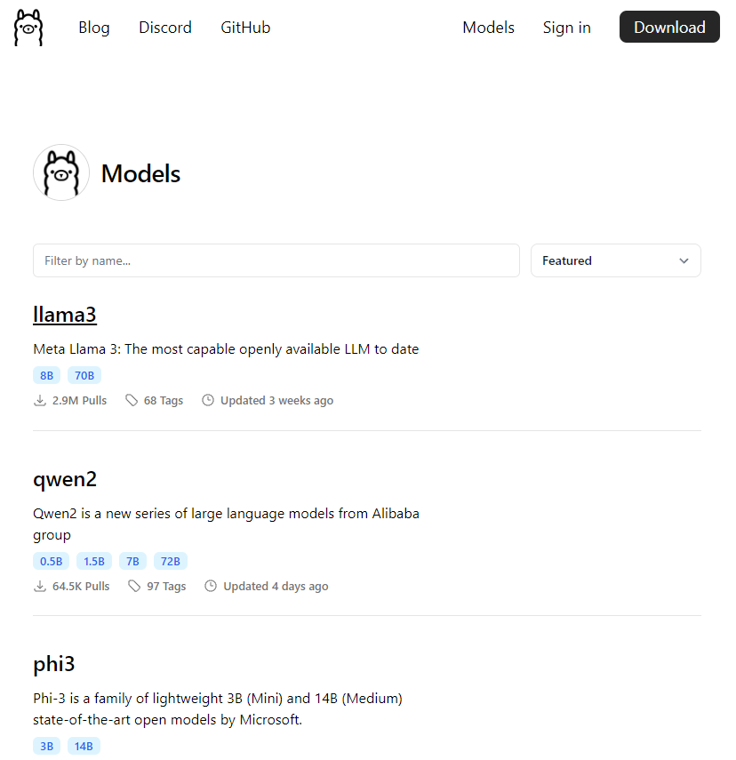
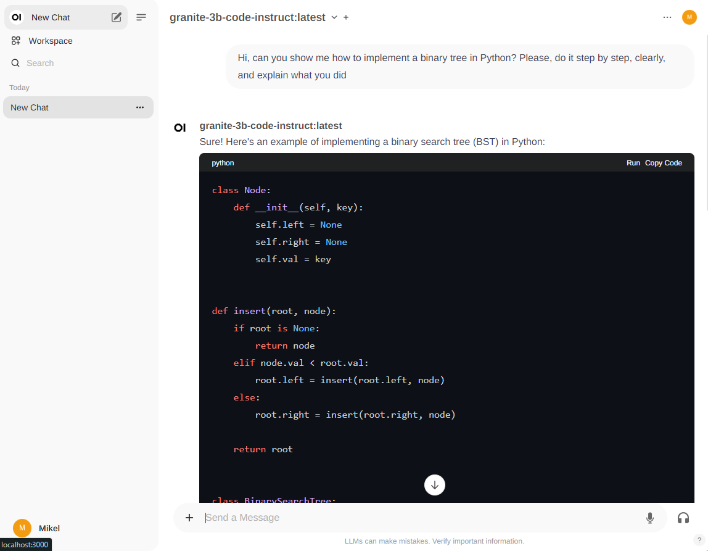
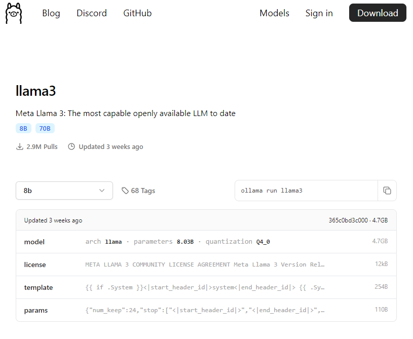

# Ollama

Ollama is a tool to run local Large Language Models (LLMs), among others.

- Website: [https://ollama.com/](https://ollama.com/)
- Github: [https://github.com/ollama/ollama](https://github.com/ollama/ollama)
- Python Library: [https://github.com/ollama/ollama-python](https://github.com/ollama/ollama-python)

Sources of this guide:

- [How to Use Ollama: Hands-On With Local LLMs and Building a Chatbot](https://hackernoon.com/how-to-use-ollama-hands-on-with-local-llms-and-building-a-chatbot)
- [Running models with Ollama step-by-step](https://medium.com/@gabrielrodewald/running-models-with-ollama-step-by-step-60b6f6125807)
- [Using Ollama in your IDE with Continue](https://medium.com/@omargohan/using-ollama-in-your-ide-with-continue-e8cefeeee033)

Table of contents:

- [Ollama](#ollama)
  - [Setup](#setup)
  - [Basic Usage](#basic-usage)
    - [Library and Models](#library-and-models)
    - [Open WebUI](#open-webui)
    - [Importing Models: Download from Hugging Face and Build Model](#importing-models-download-from-hugging-face-and-build-model)
      - [Download Models](#download-models)
      - [Create a Modelfile](#create-a-modelfile)
      - [Build Ollama Models](#build-ollama-models)
      - [Run the Model](#run-the-model)
  - [API](#api)
  - [Python Library](#python-library)
  - [More on Modelfiles](#more-on-modelfiles)
  - [Quantization and Model Types](#quantization-and-model-types)
  - [Links](#links)


## Setup

- First, we need to install the binaries from their website (Mac/Windows/Linux): [https://ollama.com/download](https://ollama.com/download).
- Then, we need to install `ollama` in our Python environment of choise: `pip install ollama`.

## Basic Usage

In this section, the basic commands for downloading and using models are used.
If you cannot download a model, for any given reason (e.g., you're using a VPN), you can also download `GGUF` and `sefetensors` models from Hugging Face and import them into `ollama`!

```bash
# Run ollama: help menu is displayed
ollama

    Usage:
    ollama [flags]
    ollama [command]

    Available Commands:
    serve       Start ollama
    create      Create a model from a Modelfile
    show        Show information for a model
    run         Run a model
    pull        Pull a model from a registry
    push        Push a model to a registry
    list        List models
    ps          List running models
    cp          Copy a model
    rm          Remove a model
    help        Help about any command

    Flags:
    -h, --help      help for ollama
    -v, --version   Show version information

# List all downloaded LLMs
ollama list

# Download a model: See the Library of Models
# Downloaded to ~/.ollama
ollama pull llama3

# Run a model: interactive CLI starts
# By default the model is also served in 
ollama run llama3

# Remove a model
ollama rm llama3
```

### Library and Models

The complete model library can be accessed here: [https://ollama.com/library](https://ollama.com/library).



Some selected models from the official Github repository:

| Model              | Parameters | Size  | Download and Run               |
| ------------------ | ---------- | ----- | ------------------------------ |
| Llama 3            | 8B         | 4.7GB | `ollama run llama3`            |
| Llama 3            | 70B        | 40GB  | `ollama run llama3:70b`        |
| Phi 3 Mini         | 3.8B       | 2.3GB | `ollama run phi3`              |
| Phi 3 Medium       | 14B        | 7.9GB | `ollama run phi3:medium`       |
| Gemma              | 2B         | 1.4GB | `ollama run gemma:2b`          |
| Gemma              | 7B         | 4.8GB | `ollama run gemma:7b`          |
| Mistral            | 7B         | 4.1GB | `ollama run mistral`           |
| Moondream 2        | 1.4B       | 829MB | `ollama run moondream`         |
| Neural Chat        | 7B         | 4.1GB | `ollama run neural-chat`       |
| Starling           | 7B         | 4.1GB | `ollama run starling-lm`       |
| Code Llama         | 7B         | 3.8GB | `ollama run codellama`         |
| Llama 2 Uncensored | 7B         | 3.8GB | `ollama run llama2-uncensored` |
| LLaVA              | 7B         | 4.5GB | `ollama run llava`             |
| Solar              | 10.7B      | 6.1GB | `ollama run solar`             |

> Note: You should have at least 8 GB of RAM available to run the 7B models, 16 GB to run the 13B models, and 32 GB to run the 33B models.

### Open WebUI

[Open WebUI](https://docs.openwebui.com/) allows a web UI similar to the one provided by OpenAI, but running locally. We can use the local `ollama` models with it!



The installation is basically (pulling) a docker image, which is run as follows:

```bash
# (Pull image and) Run Open WebUI
docker run -d -p 3000:8080 --add-host=host.docker.internal:host-gateway -v open-webui:/app/backend/data --name open-webui --restart always ghcr.io/open-webui/open-webui:main
# Open Browser in http://localhost:3000/
# Sign up for the first time: credentials locally stored, for RBAC!
# WARNING: if we remove the container, we need to sign up again!
# Select Ollama model and start chatting

# Is it still running?
docker ps

# Stop it, WITHOUT removing it
# Stop + Restart is necessary if we add a new modell to our local Ollama library
docker stop <container_name_or_id>

# Restart it; refresh http://localhost:3000/
docker ps -a
docker start <container_name_or_id>

# If we want to stop and remove everything
docker stop open-webui
docker rm open-webui
docker volume rm open-webui

docker network ls
docker network rm <network_name> # 03_ollama_default

# If we want to remove the image
docker images # list images
docker rmi ghcr.io/open-webui/open-webui:main
```

I have created a docker-compose YAML [`docker-compose-open-webui.yml`](docker-compose-open-webui.yml) for a more comfortable usage:

```bash
# Start the Open WebUI server and open http://localhost:3000
docker-compose -f docker-compose-open-webui.yml up -d

# Stop the container WITHOUT removing it and restart it again
docker-compose -f docker-compose-open-webui.yml stop
docker-compose -f docker-compose-open-webui.yml start

# Stop the container and REMOVE it; then, restart it again
docker-compose -f docker-compose-open-webui.yml down
docker-compose -f docker-compose-open-webui.yml up -d
```

Open WebUI has many more capabilities which require a guide on its own:

- Web search
- Use OpenAI API with the secret
- Image generation
- RAGs
- etc.

### Importing Models: Download from Hugging Face and Build Model

#### Download Models

We can download models from [Hugging Face](https://huggingface.co/) and import them as ollama models using `ollama create`. Two formats are supported:

- [`GGUF`](https://huggingface.co/docs/hub/gguf): binary format that is optimized for quick loading and saving of models. **Recommended**. Models are already quantized. See [Quantization and Model Types](#quantization-and-model-types).
- [`safetensors`](https://huggingface.co/docs/safetensors/index): new simple format for storing tensors safely (as opposed to pickle) and that is still fast (zero-copy). I have had problems using this format with `ollama`.

If we want to use [Hugging Face](https://huggingface.co/) programmatically, we need to have an account and also the CLI tools installed.
Hugging Face will create a local folder in `~/.cache/huggingface` where all models and datasets will be downloaded to if not specified otherwise.
Alternatively, we can also download them manually from the web, or we can also clone the HuggingFace model repo if we have installed the LFS extension for Git.

Here's a quick recipy for all those steps:

```bash
# Install in our environment
pip install "huggingface_hub[cli]"

# Login: web us prompted
huggingface-cli login

# Then, we can browse and select a model and
# download from the hub to ~/.chache/huggingface (default)
# or specify a local folder which will contain the model inside
# https://huggingface.co/TheBloke/MistralLite-7B-GGUF
huggingface-cli download TheBloke/MistralLite-7B-GGUF mistrallite.Q4_K_M.gguf --local-dir ../models --local-dir-use-symlinks False

# Alternatively, we can also download them manually from the web
# or we can also clone the HuggingFace model repo
# if we have installed the LFS extension for Git
git lfs install
cd ../models
# https://huggingface.co/bartowski/Starling-LM-7B-beta-GGUF
# WATCH OUT: Many GBs are downloaded!
git clone https://huggingface.co/bartowski/Starling-LM-7B-beta-GGUF
# https://huggingface.co/ibm-granite/granite-3b-code-instruct-GGUF
# WATCH OUT: Many GBs are downloaded!
git clone https://huggingface.co/ibm-granite/granite-3b-code-instruct-GGUF

# Or, simply click on download on the web :)
# https://huggingface.co/xezpeleta/latxa-7b-v1-gguf
```

#### Create a Modelfile

Once we have the model, we need to create a `Modelfile` which will contain at least the `FROM` command with the path of the model:

```Dockerfile
FROM /path/to/file.gguf
FROM /path/to/safetensors/directory
```

See the co-located `Modelfiles`:

- [`mistrallite.Q4_K_M.modelfile`](mistrallite.Q4_K_M.modelfile)
- [`mistral-7b-instruct-v0.2.Q2_K.modelfile`](mistral-7b-instruct-v0.2.Q2_K.modelfile)
- [`Starling-LM-7B-beta-Q6_K.modelfile`](Starling-LM-7B-beta-Q6_K.modelfile)
- [`granite-3b-code-instruct-GGUF.modelfile`](granite-3b-code-instruct-GGUF.modelfile)
- [`latxa-7b-v1-q8_0.modelfile`](latxa-7b-v1-q8_0.modelfile)

#### Build Ollama Models

We can create/build `ollama` models with this call

```bash
ollama create "ModelName" -f Modelfile
ollama list # When finished, our model shoudl appear here
```

When we create a model, a copy is generated and stored in `~/.ollama`!
That means we can remove the original ``GGUF` to save space.

Example builds:

```bash
ollama create "Starling-LM-7B-beta-Q6_K" -f Starling-LM-7B-beta-Q6_K.modelfile

ollama create "granite-3b-code-instruct" -f granite-3b-code-instruct-GGUF.modelfile

ollama create "mistrallite.Q4_K_M" -f mistrallite.Q4_K_M.modelfile

ollama create "mistral-7b-instruct-v0.2.Q2_K" -f mistral-7b-instruct-v0.2.Q2_K.modelfile

ollama create "latxa-7b-v1-q8_0" -f latxa-7b-v1-q8_0.modelfile

ollama list
```

#### Run the Model

After the models have been created or downloaded, if they appear listed, we can run them with

```bash
ollama run model_name:tag
```

This will start

- A
- B

Example run calls:

```bash
ollama list

ollama run mistral-7b-instruct-v0.2.Q2_K:latest

ollama run granite-3b-code-instruct:latest

ollama run latxa-7b-v1-q8_0:latest
```

In the interactive 

For the API

## API


## Python Library


## More on Modelfiles

The `Modelfile` can contain also a prompt in `TEMPLATE` and parameters as `PARAMETER`.
We can show the `Modelfile` of an `ollama` model as follows:

```bash
ollama show --modelfile llama3
```

We can browse in the Ollama website examples and see the `Modelfile` definitions; for instance, [https://ollama.com/library/phi3](https://ollama.com/library/phi3):

```Dockerfile
TEMPLATE """{{ if .System }}<|system|>
{{ .System }}<|end|>
{{ end }}{{ if .Prompt }}<|user|>
{{ .Prompt }}<|end|>
{{ end }}<|assistant|>
{{ .Response }}<|end|>
"""
PARAMETER stop "<|end|>"
PARAMETER stop "<|user|>"
PARAMETER stop "<|assistant|>"
```



Other `Modelfile` examples I have found:

`Starling-LM-7B-beta-GGUF`: 

```Dockerfile
FROM "./Starling-LM-7B-beta-Q6_K.gguf"
PARAMETER stop "<|im_start|>"
PARAMETER stop "<|im_end|>"
TEMPLATE """
<|im_start|>system
<|im_end|>
<|im_start|>user
<|im_end|>
<|im_start|>assistant
"""
```

## Quantization and Model Types

See [`../05_model_logbook/README.md`](../05_model_logbook/README.md).

## Links

- [HuggingFace CLI Guide](https://huggingface.co/docs/huggingface_hub/main/en/guides/cli).
- [GGUF Format](https://huggingface.co/docs/hub/gguf)
- [My HuggingFace Basic Guide]()
- [Ollama Modelfile](https://github.com/ollama/ollama/blob/main/docs/modelfile.md)
- [Cursor: Github Copilot Alternative](https://www.cursor.com/)
- [Open WebUI](https://github.com/open-webui/open-webui)