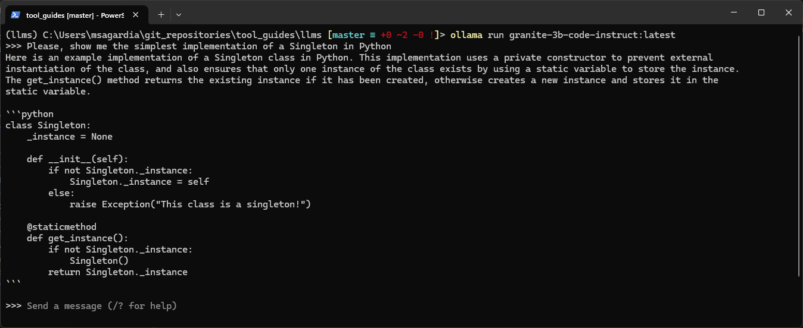

# Ollama

Ollama is a tool to run local Large Language Models (LLMs).

- Website: [https://ollama.com/](https://ollama.com/)
- Github: [https://github.com/ollama/ollama](https://github.com/ollama/ollama)
- Python Library: [https://github.com/ollama/ollama-python](https://github.com/ollama/ollama-python)

I created this guide following primarily the official documentation, as well as some other resources listed in [Links and Sources](#links-and-sources).

Table of contents:

- [Ollama](#ollama)
  - [Setup](#setup)
  - [Basic Usage](#basic-usage)
    - [Basic Commands](#basic-commands)
    - [Library and Models](#library-and-models)
    - [Importing Models: Download from Hugging Face and Build Model](#importing-models-download-from-hugging-face-and-build-model)
      - [Download Models](#download-models)
      - [Create a Modelfile](#create-a-modelfile)
      - [Build Ollama Models](#build-ollama-models)
      - [Run the Model](#run-the-model)
  - [User Interface: Open WebUI](#user-interface-open-webui)
  - [API](#api)
  - [Python Library](#python-library)
  - [More on Modelfiles](#more-on-modelfiles)
  - [Quantization and Model Types](#quantization-and-model-types)
  - [Continue VSCode Plugin](#continue-vscode-plugin)
  - [Links and Sources](#links-and-sources)


## Setup

- First, we need to install the binaries from their website (Mac/Windows/Linux): [https://ollama.com/download](https://ollama.com/download).
  - This will start a Ollama service in `http://localhost:11434/` and we should get an icon in the taskbar.
  - We can check the service is up and running by checking the icon is there or openening the URL in the browser; if the service is not running, we can start it by
    - launching the Ollama app in the OS
    - or running `ollama run model_name:tag` (this will start the service and the CLI of the selected model)
    - or running `ollama serve`.
- Then, we can install `ollama` in our Python environment of choise: `pip install ollama`.

## Basic Usage

### Basic Commands

In this section, the basic commands for downloading and using models are used.
If you cannot download a model, for any given reason (e.g., you're using a VPN), you can also download `GGUF` and `sefetensors` models from Hugging Face and import them into `ollama`!

```bash
# Run ollama: help menu is displayed
ollama

    Usage:
    ollama [flags]
    ollama [command]

    Available Commands:
    serve       Start ollama
    create      Create a model from a Modelfile
    show        Show information for a model
    run         Run a model
    pull        Pull a model from a registry
    push        Push a model to a registry
    list        List models
    ps          List running models
    cp          Copy a model
    rm          Remove a model
    help        Help about any command

    Flags:
    -h, --help      help for ollama
    -v, --version   Show version information

# List all downloaded LLMs
ollama list

# Download a model: See the Library of Models
# Downloaded to ~/.ollama
ollama pull llama3

# Run a model: interactive CLI starts
# By default this and other models can be interacted via an API in http://localhost:11434/
ollama run llama3

# Remove a model
ollama rm llama3
```

### Library and Models

The complete model library can be accessed here: [https://ollama.com/library](https://ollama.com/library).


Some selected models from the official Github repository:

| Model              | Parameters | Size  | Download and Run               |
| ------------------ | ---------- | ----- | ------------------------------ |
| Llama 3            | 8B         | 4.7GB | `ollama run llama3`            |
| Llama 3            | 70B        | 40GB  | `ollama run llama3:70b`        |
| Phi 3 Mini         | 3.8B       | 2.3GB | `ollama run phi3`              |
| Phi 3 Medium       | 14B        | 7.9GB | `ollama run phi3:medium`       |
| Gemma              | 2B         | 1.4GB | `ollama run gemma:2b`          |
| Gemma              | 7B         | 4.8GB | `ollama run gemma:7b`          |
| Mistral            | 7B         | 4.1GB | `ollama run mistral`           |
| Moondream 2        | 1.4B       | 829MB | `ollama run moondream`         |
| Neural Chat        | 7B         | 4.1GB | `ollama run neural-chat`       |
| Starling           | 7B         | 4.1GB | `ollama run starling-lm`       |
| Code Llama         | 7B         | 3.8GB | `ollama run codellama`         |
| Llama 2 Uncensored | 7B         | 3.8GB | `ollama run llama2-uncensored` |
| LLaVA              | 7B         | 4.5GB | `ollama run llava`             |
| Solar              | 10.7B      | 6.1GB | `ollama run solar`             |

> Note: You should have at least 8 GB of RAM available to run the 7B models, 16 GB to run the 13B models, and 32 GB to run the 33B models.

### Importing Models: Download from Hugging Face and Build Model

#### Download Models

We can download models from [Hugging Face](https://huggingface.co/) and import them as ollama models using `ollama create`. Two formats are supported:

- [`GGUF`](https://huggingface.co/docs/hub/gguf): binary format that is optimized for quick loading and saving of models. **Recommended**. Models are already quantized. See [Quantization and Model Types](#quantization-and-model-types).
- [`safetensors`](https://huggingface.co/docs/safetensors/index): new simple format for storing tensors safely (as opposed to pickle) and that is still fast (zero-copy). I have had problems using this format with `ollama`.

If we want to use [Hugging Face](https://huggingface.co/) programmatically, we need to have an account and also the CLI tools installed.
Hugging Face will create a local folder in `~/.cache/huggingface` where all models and datasets will be downloaded to if not specified otherwise.
Alternatively, we can also download them manually from the web, or we can also clone the HuggingFace model repo if we have installed the LFS extension for Git.

Here's a quick recipy for all those steps:

```bash
# Install in our environment
pip install "huggingface_hub[cli]"

# Login: web us prompted
huggingface-cli login

# Then, we can browse and select a model and
# download from the hub to ~/.chache/huggingface (default)
# or specify a local folder which will contain the model inside
# https://huggingface.co/TheBloke/MistralLite-7B-GGUF
huggingface-cli download TheBloke/MistralLite-7B-GGUF mistrallite.Q4_K_M.gguf --local-dir ../models --local-dir-use-symlinks False

# Alternatively, we can also download them manually from the web
# or we can also clone the HuggingFace model repo
# if we have installed the LFS extension for Git
git lfs install
cd ../models
# https://huggingface.co/bartowski/Starling-LM-7B-beta-GGUF
# WATCH OUT: Many GBs are downloaded!
git clone https://huggingface.co/bartowski/Starling-LM-7B-beta-GGUF
# https://huggingface.co/ibm-granite/granite-3b-code-instruct-GGUF
# WATCH OUT: Many GBs are downloaded!
git clone https://huggingface.co/ibm-granite/granite-3b-code-instruct-GGUF

# Or, simply click on download on the web :)
# https://huggingface.co/xezpeleta/latxa-7b-v1-gguf
```

#### Create a Modelfile

Once we have the model, we need to create a `Modelfile` which will contain at least the `FROM` command with the path of the model:

```Dockerfile
FROM /path/to/file.gguf
FROM /path/to/safetensors/directory
```

See the co-located `Modelfiles`:

- [`mistrallite.Q4_K_M.modelfile`](mistrallite.Q4_K_M.modelfile)
- [`mistral-7b-instruct-v0.2.Q2_K.modelfile`](mistral-7b-instruct-v0.2.Q2_K.modelfile)
- [`Starling-LM-7B-beta-Q6_K.modelfile`](Starling-LM-7B-beta-Q6_K.modelfile)
- [`granite-3b-code-instruct-GGUF.modelfile`](granite-3b-code-instruct-GGUF.modelfile)
- [`latxa-7b-v1-q8_0.modelfile`](latxa-7b-v1-q8_0.modelfile)

#### Build Ollama Models

We can create/build `ollama` models with this call

```bash
ollama create "ModelName" -f Modelfile
ollama list # When finished, our model shoudl appear here
```

When we create a model, a copy is generated and stored in `~/.ollama`!
That means we can remove the original ``GGUF` to save space.

Example builds:

```bash
# Create/build models using their Modelfile
# The created model is stored in ~/.ollama, so we can erase the GGUF
ollama create "Starling-LM-7B-beta-Q6_K" -f Starling-LM-7B-beta-Q6_K.modelfile
ollama create "granite-3b-code-instruct" -f granite-3b-code-instruct-GGUF.modelfile
ollama create "mistrallite.Q4_K_M" -f mistrallite.Q4_K_M.modelfile
ollama create "mistral-7b-instruct-v0.2.Q2_K" -f mistral-7b-instruct-v0.2.Q2_K.modelfile
ollama create "latxa-7b-v1-q8_0" -f latxa-7b-v1-q8_0.modelfile

# Show all available local models
ollama list
```

#### Run the Model

After the models have been created or downloaded, if they appear listed, we can run them with

```bash
ollama run model_name:tag
```

This will start:

- An **interactive CLI** where we can chat with the model using the Terminal.
- An **Ollama service**, reachable at `http://localhost:11434/`; we should also get an icon in the task bar. This service is a server which with we can interact using API calls or a Python library. To check that service is running open in the browser at `http://localhost:11434/`: we should get the message `Ollama is running`. The Ollama service is working even if we close the interactive CLI. If we quit/kill it, we can start it again either
  - running any `ollama run model_name:tag` again
  - or running `ollama serve` (in this case, at least for me, the taskbar icon dosn't appear).

Example run calls:

```bash
# List all available models
ollama list

# Run any local model
ollama run mistral-7b-instruct-v0.2.Q2_K:latest
ollama run granite-3b-code-instruct:latest
ollama run latxa-7b-v1-q8_0:latest

# /bye
# This closes the CLI session, but the service is still up at http://localhost:11434/
```

The **interactive CLI** also allows for many options:

- Spacial commands start with `/`; check commands with `/?`, stop CLI with `/bye`
- Multiline inputs start with `"""`:
  ```
  >>> """Hello,
  ... world!
  ... """
  I'm a basic program that prints the famous "Hello, world!" message to the console.
  ```
- Multimodal models:
  ```
  >>> What's in this image? /Users/jmorgan/Desktop/smile.png
  The image features a yellow smiley face, which is likely the central focus of the picture.
  ```
- and much more...



For the API, check the following two sections:

- [API](#api)
- [Python Library](#python-library)

## User Interface: Open WebUI

[Open WebUI](https://docs.openwebui.com/) allows a web UI similar to the one provided by OpenAI, but running locally. We can use the local `ollama` models with it!


We need to have Ollama installed and its service up and running.

The installation of Open WebUI is basically (pulling) a docker image, which is run as follows:

```bash
# (Pull image and) Run Open WebUI
docker run -d -p 3000:8080 --add-host=host.docker.internal:host-gateway -v open-webui:/app/backend/data --name open-webui --restart always ghcr.io/open-webui/open-webui:main
# Open Browser in http://localhost:3000/
# Sign up for the first time: credentials locally stored, for RBAC!
# WARNING: if we remove the container, we need to sign up again!
# Select Ollama model and start chatting

# Is it still running?
docker ps

# Stop it, WITHOUT removing it
# Stop + Restart is necessary if we add a new modell to our local Ollama library
docker stop <container_name_or_id>

# Restart it; refresh http://localhost:3000/
docker ps -a
docker start <container_name_or_id>

# If we want to stop and remove everything
docker stop open-webui
docker rm open-webui
docker volume rm open-webui

docker network ls
docker network rm <network_name> # 03_ollama_default

# If we want to remove the image
docker images # list images
docker rmi ghcr.io/open-webui/open-webui:main
```

I have created a docker-compose YAML [`docker-compose-open-webui.yml`](docker-compose-open-webui.yml) for a more comfortable usage:

```bash
# Start the Open WebUI server and open http://localhost:3000
docker-compose -f docker-compose-open-webui.yml up -d

# Stop the container WITHOUT removing it and restart it again
docker-compose -f docker-compose-open-webui.yml stop
docker-compose -f docker-compose-open-webui.yml start

# Stop the container and REMOVE it; then, restart it again
docker-compose -f docker-compose-open-webui.yml down
docker-compose -f docker-compose-open-webui.yml up -d
```

Open WebUI has many more capabilities which require a guide on its own:

- Web search
- Use OpenAI API with the secret
- Image generation
- RAGs
- etc.

## API

The API is served under `http://localhost:11434` and it can be started via:

- Starting the Ollama app in the OS, which will put an icon in the taskbar.
- `ollama run model_name:tag`: with this call we start the CLI of a model and the API server (for any model); after closing the model CLI, the server is still up. Additionally, we should get an icon in the taskbar.
- `ollama serve`: with this call we start the API service, too, but I get no taskbar icon.

If the Ollama service is up at `http://localhost:11434`, we should get the message `Ollama is running` if we browse that URL.

With the API server up and running, we can send many `curl` requests to it!

One simple example:

```bash
curl http://localhost:11434/api/generate -d '{
  "model": "llama3",
  "prompt": "Why is the sky blue?",
  "stream": false
}'
```

If `stream` is set to `false`, the response will be a JSON object:

```json
{
  "model": "llama3",
  "created_at": "2023-08-04T19:22:45.499127Z",
  "response": "The sky is blue because it is the color of the sky.",
  "done": true,
  "context": [1, 2, 3],
  "total_duration": 5043500667,
  "load_duration": 5025959,
  "prompt_eval_count": 26,
  "prompt_eval_duration": 325953000,
  "eval_count": 290,
  "eval_duration": 4709213000
}
```

More examples: [https://github.com/ollama/ollama/blob/main/docs/api.md](https://github.com/ollama/ollama/blob/main/docs/api.md)

## Python Library

See the notebook [`ollama_tests.ipynb`](./ollama_tests.ipynb).

Python API/Library Setup:

```bash
# First, install Ollama with the installer: https://ollama.com/download
# Then, start the server:
# - either start the Ollama app in the OS
# - or pull and run a model in the CLI
# - or execute `ollama serve` in the CLI
# Finally, install the Python library in your environment and use it
pip install ollama
```

More examples: [https://github.com/ollama/ollama-python](https://github.com/ollama/ollama-python).

```python
import ollama

# List all local models
ollama.list()

# Show Modelfile information
ollama.show('mistral-7b-instruct-v0.2.Q2_K:latest')

# Non-Streamed Chat: The entire answer is provided at once.
response = ollama.chat(model='mistral-7b-instruct-v0.2.Q2_K:latest', messages=[
  {
    'role': 'user',
    'content': 'Why is the sky blue?',
  },
])
print(response['message']['content'])
# The sky appears ...

# Streamed Chat: Answer words are generated one by one
stream = ollama.chat(
    model='mistral-7b-instruct-v0.2.Q2_K:latest',
    messages=[{'role': 'user', 'content': 'Why is the sky blue?'}],
    stream=True,
)

for chunk in stream:
  print(chunk['message']['content'], end='', flush=True)
# The sky appears ...

# Generate, not chat
res = ollama.generate(model='mistral-7b-instruct-v0.2.Q2_K:latest', prompt='Why is the sky blue?')
print(res['response'])
# The sky appears ...

# Experimental usage via OpenAI library
from openai import OpenAI

client = OpenAI(
    base_url='http://localhost:11434/v1/',
    api_key='ollama', # required but ignored
)

chat_completion = client.chat.completions.create(
    messages=[
        {
            'role': 'user',
            'content': 'Say this is a test',
        }
    ],
    model='mistral-7b-instruct-v0.2.Q2_K:latest',
)
```

## More on Modelfiles

The `Modelfile` can contain also a prompt in `TEMPLATE` and parameters as `PARAMETER`.
We can show the `Modelfile` of an `ollama` model as follows:

```bash
ollama show --modelfile llama3
```

We can browse in the Ollama website examples and see the `Modelfile` definitions; for instance, [https://ollama.com/library/phi3](https://ollama.com/library/phi3):

```Dockerfile
TEMPLATE """{{ if .System }}<|system|>
{{ .System }}<|end|>
{{ end }}{{ if .Prompt }}<|user|>
{{ .Prompt }}<|end|>
{{ end }}<|assistant|>
{{ .Response }}<|end|>
"""
PARAMETER stop "<|end|>"
PARAMETER stop "<|user|>"
PARAMETER stop "<|assistant|>"
```


Other `Modelfile` example - `Starling-LM-7B-beta-GGUF`: 

```Dockerfile
FROM "./Starling-LM-7B-beta-Q6_K.gguf"
PARAMETER stop "<|im_start|>"
PARAMETER stop "<|im_end|>"
TEMPLATE """
<|im_start|>system
<|im_end|>
<|im_start|>user
<|im_end|>
<|im_start|>assistant
```

## Quantization and Model Types

See [`../05_model_logbook/README.md`](../05_model_logbook/README.md).

## Continue VSCode Plugin

[Continue](https://www.continue.dev/) is a VSCode plugin with which we can have our own *Github Copilot* using:

- Local LLMs via Ollama service
- Remote LLMs via their APIs, e.g., OpenAI

It's usage is very simple:

- Install extension
- Select type of LLMs: Ollama, OpenAI, etc.
- Use menu icon to open chat, etc.

## Links and Sources

- [HuggingFace CLI Guide](https://huggingface.co/docs/huggingface_hub/main/en/guides/cli).
- [GGUF Format](https://huggingface.co/docs/hub/gguf)
- [My HuggingFace Basic Guide]()
- [Ollama Modelfile](https://github.com/ollama/ollama/blob/main/docs/modelfile.md)
- [Cursor: Github Copilot Alternative](https://www.cursor.com/)
- [Open WebUI](https://github.com/open-webui/open-webui)
- [How to Use Ollama: Hands-On With Local LLMs and Building a Chatbot](https://hackernoon.com/how-to-use-ollama-hands-on-with-local-llms-and-building-a-chatbot)
- [Running models with Ollama step-by-step](https://medium.com/@gabrielrodewald/running-models-with-ollama-step-by-step-60b6f6125807)
- [Using Ollama in your IDE with Continue](https://medium.com/@omargohan/using-ollama-in-your-ide-with-continue-e8cefeeee033)
