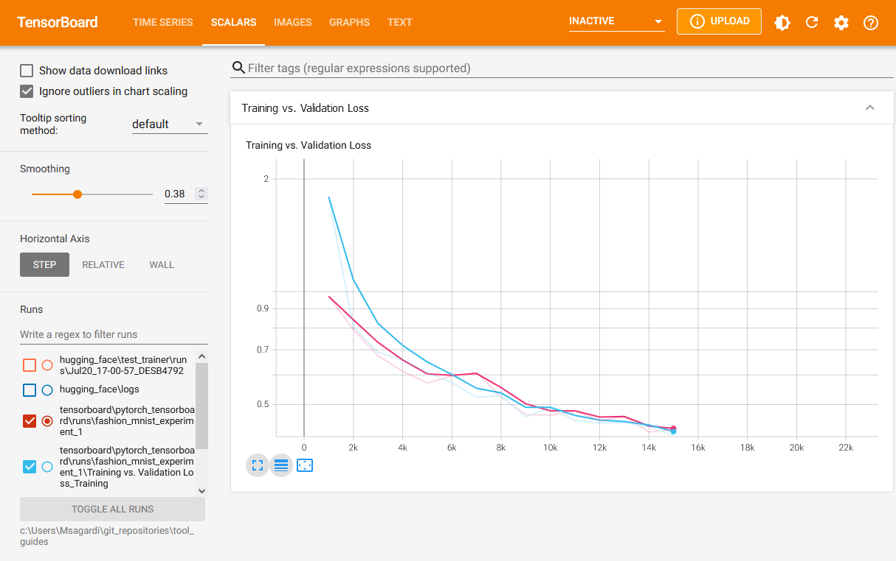

# Tensorboard

This guide compiles different use-cases of [Tensorboard](https://www.tensorflow.org/tensorboard):

- Embeddings Projector: [`embeddings/`](./embeddings/)
- Pytorch with Tensorboard: [`pytorch_tensorboard/`](./pytorch_tensorboard/)

## Setup

```bash
# Install/activate a basic environment
conda env create -f conda.yaml
conda activate ds
# Alternatively, 
pip install tensorflow
pip install tensorboard

# On Windows:
# Add path to tensorboard executable in the environment variables:
# Path += C:\Users\<UserName>\AppData\Roaming\Python\Python39\Scripts

# OPTIONAL: Pytorch on Windows + CUDA 11.7
# Update your NVIDIA drivers: https://www.nvidia.com/Download/index.aspx
# I have version 12.1, but it works with older versions, e.g. 11.7
# Check your CUDA version with: nvidia-smi.exe
# In case of any runtime errors, check vrsion compatibility tables:
# https://github.com/pytorch/vision#installation
python -m pip install -U torch==1.13+cu117 torchvision==0.14+cu117 torchaudio torchtext==0.14 --index-url https://download.pytorch.org/whl/cu117
```

## Running Tensorboard

In general, we start `tensorboard` with its executable; here is a quick recipe:

```bash
# Activate correct enviornment
conda activate ds

# On Windows:
# Add path to tensorboard executable in the environment variables:
# Path += C:\Users\<UserName>\AppData\Roaming\Python\Python39\Scripts

cd /path/to/all/files
# Don't use blank spaces
tensorboard --logdir=./
# Open borwser at http://localhost:6006/
# Refresh it several times until it works
```

## Gallery of Examples





## Authorship

Mikel Sagardia, 2023.  
Enjoy and link if you find it useful.  
No guarantees.  
